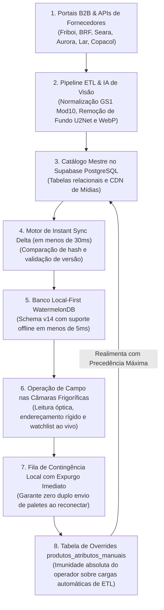
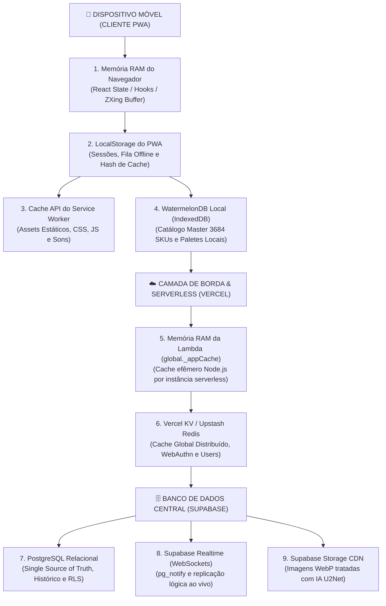

# 🏗️ Arquitetura Integrada Ponta a Ponta

A simbiose entre o **Pipeline ETL** e o **PaletScan PWA** foi desenhada para resolver um clássico dilema da engenharia de software industrial: **como manter um catálogo corporativo massivo atualizado sem comprometer a autonomia, a velocidade e a resiliência offline da operação de campo?**

---

## 🔄 1. O Circuito Fechado de Dados (Closed-Loop Data Flow)

O ecossistema opera através de um circuito fechado de dados bidirecional:



---

## 🛡️ 2. Modelo de Convivência e Imunidade de Dados Manuais

Um dos problemas mais comuns em pipelines ETL corporativos é a sobreescrita acidental de dados refinados manualmente por operadores de campo durante as cargas automatizadas de fornecedores.

Para solucionar isso, o PaletScan implementa o padrão **Dual-Layer Persistence**:

### A. Tabela de Overrides (`produtos_atributos_manuais`)
Quando um operador de empilhadeira vincula uma caixa master (DUN-14) ou um código de pesagem de balança através do modal [`GerenciarCodigosModal.tsx`](file:///root/repo_pwa/components/GerenciarCodigosModal.tsx), esse dado é gravado na tabela `produtos_atributos_manuais`:

```sql
-- Estrutura da tabela de blindagem contra sobrescritas do ETL
CREATE TABLE produtos_atributos_manuais (
    id UUID PRIMARY KEY DEFAULT gen_random_uuid(),
    produto_ean VARCHAR(20) NOT NULL UNIQUE,
    dun_14 VARCHAR(20),
    pesar_cod VARCHAR(10),
    classe_manual VARCHAR(50),
    conservacao_manual VARCHAR(50),
    atualizado_por VARCHAR(100),
    updated_at TIMESTAMP WITH TIME ZONE DEFAULT NOW()
);
```

### B. Views Relacionais Consolidadas (`vw_produtos_com_marcas`)
O catálogo mestre consumido pelo PWA é servido através de Views SQL que utilizam a cláusula `COALESCE` para priorizar rigorosamente o dado manual inserido pelo operador:

```sql
CREATE OR REPLACE VIEW vw_produtos_com_marcas AS
SELECT 
    p.ean,
    COALESCE(m.dun_14, p.dun) AS dun,
    p.marca_id,
    pr_marca.nome AS marca_nome,
    COALESCE(m.classe_manual, p.classe) AS classe,
    COALESCE(m.conservacao_manual, p.conservacao) AS conservacao,
    p.descricao,
    COALESCE(m.pesar_cod, p.pesar_cod) AS pesar_cod,
    p.imagem_url,
    p.updated_at
FROM produtos p
LEFT JOIN marcas pr_marca ON p.marca_id = pr_marca.id
LEFT JOIN produtos_atributos_manuais m ON p.ean = m.produto_ean;
```

---

## ⚡ 3. Instant Sync em Menos de 30ms (Status Hash)

Para não sobrecarregar a franquia de dados móveis e garantir velocidade instantânea de inicialização no coletor, o motor de sincronização utiliza um algoritmo de comparação de integridade baseado em hashes:

1. **Consulta Leve de Hash**: O PWA dispara uma requisição ultra-rápida (`GET /api/status-hash`) que retorna a contagem de registros e o timestamp da última mutação no Supabase.
2. **Comparação com Cache Local**: Se os hashes `ps_pwa_db_hash` e `ps_pwa_paletes_hash` coincidirem com os valores locais salvos no `localStorage`, a sincronização é **finalizada em menos de 30ms** sem transferir nenhuma linha do catálogo.
3. **Delta Download**: Se houver divergência, o sistema baixa exclusivamente os registros adicionados ou modificados desde o último timestamp, atualizando atomicamente o WatermelonDB local.

---

## 📦 4. Contratos de Dados e Tipagens Compartilhadas

Ambos os projetos compartilham as mesmas convenções de tipagem TypeScript para SKUs, conservação e códigos de barras:

| Campo | Tipo TypeScript | Validação / Padrão | Origem Principal |
| :--- | :--- | :--- | :--- |
| `ean` | `string` | 13 dígitos numéricos (Modulus 10 GS1) | ETL B2B / Cadastro PWA |
| `dun` | `string \| null` | 14 dígitos numéricos (Modulus 10 GS1) | Scraper B2B / Vínculo Manual PWA |
| `marca_nome` | `string` | Title Case (ex: *Friboi*, *Sadia*, *Lar*) | Classificador Heurístico ETL |
| `classe` | `string` | 10 Classes Canônicas | Heurística ETL / Override Manual |
| `conservacao` | `'Congelado' \| 'Resfriado'` | Restrição estrita de câmara fria | Classificador Heurístico ETL |
| `pesar_cod` | `string \| null` | 1 a 6 dígitos numéricos | Detecção `(pesar)` / Balança PWA |
| `validade` | `string` | Formato `DD/MM/AAAA` | Decodificador Regex PWA (AI 17/11) |
| `camara` | `'R1' \| 'R2' \| 'C1' \| 'C2'` | Chave de endereçamento de câmara | Seletor de Vagas PWA |
| `vaga` | `string` | 4 caracteres contínuos (ex: `A10D`) | Seletor de Vagas PWA |

---

## 💾 5. Mapeamento da Persistência de Dados & Topologia de Armazenamento

Para viabilizar a arquitetura **Local-First** com alta tolerância a blackouts de rede dentro de câmaras frias blindadas, o ecossistema PaletScan distribui a persistência dos dados em **6 camadas complementares**, desde a memória volátil do smartphone até o cluster PostgreSQL em nuvem:



### Matriz Completa de Persistência por Camada

| Camada / Tecnologia | Onde Reside | Volatilidade | O Que Armazena | Tempo de Acesso | Estratégia de Invalidação / Purga |
| :--- | :--- | :---: | :--- | :---: | :--- |
| **Memória RAM do Cliente** *(React Context / Hooks)* | Smartphone / Coletor | **Altamente Volátil** *(Zera ao fechar aba)* | Estados momentâneos de UI, flags de modal aberto, buffer de vídeo da câmera ZXing, instâncias WebSocket do Realtime. | `< 1ms` | Automática ao desmontar componentes ou recarregar página. |
| **LocalStorage** *(Browser Web Storage)* | Smartphone / Coletor | **Persistente** *(Sobrevive a reinícios)* | • `ps_auth_session`: Sessão offline de usuário.<br>• `ps_meus_paletes_conflito`: IDs que bloqueiam o app.<br>• `pending_sync`: Fila de contingência de paletes.<br>• `ps_pwa_paletes_hash`: Hash MD5 do catálogo.<br>• `ps_filial_ativa`: Loja multi-tenant ativa. | `< 2ms` | • Expurgado após resolução de conflitos.<br>• Limpo via `Reset Database` no menu. |
| **Service Worker Cache** *(Serwist / Cache API)* | Smartphone / Coletor | **Persistente** *(Cache de App Shell)* | HTML estático prerenderizado, bundles JS do Next.js, folhas CSS Tailwind, fontes, ícones do manifesto e áudios de bip. | `< 5ms` | Invalidação automática por hash de revisão a cada novo deploy em produção. |
| **WatermelonDB** *(IndexedDB / LokiJS)* | Smartphone / Coletor | **Persistente** *(Banco Local-First)* | • `produtos`: 3.684 SKUs do catálogo mestre higienizado.<br>• `paletes`: Cargas ativas e baixadas na filial.<br>• `codigos_barras`: Variantes de DUN-14 e pesagem. | `< 5ms` | Atualização delta via `syncLocalDB` ou `unsafeResetDatabase()` forçado. |
| **Vercel Serverless RAM** *(Node.js `global._appCache`)* | Borda em Nuvem *(Vercel Lambdas)* | **Efêmera** *(Desliga ao congelar container)* | Cache em memória de respostas das rotas `/api/vagas-ocupadas` e catálogo para amortecer rajadas repetidas. | `< 2ms` | TTL configurado (ex: 5 a 60 seg) ou purga manual no `clearCache()`. |
| **Vercel KV / Upstash Redis** *(Redis REST API)* | Nuvem Global *(Edge KV)* | **Persistente em Memória Distribuída** | • `banco_valida_data_v50_catalog_3684`: Catálogo compilado compartilhado entre lambdas.<br>• `paletscan:users`: Sincronização de credenciais e operadores.<br>• *FIDO2 Challenges*: Desafios WebAuthn/Passkeys. | `< 25ms` | Invalidação explícita via comando `DEL` emitido pela função `clearCache(key)`. |
| **Supabase PostgreSQL** *(Database Central)* | Nuvem *(AWS / Supabase)* | **Persistente Permanente** *(ACID)* | **Fonte Única da Verdade**: Tabelas `produtos`, `marcas`, `paletes_armazenados`, `paletes_historico`, `filiais`, `usuarios`, `reportes`, `watchlists` e `logs_sessao`. | `< 80ms` | Atualizações atômicas transacionais, backups diários e soft deletes (`deleted_at`). |
| **Supabase Realtime** *(WebSocket / Postgres CDC)* | Nuvem *(pg_notify)* | **Canal Efêmero de Transporte** | Eventos `INSERT`, `UPDATE` e `DELETE` em tempo real disparados para todas as sessões ativas da filial. | `< 50ms` | Desconexão / reconexão resiliente com fallback para polling a cada 4 segundos. |
| **Supabase Storage** *(S3-Compatible CDN)* | Nuvem *(Storage Bucket)* | **Persistente Permanente** | Imagens WebP tratadas e otimizadas dos produtos alimentícios (bucket `produtos-imagens`). | CDN Edge | Substituição atômica de imagens via `upsert: true` no pipeline de scraping/ETL. |

---

### Isolamento e Segurança entre Camadas
1. **Blackout Total de Conectividade**: O operador consegue trabalhar sem interrupção porque o **WatermelonDB** e o **LocalStorage** fornecem autonomia de leitura e escrita a 100% dos recursos críticos.
2. **Reconexão e Tolerância a Falhas**: Dados acumulados offline sobem em lote via `pending_sync` e sofrem desempate atômico no backend em caso de disputa de vagas.
3. **Escala Serverless sem Perda de Estado**: O uso do **Redis KV** desacopla a autenticação e o cache do catálogo das instâncias efêmeras da Vercel, impedindo inconsistências entre múltiplas requisições simultâneas.

