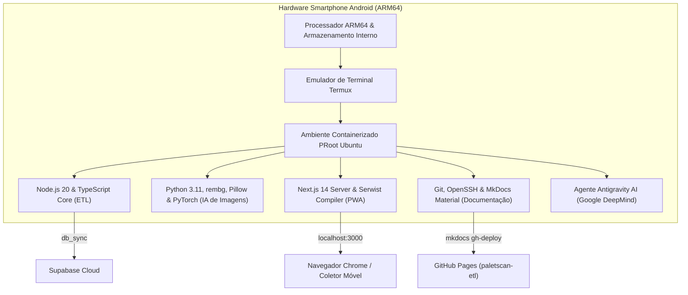

# 📱 Dev Móvel no Smartphone & Termux

Um dos pilares mais singulares do **Ecossistema PaletScan** é a sua origem e ciclo de vida inteiramente móveis: tanto o pipeline de engenharia de dados (ETL) quanto a aplicação cliente (PWA) foram idealizados, desenvolvidos, testados e documentados diretamente a partir de um smartphone Android.

---

## 🛠️ 1. Infraestrutura Linux no Smartphone (Termux + PRoot Ubuntu)

Sem a utilização de computadores tradicionais, o ambiente de desenvolvimento completo foi estruturado no celular via **Termux** rodando uma distribuição Linux containerizada (**PRoot Ubuntu ARM64**):



### Componentes do Ambiente Móvel:
- **Node.js 20 & npm**: Compilação de scrapers, execução de validações Modulus 10 e compilação do Service Worker Serwist.
- **Python 3 & rembg (U2Net/ONNX)**: Execução local de modelos de aprendizado profundo (Deep Learning) para remoção de fundo e tratamento de imagens em CPU ARM64 móvel.
- **MkDocs Material**: Compilação e publicação automatizada do site de documentação unificado via GitHub Actions.
- **Agente Antigravity (Google DeepMind)**: Assistente IA que opera como copiloto avançado diretamente no terminal móvel, realizando diagnóstico em tempo real, refatorações complexas e auditoria de código.

---

## 📲 2. Indexação Nativa de Arquivos no Android (Media Scan)

Ao exportar relatórios para a memória interna do celular (`/sdcard/Download/`), o sistema invoca utilitários nativos do Termux para indexar imediatamente tanto planilhas **CSV** quanto documentos **PDF**:

```bash
# Indexação nativa de relatórios CSV e PDF no Android
termux-media-scan /sdcard/Download/relatorio_paletes.csv
termux-media-scan /sdcard/Download/relatorio_paletes.pdf
```

### Por que o MediaScan é Crucial no Chão de Fábrica?
- **Atualização Imediata do MediaStore**: Elimina a necessidade de reiniciar o smartphone ou conectar via USB para localizar arquivos baixados.
- **Agilidade no Compartilhamento**: O operador de empilhadeira gera o relatório PDF ou CSV e pode anexá-lo instantaneamente no WhatsApp corporativo ou e-mail.

---

## 🚀 3. Guia de Execução Local Unificado

```bash
# 1. Clonar o repositório ETL
git clone https://github.com/NaejBarbosa/paletscan-etl.git
cd paletscan-etl

# 2. Instalar dependências Node.js e Python
npm install
pip install -r requirements.txt

# 3. Executar o pipeline de extração e tratamento
npm run scrape:all
npm run images:process
npm run sync:supabase

# 4. Compilar e testar a documentação unificada
mkdocs serve
```
