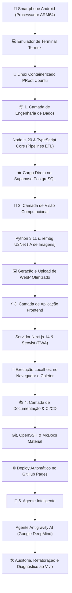
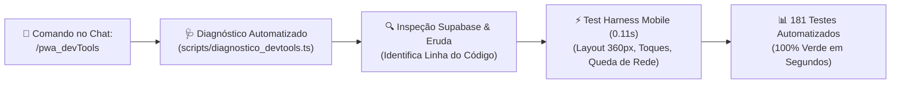
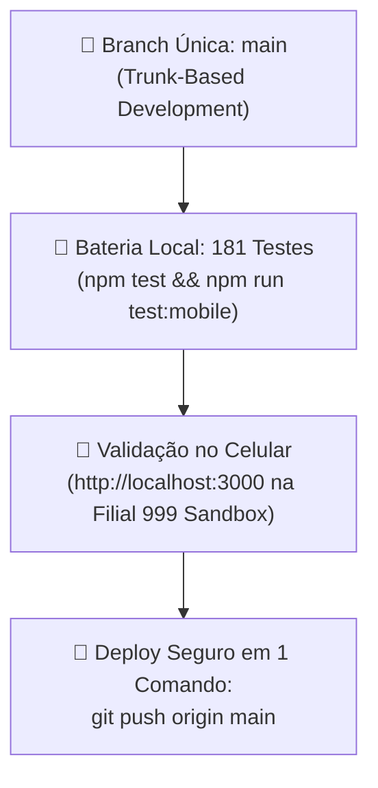

# 📱 Dev Móvel no Smartphone & Termux

Um dos pilares mais singulares do **Ecossistema PaletScan** é a sua origem e ciclo de vida inteiramente móveis: tanto o pipeline de engenharia de dados (ETL) quanto a aplicação cliente (PWA) foram idealizados, desenvolvidos, testados e documentados diretamente a partir de um smartphone Android.

---

## 🛠️ 1. Infraestrutura Linux no Smartphone (Termux + PRoot Ubuntu)

Sem a utilização de computadores tradicionais, o ambiente de desenvolvimento completo foi estruturado no celular via **Termux** rodando uma distribuição Linux containerizada (**PRoot Ubuntu ARM64**), encadeada em uma esteira 100% vertical:



### Componentes do Ambiente Móvel:
* **Node.js 20 & npm**: Compilação de scrapers, execução de validações Modulus 10 e compilação do Service Worker Serwist.
* **Python 3 & rembg (U2Net/ONNX)**: Execução local de modelos de aprendizado profundo (*Deep Learning*) para remoção de fundo e tratamento de imagens em CPU ARM64 móvel.
* **MkDocs Material**: Compilação e publicação automatizada do site de documentação unificado via GitHub Actions.
* **Agente Antigravity (Google DeepMind)**: Assistente IA que opera como copiloto avançado diretamente no terminal móvel, realizando diagnóstico em tempo real, refatorações complexas e auditoria de código.

---

## ⏰ 2. Persistência de Rotinas Noturnas no Android (Crontab & Wake-Lock)

Para permitir que o pipeline ETL (`etl-run`) seja executado automaticamente de madrugada (ex: 03:00) com a tela do celular apagada:

1. **Ativação do Wake-Lock**:
   ```bash
   termux-wake-lock
   ```
   *Impede que a CPU do smartphone entre em modo de suspensão profunda (Deep Sleep).*
2. **Bateria Irrestrita**:
   *Configurar a gestão de bateria do aplicativo Termux no Android como **Sem Restrições**.*
3. **Monitoramento e Autocura**:
   *Utilizar `etl-cron-status` para verificar a integridade do daemon e acompanhar os logs.*

---

## 📲 3. Indexação Nativa de Arquivos no Android (Media Scan)

Ao exportar relatórios para a memória interna do celular (`/sdcard/Download/`), o sistema invoca utilitários nativos do Termux para indexar imediatamente tanto planilhas **CSV** quanto documentos **PDF**:

```bash
# Indexação nativa de relatórios CSV e PDF no Android
termux-media-scan /sdcard/Download/relatorio_paletes.csv
termux-media-scan /sdcard/Download/relatorio_paletes.pdf
```

### Por que o MediaScan é Crucial no Chão de Fábrica?
* **Atualização Imediata do MediaStore**: Elimina a necessidade de reiniciar o smartphone ou conectar via USB para localizar arquivos baixados.
* **Agilidade no Compartilhamento**: O operador de empilhadeira gera o relatório PDF ou CSV e pode anexá-lo instantaneamente no WhatsApp corporativo ou e-mail.

---

## ⚡ 4. Esteira de Eficiência Operacional, DevTools & Autonomia Mobile

Para eliminar a sobrecarga de digitação e aprovações no teclado virtual do smartphone, foi projetada uma esteira de diagnóstico e validação em comando único:



### Principais Recursos da Esteira:
* **Diagnóstico Inteligente em 1 Comando (`npm run devtools:diagnosticar` / `/pwa_devTools`)**: Conecta ao Supabase (`logs_sessao`), analisa o stack trace do Eruda, status de conectividade e dimensões da tela do coletor, exibindo diretamente o arquivo e a linha da causa raiz.
* **Test Harness Mobile-First (`npm run test:mobile`)**: Validação sem navegador pesado (sem risco de *Android OOM Killer*):
  1. *Viewports Estreitos (360px–390px)*: Garante que botões e headers não quebrem a interface tátil.
  2. *Anti-Double-Tap & Debounce*: Rejeita disparos repetidos acidentais de bipagem em menos de 50ms.
  3. *Simulação de Blackout em Câmara Frigorífica*: Gravação em fila local em menos de 10ms e sincronização automática ao sair do congelador.
* **Suíte Automatizada Completa**: **181 testes automatizados** (154 testes de regras operacionais + 10 de isolamento 410 vs 999 + 17 testes de resiliência mobile).

---

## 🌿 5. Filosofia Trunk-Based Development no Smartphone (Branch `main` Única)

No desenvolvimento realizado diretamente no smartphone, manter múltiplas branches Git (`staging`, `feature/*`, `master`) introduz fricção e risco de erro humano em telas pequenas:



* **Trunk Único**: Todo o código reside e evolui na branch oficial **`main`**.
* **Proteção Lógica no Banco (Filial 999 Sandbox)**: Os testes manuais em `localhost:3000` utilizam a Filial 999, que é logicamente isolada no Supabase e nunca colide com os paletes reais da Loja 410.
* **Agilidade Máxima**: 1 comando para testar, 1 toque para abrir o navegador e 1 comando para publicar.

---

## 🚀 6. Guia de Execução Local Unificado

```bash
# 1. Clonar o repositório ETL ou PWA
git clone https://github.com/NaejBarbosa/paletscan-etl.git
git clone https://github.com/NaejBarbosa/PaletScan_pwa.git

# 2. Executar a suíte completa de testes no PWA (181 testes)
cd PaletScan_pwa
npm test && npm run test:mobile

# 3. Diagnóstico DevTools rápido em 1 comando
npm run devtools:diagnosticar

# 4. Iniciar servidor local de desenvolvimento
npm run dev

# 5. Compilar e testar a documentação técnica unificada
cd ../paletscan-etl
mkdocs serve
```
