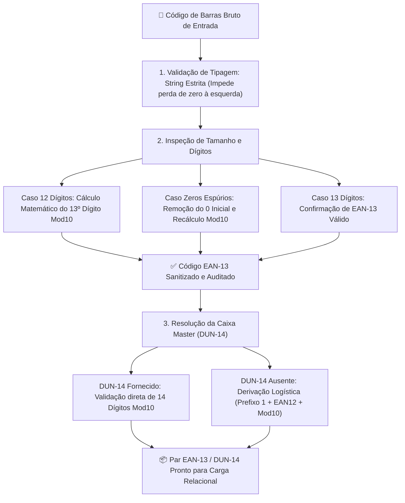

# 🧮 Core Engine: Heurísticas e Normalizadores

O diretório [`core/`](file:///root/paletscan-etl/core/) abriga os algoritmos de sanitização, normalização e heurísticas de domínio do PaletScan ETL. É o responsável por transformar dados brutos e ruidosos vindos da web em registros padronizados com alta integridade de negócios.

---

## 🔤 1. Normalização de Texto e Pesos (`text_parser.ts`)

O arquivo [`core/normalizers/text_parser.ts`](file:///root/paletscan-etl/core/normalizers/text_parser.ts) implementa regras estritas de padronização textual voltadas para a indústria alimentícia em Português (PT-BR).

### A. Conversão de Caixa e Preservação de Acentos (Title Case PT-BR)
- Converte textos em `ALL CAPS` para `Title Case`.
- Preserva acentuações corretas da língua portuguesa (ex: *"FILÉ DE PEITO DE FRANGO"* ➔ *"Filé de Peito de Frango"*).
- Prepara conjunções e preposições curtas em minúsculo (*de, da, do, com, em, e*).

### B. Extração de Pesos Numéricos e Detecção de Peso Variável
- **Pesos Fixos (`peso_gramas`)**: Extrai valores gramaticais e converte para gramas numéricas inteiras (ex: `"500g"` ➔ `500`, `"1.2kg"` ➔ `1200`).
- **Cortes por Peso Variável**: Identifica cortes de carne e produtos vendidos por pesagem dinâmica na câmara fria (ex: *"peça vácuo"*, *"peso variável"*), ajustando a descrição do produto para incluir o sufixo `(pesar)`.

---

## 🔢 2. Algoritmos Matemáticos Modulus 10 (GS1 EAN-13 & DUN-14)

A validação de códigos de barras é uma das etapas mais críticas do PaletScan. Códigos mal formatados ou com zeros truncados inviabilizam a leitura no scanner do operador.

### 🛡️ A. Tipagem Estrita como String
Todas as funções de código de barras trabalham **exclusivamente com o tipo `string`**. Isso impede que compiladores ou bibliotecas convertam códigos iniciados em zero (como `07891515...`) em números inteiros, o que causaria a perda irreparável de zeros à esquerda.

### 📐 B. Função `normalizeEAN13` (GS1 Modulus 10)
- **Sanitização de Zeros Espúrios**: Detecta sequências de 13 dígitos iniciadas com zero indevido (`0789...` ou `0790...`), limpa o zero inicial e recalcula o dígito verificador real.
- **Tratamento de 12 Dígitos**: Caso o fornecedor retorne um EAN de 12 dígitos, calcula matematicamente o 13º dígito verificador utilizando o algoritmo estipulado pela GS1:

$$\text{Soma} = \sum_{i=1}^{12} d_i \times w_i \quad \text{onde } w_i = 1 \text{ (posições ímpares)}, w_i = 3 \text{ (posições pares)}$$

$$\text{Dígito Verificador} = (10 - (\text{Soma} \bmod 10)) \bmod 10$$

### 📦 C. Função `normalizeDUN14` e Derivação Logística
- **Validação de DUN-14**: Garante que o código logístico da caixa (DUN-14) possua exatamente 14 dígitos e passe no teste Modulus 10.
- **Derivação Automática a partir do EAN-13**: Quando o fornecedor B2B não disponibiliza o DUN-14 da caixa, o PaletScan constrói o DUN-14 determinístico utilizando a regra logística internacional:

$$\text{DUN-14 Derivado} = \text{'1'} + \text{EAN13}_{[1..12]} + \text{Modulus10}(\text{'1'} + \text{EAN13}_{[1..12]})$$
