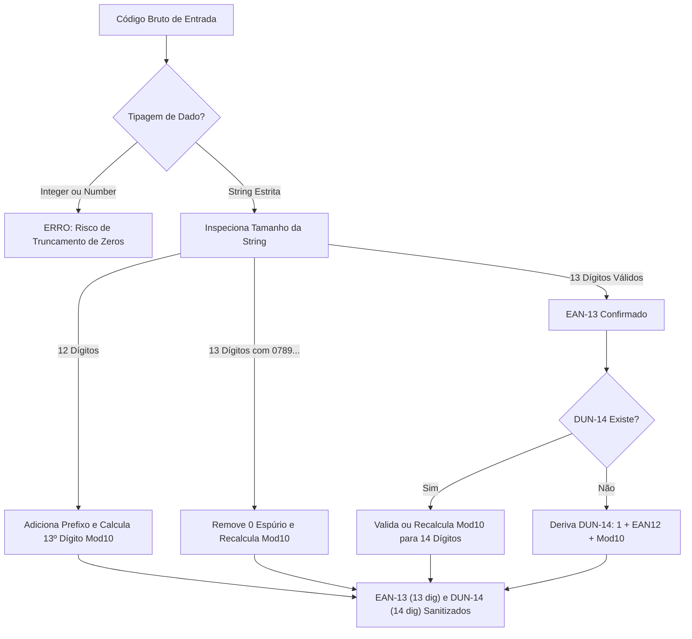

# 🧮 Core Engine: Heurísticas e Normalizadores

O diretório [`core/`](file:///root/paletscan-etl/core/) abriga os algoritmos de sanitização, normalização e heurísticas de domínio do PaletScan ETL. É o responsável por transformar dados brutos e ruidosos vindos da web em registros padronizados com alta integridade de negócios.

---

## 🔤 1. Normalização de Texto e Pesos (`text_parser.ts`)

O arquivo [`core/normalizers/text_parser.ts`](file:///root/paletscan-etl/core/normalizers/text_parser.ts) implementa regras estritas de padronização textual voltadas para a indústria alimentícia em Português (PT-BR).

### A. Conversão de Caixa e Preservação de Acentos (Title Case PT-BR)
- Converte textos em `ALL CAPS` para `Title Case`.
- Preserva acentuações corretas da língua portuguesa (ex: *"FILÉ DE PEITO DE FRANGO"* ➔ *"Filé de Peito de Frango"*).
- Prepara conjunções e preposições curtas em minúsculo (*de, da, do, com, em, e*).

### B. Extração de Pesos Numéricos e Detecção de Peso Variável
- **Pesos Fixos (`peso_gramas`)**: Extrai valores gramaticais e converte para gramas numéricas inteiras (ex: `"500g"` ➔ `500`, `"1.2kg"` ➔ `1200`).
- **Cortes por Peso Variável**: Identifica cortes de carne e produtos vendidos por pesagem dinâmica na câmara fria (ex: *"peça vácuo"*, *"peso variável"*), ajustando a descrição do produto para incluir o sufixo `(pesar)`.

---

## 🔢 2. Algoritmos Matemáticos Modulus 10 (GS1 EAN-13 & DUN-14)

A validação de códigos de barras é uma das etapas mais críticas do PaletScan. Códigos mal formatados ou com zeros truncados inviabilizam a leitura no scanner do operador.

### 🛡️ A. Tipagem Estrita como String
Todas as funções de código de barras trabalham **exclusivamente com o tipo `string`**. Isso impede que compiladores ou bibliotecas convertam códigos iniciados em zero (como `07891515...`) em números inteiros, o que causaria a perda irreparable de zeros à esquerda.

### 📐 B. Função `normalizeEAN13` (GS1 Modulus 10)
- **Sanitização de Zeros Espúrios**: Detecta sequências de 13 dígitos iniciadas com zero indevido (`0789...` ou `0790...`), limpa o zero inicial e recalcula o dígito verificador real.
- **Tratamento de 12 Dígitos**: Caso o fornecedor retorne um EAN de 12 dígitos, calcula matematicamente o 13º dígito verificador utilizando o algoritmo estipulado pela GS1:

$$\text{Soma} = \sum_{i=1}^{12} d_i \times w_i \quad \text{onde } w_i = 1 \text{ (posições ímpares)}, w_i = 3 \text{ (posições pares)}$$

$$\text{Dígito Verificador} = (10 - (\text{Soma} \bmod 10)) \bmod 10$$

### 📦 C. Função `normalizeDUN14` e Derivação Logística
- **Validação de DUN-14**: Garante que o código logístico da caixa (DUN-14) possua exatamente 14 dígitos e passe no teste Modulus 10.
- **Derivação Automática a partir do EAN-13**: Quando o fornecedor B2B não disponibiliza o DUN-14 da caixa, o PaletScan constrói o DUN-14 determinístico utilizando a regra logística internacional:

$$\text{DUN-14 Derivado} = \text{'1'} + \text{EAN13}_{[1..12]} + \text{Modulus10}(\text{'1'} + \text{EAN13}_{[1..12]})$$

---

## 🏷️ 3. Classificadores e Heurísticas de Domínio (`core/heuristics/`)

### A. Classificação de Marcas (`brand_classifier.ts`)
O módulo [`brand_classifier.ts`](file:///root/paletscan-etl/core/heuristics/brand_classifier.ts) identifica a marca do produto através da análise de padrões de texto e fallback para holdings de fabricantes:
- **Padrões Regex**: Detecta variações comerciais como *Friboi Reserva, Maturatta Friboi, Swift, Seara Gourmet, Mataboi, Minerva Prime, 1953 Friboi*.
- **Mapeamento de Fabricante**: Associa automaticamente a marca à Holding correspondente (ex: *Friboi* ➔ *JBS S.A.*).

### B. Classificação de Categorias e Conservação (`category_classifier.ts`)
O módulo [`category_classifier.ts`](file:///root/paletscan-etl/core/heuristics/category_classifier.ts) implementa a **Taxonomia Canônica Oficial do PaletScan**, eliminando fragmentações, duplicidades de singular/plural e corrigindo escapes Unicode (como `\u00ed` ➔ `í`):

#### 🛡️ Regras e Recursos do Motor:
1. **Decodificação Automática de Unicode (`decodeUnicodeEscapes`)**: Normaliza strings ruidosas de fontes web (ex: `Su\u00ednos` ➔ `Suínos`).
2. **Delimitação Estrita de Palavra (`\b`)**: Impede sobreposições semânticas (ex: *Peito Brisket Bovino* não vira *Aves*; *Polvo Tenderizado* não vira *Suínos* por causa de `tender`).
3. **Priorização Hierárquica**: Itens *Plant-Based*, *Vegetais Puros*, *Sobremesas* e *Laticínios* são avaliados antes de cair em categorias de carnes ou embutidos.

#### 🏷️ As 10 Classes Canônicas Oficiais:

| Classe Canônica | Descrição e Abrangência | Principais Termos / Exemplo |
| :--- | :--- | :--- |
| **Bovinos** | Cortes bovinos in natura, maturados, miúdos bovinos e jerked beef. | *Alcatra, Contrafilé, Picanha, Mignon, Costela Bovina, Acém, Brisket, Cupim* |
| **Suínos** | Cortes suínos in natura, temperados, pernil, lombo, costela e banha suína. | *Bisteca Suína, Costelinha, Lombo Suíno, Pernil, Panceta, Toucinho, Bacon* |
| **Aves** | Cortes de frango, galinha, peru, chester, cortes IQF e miúdos de aves. | *Filé de Peito, Coxa, Sobrecoxa, Asa, Tulipa, Sassami, Coração de Frango* |
| **Pescados** | Peixes inteiros, postas, filés congelados, frutos do mar e crustáceos. | *Tilápia, Salmão, Bacalhau, Merluza, Polaca, Camarão, Polvo, Kani Kama* |
| **Ovinos & Caprinos** | Cortes de cordeiro, carneiro e caprinos. | *Paleta Ovina, Cordeiro, Espinazo, Hasta, Nirea* |
| **Processados & Embutidos** | Embutidos cárneos, hambúrgueres, linguiças, salsichas, pizzas, lasanhas, cestas e kits natalinos. | *Linguiça Toscana, Salsicha, Mortadela, Presunto, Hambúrguer, Nugget, Pizza, Lasanha, Cestas* |
| **Vegetais & Congelados** | Legumes, seletas mistas, ervilhas, milho, batatas pré-fritas, mandiocas e polpas. | *Seleta Mista, Brócolis, Couve-Flor, Ervilha, Batata Palito/Rústica, Mandioca* |
| **Plant-Based & Vegetarianos** | Produtos 100% vegetais análogos de carnes (substitutos vegetais). | *Linha Incrível!, Sadia Veg&Tal, Plantplus, Hambúrguer 100% Vegetal* |
| **Laticínios, Margarinas & Gorduras** | Margarinas, queijos fatiados/peça, manteigas, requeijões, bebidas lácteas e gorduras. | *Margarina Doriana, Queijo Prato, Queijo Mussarela Soltíssimo, Requeijão* |
| **Sobremesas & Panificação** | Tortas doces congeladas, mousses, sobremesas, pães de queijo, panetones e bolos. | *Torta Mousse Miss Daisy, Torta Holandesa, Pão de Queijo Qualy/Perdigão* |
