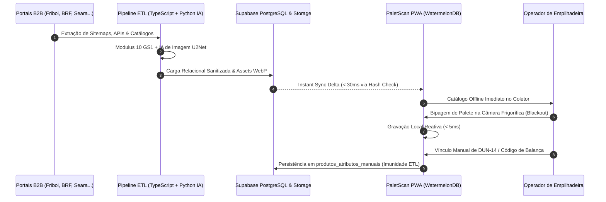

# 🌐 Ecossistema PaletScan - Simbiose entre Engenharia de Dados & PWA

[](index.md)
[](pwa-visao-geral.md)
[](supabase.md)
[](processamento-imagens.md)

> O **Ecossistema PaletScan** é uma solução industrial completa e integrada, projetada para eliminar perdas financeiras por vencimento, acelerar o giro de mercadorias perecíveis (**FEFO / PVPS**) e garantir precisão cirúrgica no endereçamento de paletes em câmaras frigoríficas industriais (congelados e resfriados).

---

## 🧬 1. A Simbiose Perfeita: Do B2B ao Chão de Fábrica

O PaletScan une duas frentes de tecnologia que operam em harmonia contínua:

```mermaid
flowchart TD
    subgraph CamadaETL ["1. Camada de Inteligência & ETL"]
        A1["Scrapers B2B Multi-Fornecedores"] --> A2["Normalização & Heurísticas"]
        A2 --> A3["Pipeline de IA de Imagens (U2Net)"]
        A3 --> A4["Validação Matemática Modulus 10 (GS1)"]
    end

    subgraph NuvemDB ["2. Núcleo Relacional Supabase PostgreSQL"]
        B1[("Catálogo Mestre de Produtos e Marcas")]
        B2[("Tabela Imutável produtos_atributos_manuais")]
        B3[("Views Relacionais Otimizadas (vw_produtos_com_marcas)")]
    end

    subgraph CamadaPWA ["3. Camada Operacional PWA Local-First"]
        C1["Service Worker Serwist (sw.ts) & App Shell"] --> C2["Banco Local Reativo WatermelonDB (< 5ms)"]
        C2 --> C3["Leitor de Câmera & Recorte Óptico Interativo"]
        C3 --> C4["Funil de Regex Industrial (GS1 / Data Matrix / Lar +365d)"]
    end

    CamadaETL -->|Carga de Dados Master| NuvemDB
    NuvemDB -->|Instant Sync < 30ms| CamadaPWA
    CamadaPWA -->|Fila pending_sync (Reconexão)| NuvemDB
```

1. **Camada de Inteligência de Dados (ETL & Pipelines)**:
   - Extrai e higieniza continuamente catálogos industriais B2B dos maiores frigoríficos e indústrias alimentícias (**Friboi, JBS, BRF Sadia/Perdigão, Seara, Aurora, Copacol, Lar Cooperativa**).
   - Aplica validação matemática estrita de **Modulus 10 (GS1)** para códigos EAN-13 e DUN-14.
   - Processa fotos de produtos através de redes neurais artificiais (**U2Net / ONNX / rembg**), gerando assets transparentes otimizados em WebP.
   - Alimenta o banco de dados mestre no **Supabase PostgreSQL**.

2. **Camada de Operação de Campo (PWA Local-First)**:
   - Progressive Web App instalável que consome a base mestre e opera **100% offline** dentro de câmaras frias através do **WatermelonDB (IndexedDB / LokiJS)**.
   - Decodifica códigos complexos (GS1-128, Data Matrix 2D, regra Lar `+365 dias`, BRF, pesagem dinâmica) com tempo de resposta inferior a **5 milissegundos**.
   - Gerencia alocação de vagas em coordenadas de 4 dígitos (`A10D` a `B53E`), controle de inventário físico, listas prioritárias (Watchlist com confetes) e exportação de relatórios executivos.

---

## 🎯 2. Autoria e Origem Operacional

O projeto foi integralmente idealizado, desenhado e desenvolvido por **Jean Barbosa**, Operador de Empilhadeira do setor de Perecíveis na **Loja 410 do Fort Atacadista no Rio Tavares (Florianópolis - SC)**, em parceria estratégica com o **Agente Antigravity** (IA da Google DeepMind).

> [!IMPORTANT]
> **Engenharia Autônoma 100% Mobile**:  
> Todo o ecossistema — desde os scrapers em TypeScript, pipelines de visão computacional em Python, banco de dados relacional e a aplicação PWA em React/Next.js — foi **codificado e mantido a partir de um smartphone pessoal**, utilizando o emulador de terminal **Termux** com distribuição Linux containerizada (**PRoot Ubuntu**).

---

## 🔄 3. Ciclo de Vida da Informação Ponta a Ponta



---

## 🛠️ 4. Sumário da Stack Tecnológica Unificada

| Camada | Tecnologia | Função no Ecossistema |
| :--- | :--- | :--- |
| **Pipeline ETL & Core** | `TypeScript 5` / `Node.js 20` | Scrapers concorrentes, parsing XML/JSON, heurísticas e validação Modulus 10. |
| **Visão Computacional (IA)** | `Python 3` / `rembg (U2Net)` / `Pillow` | Remoção de fundo via redes neurais, recorte automático e compressão WebP. |
| **Banco Nuvem & Storage** | `Supabase` (PostgreSQL 15) | Banco relacional master, Row Level Security (RLS) e Storage Buckets. |
| **Frontend PWA** | `Next.js 14` (Pages Router) | Framework React para aplicação PWA industrial Touch-First. |
| **Service Worker & Cache** | `@serwist/next` & Serwist | App Shell precaching, navegação offline e cache inteligente de imagens. |
| **Banco Reativo Local** | `WatermelonDB v11` (IndexedDB / LokiJS) | Operação offline de alta performance com tempos de resposta < 5ms. |
| **Leitor Óptico & Scanner** | `@zxing/library` & `BarcodeDetector API` | Leitura em tempo real pela câmera e upload com recorte interativo (`react-zoom-pan-pinch`). |
| **Autenticação & Segurança** | `NextAuth.js` & `@simplewebauthn` | Login por senha, QR Code móvel e biometria/Passkeys FIDO2. |
| **Busca & Gamificação** | `fuzzball` & `canvas-confetti` | Busca fonética por aproximação e celebração visual no Radar Watchlist. |
| **Exportação de Dados** | `jspdf` & `jspdf-autotable` | Geração client-side de relatórios tabulares em PDF e CSV (CP1252) com Android MediaScan. |

---

## 📚 5. Guia de Navegação na Documentação

Explore os módulos completos do ecossistema organizados por área:

### 🏛️ Ecossistema & Arquitetura
* [Arquitetura Integrada Ponta a Ponta](arquitetura-ecossistema.md): Detalhamento dos contratos de dados, resolução de conflitos e isolamento de overrides manuais.
* [Dev Móvel no Smartphone & Termux](desenvolvimento-termux.md): Ambiente Linux no celular, compilação de assets, automação e desenvolvimento assistido por IA.

### 📱 Aplicação PWA Local-First
* [Visão Geral & Conceito PWA](pwa-visao-geral.md): Funcionalidades operacionais, interface Touch-First e métricas de chão de fábrica.
* [Service Worker & Resiliência Offline](pwa-service-worker.md): Estratégias de cache Serwist, ciclo de vida do Service Worker e operação em câmaras frigoríficas.
* [Leitor Câmera & Regex Industrial](pwa-scanner-regex.md): Motores de câmera, decodificação GS1-128, Data Matrix 2D, regra Lar (+365 dias) e pesagem dinâmica.
* [Endereçamento & Vagas de Câmaras](pwa-vagas-zoneamento.md): Coordenadas de 4 caracteres, zoneamento R1/R2/C1/C2 e prevenção de vagas duplicadas.
* [Pesquisa, Consulta & Radar Watchlist](pwa-pesquisa-watchlist.md): Busca Fuzzy, múltiplas Watchlists, celebração com confetes e vínculos de caixas DUN-14.
* [Relatórios, Conferência & Auditoria](pwa-relatorios-auditoria.md): Modo conferência física com checklist, expurgo em massa e relatórios CSV/PDF com MediaScan.
* [Autenticação, Passkeys & Permissões](pwa-auth-permissoes.md): Sessões híbridas offline, biometria WebAuthn FIDO2, matriz de permissões RBAC e APIs serverless.

### ⚙️ Engenharia de Dados (ETL & Pipeline)
* [Guia de Operações & CLI](operacoes.md): Comandos da interface de linha de comando, modos de execução e fluxos do pipeline.
* [Scrapers Multi-Fornecedores](scrapers-multi-fornecedores.md): Engenharia reversa e extração B2B de Aurora, BRF, Copacol, Friboi, Lar e Seara.
* [Pipeline Friboi / JBS](pipeline-friboi.md): Pipeline especializado com APIs Oracle, sessões e paginação concorrente.
* [Normalizadores & Heurísticas](heuristicas-normalizadores.md): Classificação taxonômica, padronização de pesos e algoritmos Modulus 10.
* [Pipeline de IA de Imagens](processamento-imagens.md): Arquitetura de processamento visual com U2Net e otimização WebP.
* [Governança de Schema & Manifesto](schema-manifesto.md): Validação Draft-07 e integridade de dados em staging.
* [Sincronização com Supabase](supabase.md): Scripts de conciliação relacional, tratamento de duplicidades e Storage CDN.
* [Glossário & Referências](glossario.md): Dicionário de termos técnicos de logística, GS1, PWA e banco de dados.
