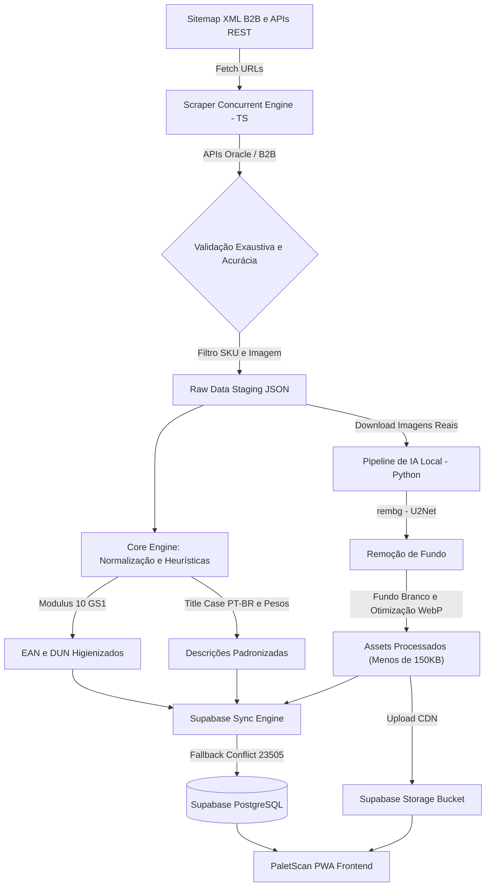

# 📦 PaletScan ETL - Visão Geral da Arquitetura

> **PaletScan** é uma solução de alto desempenho para escaneamento de códigos de barras (`EAN` / `DUN`), controle de validades e endereçamento dinâmico de paletes em câmaras frias da indústria alimentícia (congelados e resfriados).

---

## 💡 1. Contexto e Engenharia de Origem

O **PaletScan ETL** foi idealizado e construído por **Jean Barbosa (Operador de Empilhadeira)**, desenvolvido originalmente a partir de um smartphone Android rodando um ambiente containerizado Linux (Ubuntu no Termux). O projeto une o conhecimento prático de chão de fábrica e movimentação logística de câmaras frias à engenharia de software e arquitetura de dados profissional.

O pipeline de ETL (*Extract, Transform, Load*) é responsável por extrair dados ao vivo de portais B2B fornecedores, higienizar descrições, validar com acurácia códigos de barras tratados com algoritmos matemáticos **Modulus 10 (GS1)**, processar imagens de produtos via Inteligência Artificial local e alimentar o banco de dados relacional no **Supabase**.

---

## 🔄 2. Fluxo Geral de Dados (Data Pipeline)

O diagrama abaixo sintetiza o ciclo de vida completo do dado, desde a extração B2B até a disponibilidade no aplicativo PWA:



---

## 🛠️ 3. Stack Tecnológica

| Camada | Tecnologia | Função no Projeto |
| :--- | :--- | :--- |
| **Scraping & Core** | `TypeScript` / `Node.js` | Concorrência de requisições, parsing de sitemaps XML, validações Modulus 10 e execução do pipeline. |
| **Processamento Visual (IA)** | `Python 3` / `rembg` / `Pillow` | Remoção de fundo via redes neurais (U2Net/ONNX), achatamento Alpha e otimização WebP. |
| **Banco de Dados & Storage** | `PostgreSQL` / `Supabase` | Modelo relacional resiliente, IDs determinísticos UUIDv5, Storage Bucket para imagens. |
| **Governança & Staging** | `JSON Schema (Draft-07)` | Validação estrita de contratos de dados em staging antes do carregamento final. |
| **CI/CD & Documentação** | `MkDocs Material` / `GitHub Actions` | Geração automática da documentação técnica e deploy contínuo no GitHub Pages. |

---

## 🏛️ 4. Estrutura do Repositório

```text
paletscan-etl/
├── core/
│   ├── heuristics/         # Classificadores de marcas, categorias e conservação
│   ├── manifest/           # Contrato de dados (schema_manifest.json)
│   └── normalizers/        # Parser de texto, pesos e geradores EAN-13/DUN-14 Modulus 10
├── db_sync/                # Scripts de sincronização relacional e de mídias no Supabase
├── docs/                   # Documentação técnica em Markdown (MkDocs)
├── images/
│   ├── ai_pipeline/        # Script Python com rembg e Pillow para tratamento de imagens
│   ├── raw/                # Imagens brutas baixadas
│   ├── processed/          # Imagens tratadas com fundo branco em WebP
│   └── archived/           # Imagens sincronizadas com o Supabase Storage
├── scrapers/               # Scrapers concorrentes em tempo real (ex: Friboi)
├── staging/                # Arquivos JSON sanitizados prontos para sync
└── mkdocs.yml              # Arquivo de configuração da documentação
```
