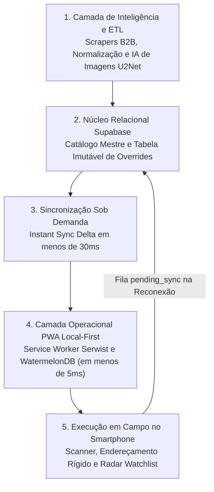
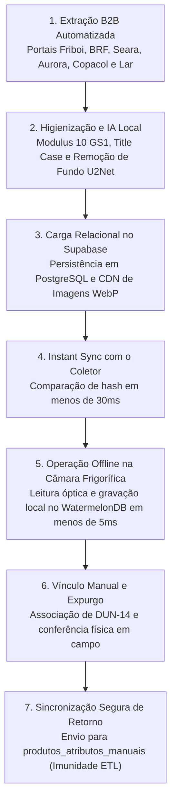
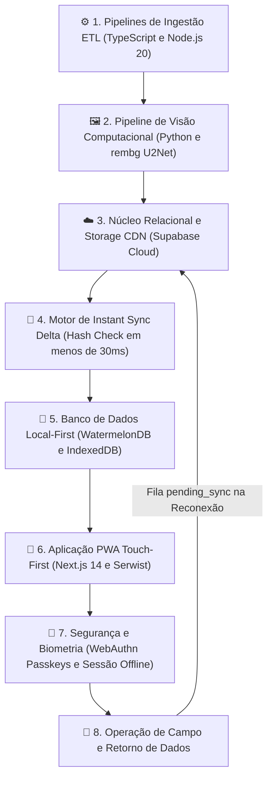

# 🌐 Ecossistema PaletScan - Simbiose entre Engenharia de Dados & PWA

  
  
  
  
  
  
  
  
  
  
  

> O **Ecossistema PaletScan** é uma solução industrial completa e integrada, projetada para eliminar perdas financeiras por vencimento, acelerar o giro de mercadorias perecíveis (**FEFO / PVPS**) e garantir precisão cirúrgica no endereçamento de paletes em câmaras frigoríficas industriais (congelados e resfriados).

---

## 🧬 1. A Simbiose Perfeita: Do B2B ao Chão de Fábrica

O PaletScan une duas frentes de tecnologia que operam em harmonia contínua através de uma esteira vertical integrada:

1. **Camada de Inteligência de Dados (ETL & Pipelines)**:
   - Extrai e higieniza continuamente catálogos industriais B2B dos maiores frigoríficos e indústrias alimentícias (**Friboi, JBS, BRF Sadia/Perdigão, Seara, Aurora, Copacol, Lar Cooperativa**).
   - Aplica validação matemática estrita de **Modulus 10 (GS1)** para códigos EAN-13 e DUN-14.
   - Processa fotos de produtos através de redes neurais artificiais (**U2Net / ONNX / rembg**), gerando assets transparentes otimizados em WebP.
   - Alimenta o banco de dados mestre no **Supabase PostgreSQL**.

2. **Camada de Operação de Campo (PWA Local-First)**:
   - Progressive Web App instalável que consome a base mestre e opera **100% offline** dentro de câmaras frias através do **WatermelonDB (IndexedDB / LokiJS)**.
   - Decodifica códigos complexos (GS1-128, Data Matrix 2D, regra Lar `+365 dias`, BRF, pesagem dinâmica) com tempo de resposta inferior a **5 milissegundos**.
   - Gerencia alocação de vagas em coordenadas de 4 dígitos (`A10D` a `B53E`), controle de inventário físico, listas prioritárias (Watchlist com confetes) e exportação de relatórios executivos.

---

## 🎯 2. Autoria e Origem Operacional

O projeto foi integralmente idealizado, desenhado e desenvolvido por **Jean Barbosa**, Operador de Empilhadeira do setor de Perecíveis na **Loja 410 do Fort Atacadista no Rio Tavares (Florianópolis - SC)**, em parceria estratégica com o **Agente Antigravity** (IA da Google DeepMind).

> [!IMPORTANT]
> **Engenharia Autônoma 100% Mobile**:  
> Todo o ecossistema — desde os scrapers em TypeScript, pipelines de visão computacional em Python, banco de dados relacional e a aplicação PWA em React/Next.js — foi **codificado e mantido a partir de um smartphone pessoal**, utilizando o emulador de terminal **Termux** com distribuição Linux containerizada (**PRoot Ubuntu**).

---

## 🔄 3. Ciclo de Vida da Informação Ponta a Ponta

Abaixo, o fluxo de dados industrial é apresentado em formato vertical para leitura clara em smartphones e coletores móveis:

---

## 🧩 4. A Simbiose Tecnológica: Como as Tecnologias se Relacionam

A arquitetura do PaletScan foi desenhada para que cada tecnologia complemente a outra de forma sinérgica e estritamente vertical:

### Detalhamento das Integrações:

1. **[Serwist (Service Worker)](https://serwist.pages.dev/) & [Next.js 14](https://nextjs.org/)**:
   - O Serwist compila e orquestra o Service Worker (`sw.ts`), interceptando requisições de rede. Ele faz o *precaching* de todo o App Shell do Next.js e aplica a estratégia `CacheFirst` nas imagens dos produtos, garantindo que o operador nunca veja uma tela em branco no interior das câmaras frias.

2. **[WatermelonDB](https://watermelondb.dev/) & [IndexedDB API](https://developer.mozilla.org/en-US/docs/Web/API/IndexedDB_API)**:
   - Em vez de leituras diretas e lentas no IndexedDB ou uso do limitado `localStorage`, o PaletScan utiliza o WatermelonDB como camada de abstração reativa. Ele gerencia índices em memória e persiste no IndexedDB/LokiJS, permitindo buscas fonéticas instantâneas e mutações em **menos de 5 milissegundos**.

3. **[Supabase PostgreSQL](https://supabase.com/) & Sincronização Delta**:
   - O Supabase atua como a *Single Source of Truth* do ecossistema. O motor de sincronização (`sync.ts`) compara o hash do banco local com a nuvem em menos de 30ms. Mutações offline acumuladas são salvas na fila `pending_sync` e despachadas para o Supabase assim que o coletor detecta sinal de rede.

4. **[rembg (U2Net)](https://github.com/danielgatis/rembg) & [Python 3](https://www.python.org/)**:
   - O pipeline em Python processa localmente as fotos brutas baixadas pelos scrapers em TypeScript. A rede neural U2Net isola a embalagem do produto, aplica fundo branco puro `#FFFFFF` e converte para WebP de até 150KB. Esses ativos são armazenados no Supabase Storage e cacheados pelo Service Worker no coletor.

5. **[SimpleWebAuthn](https://simplewebauthn.dev/) & Biometria FIDO2**:
   - Elimina a necessidade de digitação de senhas com luvas térmicas no frio extremo através de autenticação por impressão digital ou reconhecimento facial (Passkeys), com suporte a cache de sessão offline (`ps_auth_session`).

6. **[Termux](https://termux.dev/) & [PRoot Ubuntu Linux](https://wiki.termux.com/wiki/PRoot)**:
   - Toda a esteira de engenharia de software — do desenvolvimento dos scrapers, treinamento de heurísticas, testes unitários até a publicação automatizada do MkDocs — é operada diretamente no smartphone do autor.

---

## 🛠️ 5. Sumário da Stack Tecnológica Unificada

| Camada | Tecnologia | Função no Ecossistema |
| :--- | :--- | :--- |
| **Pipeline ETL & Core** | [TypeScript 5](https://www.typescriptlang.org/) / [Node.js 20](https://nodejs.org/) | Scrapers concorrentes, parsing XML/JSON, heurísticas e validação Modulus 10. |
| **Visão Computacional (IA)** | [Python 3](https://www.python.org/) / [rembg (U2Net)](https://github.com/danielgatis/rembg) / [Pillow](https://python-pillow.org/) | Remoção de fundo via redes neurais, recorte automático e compressão WebP. |
| **Banco Nuvem & Storage** | [Supabase](https://supabase.com/) (PostgreSQL 15) | Banco relacional master, Row Level Security (RLS) e Storage Buckets. |
| **Frontend PWA** | [Next.js 14](https://nextjs.org/) (Pages Router) | Framework React para aplicação PWA industrial Touch-First. |
| **Service Worker & Cache** | [@serwist/next](https://serwist.pages.dev/) & Serwist | App Shell precaching, navegação offline e cache inteligente de imagens. |
| **Banco Reativo Local** | [WatermelonDB v11](https://watermelondb.dev/) ([IndexedDB](https://developer.mozilla.org/en-US/docs/Web/API/IndexedDB_API)) | Operação offline de alta performance com tempos de resposta rápidos (< 5ms). |
| **Leitor Óptico & Scanner** | [@zxing/library](https://github.com/zxing-js/library) & [BarcodeDetector API](https://developer.mozilla.org/en-US/docs/Web/API/Barcode_Detection_API) | Leitura em tempo real pela câmera e upload com recorte interativo (`react-zoom-pan-pinch`). |
| **Autenticação & Segurança** | [NextAuth.js](https://next-auth.js.org/) & [SimpleWebAuthn](https://simplewebauthn.dev/) | Login por senha, QR Code móvel e biometria/Passkeys FIDO2. |
| **Busca & Gamificação** | [fuzzball](https://github.com/wsorenson/fuzzball.js) & [canvas-confetti](https://www.kirilv.com/canvas-confetti/) | Busca fonética por aproximação e celebração visual no Radar Watchlist. |
| **Exportação de Dados** | [jspdf](https://github.com/parallax/jsPDF) & [jspdf-autotable](https://github.com/simonbengtsson/jsPDF-AutoTable) | Geração client-side de relatórios tabulares em PDF e CSV (CP1252) com Android MediaScan. |

---

## 📚 6. Guia de Navegação na Documentação

Explore os módulos completos do ecossistema organizados por área:

### 🏛️ Ecossistema & Arquitetura
* [Arquitetura Integrada Ponta a Ponta](arquitetura-ecossistema.md): Detalhamento dos contratos de dados, resolução de conflitos e isolamento de overrides manuais.
* [Dev Móvel no Smartphone & Termux](desenvolvimento-termux.md): Ambiente Linux no celular, compilação de assets, automação e desenvolvimento assistido por IA.

### 📱 Aplicação PWA Local-First
* [Visão Geral & Conceito PWA](pwa-visao-geral.md): Funcionalidades operacionais, interface Touch-First e métricas de chão de fábrica.
* [Service Worker & Resiliência Offline](pwa-service-worker.md): Estratégias de cache Serwist, ciclo de vida do Service Worker e operação em câmaras frigoríficas.
* [Leitor Câmera & Regex Industrial](pwa-scanner-regex.md): Motores de câmera, decodificação GS1-128, Data Matrix 2D, regra Lar (+365 dias) e pesagem dinâmica.
* [Endereçamento & Vagas de Câmaras](pwa-vagas-zoneamento.md): Coordenadas de 4 caracteres, zoneamento R1/R2/C1/C2 e prevenção de vagas duplicadas.
* [Pesquisa, Consulta & Radar Watchlist](pwa-pesquisa-watchlist.md): Busca Fuzzy, múltiplas Watchlists, celebração com confetes e vínculos de caixas DUN-14.
* [Relatórios, Conferência & Auditoria](pwa-relatorios-auditoria.md): Modo conferência física com checklist, expurgo em massa e relatórios CSV/PDF com MediaScan.
* [Autenticação, Passkeys & Permissões](pwa-auth-permissoes.md): Sessões híbridas offline, biometria WebAuthn FIDO2, matriz de permissões RBAC e APIs serverless.

### ⚙️ Engenharia de Dados (ETL & Pipeline)
* [Guia de Operações & CLI](operacoes.md): Comandos da interface de linha de comando, modos de execução e fluxos do pipeline.
* [Scrapers Multi-Fornecedores](scrapers-multi-fornecedores.md): Engenharia reversa e extração B2B de Aurora, BRF, Copacol, Friboi, Lar e Seara.
* [Pipeline Friboi / JBS](pipeline-friboi.md): Pipeline especializado com APIs Oracle, sessões e paginação concorrente.
* [Normalizadores & Heurísticas](heuristicas-normalizadores.md): Classificação taxonômica, padronização de pesos e algoritmos Modulus 10.
* [Pipeline de IA de Imagens](processamento-imagens.md): Arquitetura de processamento visual com U2Net e otimização WebP.
* [Governança de Schema & Manifesto](schema-manifesto.md): Validação Draft-07 e integridade de dados em staging.
* [Sincronização com Supabase](supabase.md): Scripts de conciliação relacional, tratamento de duplicidades e Storage CDN.
* [Glossário & Referências](glossario.md): Dicionário de termos técnicos de logística, GS1, PWA e banco de dados.
