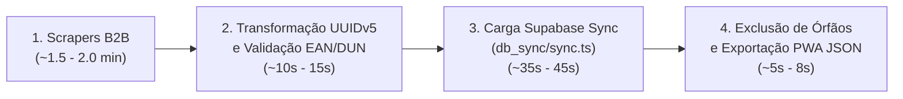

# 🛠️ Guia Prático de Operações, CLI e Manutenção de Dados

Este guia fornece os procedimentos operacionais padrão para administradores e engenheiros de dados executarem **limpeza de bases**, **execução do pipeline ETL**, **benchmarks de desempenho**, **acompanhamento de logs** e **verificação de saúde do sistema** no ecossistema PaletScan.

---

## 🧹 1. Limpeza de Bases de Dados (Supabase & WatermelonDB)

Quando for necessário resetar o ambiente antes de um novo ciclo de ingestão de dados, siga as instruções abaixo:

### A. Limpeza no Supabase (Remoto)
Existem duas formas seguras de excluir todos os dados das tabelas do Supabase mantendo a estrutura relacional pronta para novos inserts:

#### Opção 1: Via Script CLI (TypeScript / Node.js)
Execute o comando a partir do diretório raiz do `paletscan-etl`:

```bash
npx tsx -e '
import { createClient } from "@supabase/supabase-js";
import dotenv from "dotenv";
dotenv.config();

const supabase = createClient(process.env.SUPABASE_URL, process.env.SUPABASE_KEY);

async function wipeAll() {
  console.log("🧹 Limpando todas as tabelas do Supabase...");

  const { error: e1 } = await supabase.from("codigos_barras").delete().neq("id", "00000000-0000-0000-0000-000000000000");
  console.log("codigos_barras limpo:", e1?.message || "OK");

  const { error: e2 } = await supabase.from("produtos").delete().neq("id", "00000000-0000-0000-0000-000000000000");
  console.log("produtos limpo:", e2?.message || "OK");

  const { error: e3 } = await supabase.from("marcas").delete().neq("id", "00000000-0000-0000-0000-000000000000");
  console.log("marcas limpo:", e3?.message || "OK");

  const { error: e4 } = await supabase.from("fabricantes").delete().neq("id", "00000000-0000-0000-0000-000000000000");
  console.log("fabricantes limpo:", e4?.message || "OK");

  console.log("✅ Limpeza concluída!");
}

wipeAll();
'
```

#### Opção 2: Via Console SQL no Supabase
Caso prefira executar via interface administrativa do Supabase SQL Editor:

```sql
-- Exclusão rápida e segura em cascata
TRUNCATE TABLE codigos_barras, paletes_armazenados, produtos, marcas, fabricantes CASCADE;
```

---

### B. Limpeza no WatermelonDB (Dispositivos / PWA)
Para limpar a base de dados local SQLite / IndexedDB no aplicativo do coletor / navegador:

1. Abra o aplicativo PaletScan PWA.
2. Acesse o menu de **Configurações** $\rightarrow$ clique no botão **"Limpar Banco Local e Sincronizar"**.
3. O aplicativo limpará o WatermelonDB (`unsafeResetDatabase()`), zerará o `CacheStorage` do Service Worker, limpará o `localStorage` e executará o `pullChanges` limpo diretamente da nuvem.

---

## 🚀 2. Processo de Execução do Pipeline e Mapeamento de Desempenho

### A. Scrapers Primários e Tempos Médios de Execução
A camada de extração é composta por 4 scrapers especializados que realizam requisições HTTP paralelas aos portais institucionais e APIs B2B dos fabricantes:

| Scraper / Fabricante | Diretório do Módulo | Itens Brutos Coletados | Tempo Médio de Execução |
| :--- | :--- | :--- | :--- |
| **Friboi / JBS / Swift** | `scrapers/friboi/` | ~1.812 itens brutos | **35s a 45s** |
| **Seara Alimentos** | `scrapers/seara/` | ~621 itens brutos | **20s a 30s** |
| **BRF (Sadia / Perdigão)** | `scrapers/brf/` | ~1.120 itens brutos | **25s a 35s** |
| **Cooperativa Lar** | `scrapers/lar/` | ~111 itens brutos | **5s a 10s** |

Para re-extrair dados brutos dos portais institucionais B2B:

```bash
# Scraper Friboi / JBS / Swift
npm run scrape:friboi

# Scraper Seara (Multi-Site 100% Live: B2B, B2C, E-Com)
npm run scrape:seara

# Scraper BRF (Sadia, Perdigão, Qualy, Central MBRF, Catalogo PDF)
npx tsx scrapers/brf/index.ts

# Scraper Lar (Cooperativa Agroindustrial Lar)
npx tsx scrapers/lar/index.ts
```

---

### B. Ciclo Completo do Pipeline e Tempo Médio Geral
O pipeline completo de tratamento, normalização, carga no Supabase e exportação do catálogo PWA opera em 4 etapas sequenciais automatizadas:



| Etapa do Pipeline | Script Executado | Descrição da Operação | Tempo Médio |
| :--- | :--- | :--- | :--- |
| **1. Extração Concorrente** | Scrapers B2B (Friboi, Seara, BRF, Lar) | Varredura de sitemaps XML e APIs REST dos 4 fabricantes. | **1.5 min a 2.0 min** |
| **2. Transformação Relacional** | Core Engine (`core/`) | Validação estrita de EANs, conversão para UUIDv5 e normalização de `EAN`/`DUN`. | **10s a 15s** |
| **3. Sincronização Supabase** | `db_sync/sync.ts` | Upsert ordenado nas tabelas `fabricantes` $\rightarrow$ `marcas` $\rightarrow$ `produtos` $\rightarrow$ `codigos_barras`. | **35s a 45s** |
| **4. Sanitização & Exportação** | `generate_pwa_produtos_json.ts` | Expurgativo de produtos sem EAN e geração de `produtos.json` para o PWA. | **5s a 8s** |
| **TEMPO TOTAL DO PIPELINE** | **Pipeline Completo** | **Ciclo completo de ponta a ponta (ingestão a publicação PWA).** | **~2.5 min a 3.0 min** |

---

### C. Relação Atual de Fabricantes, Marcas e Produtos no Banco

Com a conclusão do pipeline, a base relacional apresenta a seguinte distribuição consolidada de registros auditados:

| Fabricante (Holding) | Marcas Principais Mapeadas | Produtos Validados (com EAN) | Códigos de Barras (EAN + DUN) |
| :--- | :--- | :--- | :--- |
| **JBS S.A. (Friboi)** | Friboi, Reserva, Maturatta, 1953, Swift, Do Chef, Friboi Black | **1.501** | 4.503 |
| **BRF S.A.** | Sadia, Perdigão, Qualy, Chester, MBRF | **1.025** | 3.073 |
| **Seara Alimentos LTDA** | Seara, Seara Gourmet, Incrível, Rezende, Wilson | **365** | 699 |
| **Cooperativa Lar** | Lar Alimentos | **110** | 220 |
| **TOTAL GERAL** | **141 Marcas Comerciais** | **3.001 Produtos** | **8.495 Códigos** |

---

### D. Comandos para Execução e Sincronização Automatizada

Para rodar a carga relacional otimizada no Supabase e gerar o catálogo do PWA em um único fluxo:

```bash
# Sincroniza todos os arquivos de staging com o Supabase
npm run sync:supabase

# Exporta o catálogo produtos.json padronizado para o PWA
npx tsx scripts/generate_pwa_produtos_json.ts

# Executa auditoria exaustiva de integridade e anomalias
npx tsx scripts/audit_database.ts
```

---

## 📊 3. Acompanhamento de Logs e Auditoria

### A. Monitoramento de Conflitos de EAN / DUN (`conflicts_log.json`)
Códigos de barras duplicados ou com colisões cross-scraper são registrados em `staging/conflicts_log.json`:

```bash
# Exibir últimos conflitos registrados no staging
cat staging/conflicts_log.json | tail -n 40
```

### B. Acompanhamento de Relatórios de Auditoria (`audit_report.json`)
Para verificar se existem produtos sem código ou com anomalias de EAN:

```bash
# Exibir relatório de auditoria gerado pelo audit_database.ts
cat staging/audit_report.json
```

---

## 🔍 4. Verificação de Saúde das Bases

Para consultar a contagem exata de registros salvos no Supabase a qualquer momento:

```bash
npx tsx -e '
import { createClient } from "@supabase/supabase-js";
import dotenv from "dotenv";
dotenv.config();

const supabase = createClient(process.env.SUPABASE_URL, process.env.SUPABASE_KEY);

async function verify() {
  const { count: prodCount } = await supabase.from("produtos").select("*", { count: "exact", head: true });
  const { count: codCount } = await supabase.from("codigos_barras").select("*", { count: "exact", head: true });
  const { count: marcaCount } = await supabase.from("marcas").select("*", { count: "exact", head: true });
  const { count: fabCount } = await supabase.from("fabricantes").select("*", { count: "exact", head: true });

  console.log("📊 STATUS ATUAL DAS BASES (SUPABASE):");
  console.log(` 🏢 Fabricantes:        ${fabCount}`);
  console.log(` 🏷️  Marcas:             ${marcaCount}`);
  console.log(` 🥩 Produtos:           ${prodCount}`);
  console.log(` 📊 Códigos de Barras:  ${codCount}`);
}

verify();
'
```
