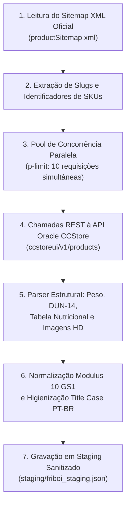

# 🥩 Pipeline Friboi / JBS & Oracle CCStore

O pipeline de extração e higienização da **JBS / Friboi** ([`scrapers/friboi/`](file:///root/paletscan-etl/scrapers/friboi/)) é o mais complexo e volumoso do PaletScan ETL, abrangendo mais de 1.800 SKUs de cortes bovinos resfriados, congelados, porcionados e industrializados.

---

## 🏗️ 1. Arquitetura de Ingestão em Duas Etapas

Em vez de scraping de páginas HTML, o pipeline Friboi conecta-se diretamente às APIs da plataforma **Oracle Commerce Cloud (CCStore)** da JBS:



---

## 🏷️ 2. Marcas Mapeadas no Grupo JBS

O pipeline classifica e isola automaticamente as seguintes marcas canônicas da holding:
* **Friboi Tradicional**: Linha principal de cortes in-natura resfriados e congelados.
* **Maturatta Friboi**: Cortes nobres maturados para churrasco.
* **1953 Friboi**: Linha premium de cruzamento de raças europeias.
* **Reserva Friboi**: Cortes selecionados para autosserviço e atacarejo.
* **Do Chef Friboi**: Embalagens institucionais para food service.
* **Black Friboi**: Linha super-premium de marmoreio elevado.
* **Swift**: Cortes congelados e pratos prontos associados.

---

## 📦 3. Extração e Resolução de DUN-14 e Pesagem Dinâmica

### A. Resolução de Caixa de Embarque (DUN-14)
A API Oracle retorna propriedades personalizadas para logística de atacarejo:
- `x_dun14` / `x_codigoCaixa`: Código de 14 dígitos da caixa master.
- `x_quantidadePorCaixa`: Número de unidades por caixa de despacho.
- `x_pesoMedioCaixa`: Peso médio em quilos para conferência de tara.

### B. Tratamento de Produtos Fracionados (`pesar`)
Para peças inteiras com peso variável (como *Picanha*, *Costela*, *Alcatra* e *Fraldinha*):
- O script identifica o atributo `x_pesoVariavel: true` ou termos na descrição (*"peça a vácuo"*).
- Insere automaticamente o indicativo `(pesar)` no nome do produto, instruindo o PWA a exigir o input de pesagem na balança pelo operador.

---

## ⚡ 4. Execução do Pipeline via Linha de Comando

```bash
# Executar a extração completa da Friboi
npm run scrape:friboi

# Executar a normalização e staging
npm run normalize:friboi
```
