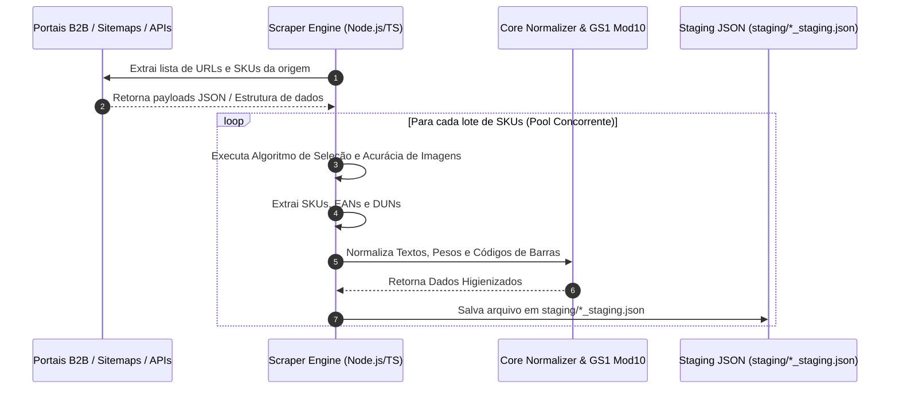

# 🛒 Scrapers e Pipelines de Extração Multi-Fornecedores

O módulo de extração do **PaletScan ETL** ([`scrapers/`](file:///root/paletscan-etl/scrapers/)) é composto por pipelines de web scraping de alta concorrência projetados para coletar catalogação atualizada, dados nutricionais, códigos logísticos e mídias de produtos diretamente dos portais institucionais e APIs B2B dos 4 maiores grupos frigoríficos e alimentícios parceiros: **JBS / Friboi**, **Seara Alimentos**, **BRF S.A.** e **Cooperativa Lar**.

---

## 📊 1. Matriz Comparativa dos Scrapers B2B

| Fabricante (Holding) | Diretório do Scraper | Estratégia de Captura | Produtos Brutos | Produtos Validados (com EAN) | Tempo Médio |
| :--- | :--- | :--- | :--- | :--- | :--- |
| **JBS S.A. (Friboi)** | [`scrapers/friboi/`](file:///root/paletscan-etl/scrapers/friboi/index.ts) | Sitemap XML + API REST Oracle CCStore | ~1.812 | **1.501** | **35s a 45s** |
| **BRF S.A.** | [`scrapers/brf/`](file:///root/paletscan-etl/scrapers/brf/index.ts) | Catálogo PDF + Central MBRF REST | ~1.120 | **1.025** | **25s a 35s** |
| **Seara Alimentos** | [`scrapers/seara/`](file:///root/paletscan-etl/scrapers/seara/index.ts) | Multi-site B2B/B2C + E-Commerce Live | ~621 | **365** | **20s a 30s** |
| **Cooperativa Lar** | [`scrapers/lar/`](file:///root/paletscan-etl/scrapers/lar/index.ts) | Portal Institucional Lar Alimentos | ~111 | **110** | **5s a 10s** |

---

## 🏗️ 2. Arquitetura Geral de Extração Concorrente

Os scrapers do PaletScan não dependem de varreduras HTML lentas via navegadores automatizados (Selenium/Puppeteer). Em vez disso, utilizam um fluxo em duas etapas otimizado para requisições HTTP diretas e concorrência controlada via `p-limit`:



---

## 🏭 3. Detalhamento dos Pipelines de Ingestão por Fornecedor

### A. Pipeline JBS / Friboi (`scrapers/friboi/`)
- **Marcas Mapeadas**: Friboi, Reserva, Maturatta Friboi, 1953 Friboi, Swift, Do Chef, Black Friboi.
- **Estratégia**: Varredura inicial no endpoint XML `https://www.friboionline.com.br/productSitemap.xml`, seguida de requisições concorrentes paralelas à API REST `ccstoreui/v1/products/` da Oracle Commerce Cloud.
- **Diferencial**: Captura detalhada de tabelas nutricionais, peças por caixa, peso médio e DUN-14 da caixa de despacho.

### B. Pipeline BRF S.A. (`scrapers/brf/`)
- **Marcas Mapeadas**: Sadia, Perdigão, Qualy, Chester, Central MBRF.
- **Estratégia**: Ingestão combinada de APIs REST da Central MBRF com parsing estruturado do catálogo oficial de produtos em PDF.
- **Diferencial**: Resolução exata de códigos EAN primários de cortes congelados e de produtos processados para exportação.

### C. Pipeline Seara Alimentos (`scrapers/seara/`)
- **Marcas Mapeadas**: Seara, Seara Gourmet, Incrível (Plant-Based), Rezende, Wilson.
- **Estratégia**: Varredura multi-site ao vivo cobrindo os portais institucionais B2B, B2C e e-commerce oficial da Seara.
- **Diferencial**: Tratamento de cortes fracionados por pesagem dinâmica e linha completa de industrializados.

### D. Pipeline Cooperativa Lar (`scrapers/lar/`)
- **Marcas Mapeadas**: Lar Alimentos (Aves, Suínos, Cortes Especiais).
- **Estratégia**: Ingestão automatizada do catálogo oficial de produtos da Cooperativa Agroindustrial Lar.
- **Diferencial**: 100% dos produtos validados possuem EAN e DUN cadastrados e higienizados.

---

## 🎯 4. Algoritmo de Acurácia de Imagens e Filtro Anti-Ruído

Para evitar a exibição de imagens incorretas (como fotos de receitas, pratos prontos ou marcas d'água de distribuidores), todos os scrapers aplicam o algoritmo de filtragem heurística `extractBestProductImage`:

### 🔍 A. Regras de Rejeição Automatizadas:

| Indicador no Nome do Arquivo / URL | Motivo do Descarte |
| :--- | :--- |
| `_02`, `_03`, `_04`, `_05` | Fotos de pratos prontos, receitas preparadas ou embalagens de despacho. |
| `_50` | Logotipos institucionais e marcas d'água de distribuidores. |
| `receita`, `prato`, `banner` | Imagens publicitárias ou sugestões de consumo. |
| `tabela`, `nutricional`, `selo` | Tabelas de informação nutricional ou selos de certificação. |
| `placeholder`, `no-image` | Imagens padrão quando o produto não possui foto real. |

---

## 📄 5. Formato Unificado de Saída em Staging

Após a extração e sanitização estrita, todos os scrapers salvam os dados brutos consolidados na pasta `staging/` seguindo a estrutura de contrato padronizada (`*_staging.json`):

```json
{
  "fabricantes": [
    {
      "id": "fab_jbs",
      "nome": "JBS S.A.",
      "cnpj": "10000000000000"
    }
  ],
  "marcas": [
    {
      "id": "marca_friboi",
      "fabricante_id": "fab_jbs",
      "nome": "Friboi"
    }
  ],
  "produtos": [
    {
      "id": "prod_109403",
      "marca_id": "marca_friboi",
      "nome": "Corte Dianteiro Bovino Friboi Peito (pesar)",
      "categoria": "Bovinos - Resfriados",
      "conservacao": "Resfriado",
      "peso_gramas": null,
      "peso_variavel": true,
      "imagem_url": "https://www.friboionline.com.br/ccstore/v1/images/?source=/file/v123/products/109403_00.jpg",
      "imagem_status": "aprovado"
    }
  ],
  "codigos_barras": [
    {
      "id": "cb_ean_7891515432101",
      "produto_id": "prod_109403",
      "codigo": "7891515432101",
      "tipo": "EAN",
      "quantidade_embalagem": 1
    },
    {
      "id": "cb_dun_17891515432108",
      "produto_id": "prod_109403",
      "codigo": "17891515432108",
      "tipo": "DUN",
      "quantidade_embalagem": 6
    }
  ]
}
```
