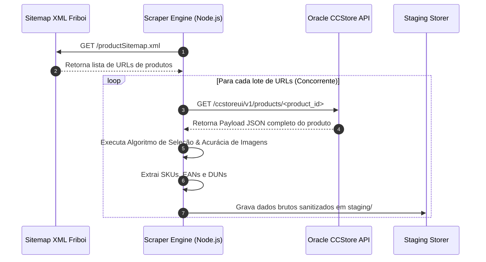

# 🛒 Pipeline de Extração B2B Friboi

O módulo de extração da Friboi ([`scrapers/friboi/index.ts`](file:///root/paletscan-etl/scrapers/friboi/index.ts)) é um pipeline de web scraping de alta concorrência projetado para coletar catalogação atualizada, dados nutricionais, códigos logísticos e mídias de produtos diretamente da infraestrutura B2B da Oracle Commerce Cloud.

---

## 🏗️ 1. Arquitetura do Scraper

O processo de extração não depende de varreduras HTML lentas no navegador (DOM parsing). Em vez disso, utiliza um fluxo em duas etapas otimizado para requisições HTTP diretas:



---

## ⚡ 2. Leitura do Sitemap XML e Concorrência HTTP

1. **Extração de URLs**: O scraper inicia lendo o endpoint público `https://www.friboionline.com.br/productSitemap.xml`.
2. **Parsing das Tags `<loc>`**: Extrai os identificadores únicos de produtos contidos na estrutura dos links.
3. **Pool Concorrente**: Utiliza um limitador de requisições concorrentes (`p-limit` / batches configuráveis) para realizar chamadas paralelas ao endpoint de API REST `ccstoreui/v1/products/` da Oracle Commerce Cloud, otimizando o tempo total de execução sem sobrecarregar a origem.

---

## 🎯 3. Algoritmo de Seleção Exaustiva e Acurácia de Imagens

Um dos grandes desafios de scrapers em e-commerce B2B é a presença de imagens genéricas, banners promocionais, tabelas nutricionais e fotos de receitas preparadas na página do produto. O PaletScan implementa um algoritmo de filtragem heurística rigorosa através das funções `isValidProductImage` e `extractBestProductImage`:

### 🔍 A. Busca Exaustiva em Múltiplos Campos
O algoritmo inspeciona recursivamente todos os nós de mídia retornados pelo JSON da API CCStore:
- `primaryFullImageURL`
- `primaryLargeImageURL`
- `fullImageURLs`
- `sourceImageURLs`
- Objeto de variação `childSKUs`

### 🛡️ B. Validação Semântica e Filtro de SKU Exato
- **Correspondência de SKU no Nome do Arquivo**: Garante que a URL da imagem contenha o padrão `/products/<SKU>_(00|01)_<slug>`. O SKU contido na imagem deve corresponder estritamente ao SKU do produto inspecionado.
- **Sobreposição Semântica**: Realiza a comparação entre os termos do slug do arquivo da imagem e as palavras-chave do título do produto.

### 🚫 C. Regras de Rejeição (Filtro Anti-Ruído)
As imagens que contiverem qualquer um dos sufixos ou palavras-chave abaixo são imediatamente descartadas:

| Indicador no Nome do Arquivo | Motivo da Rejeição |
| :--- | :--- |
| `_02`, `_03`, `_04`, `_05` | Fotos de pratos prontos, receitas, ângulos secundários ou embalagens de envio. |
| `_50` | Logotipos institucionais e marcas d'água de fornecedores. |
| `receita`, `prato`, `banner` | Imagens publicitárias ou sugestões de consumo. |
| `tabela`, `nutricional`, `selo` | Tabelas de informação nutricional ou selos de certificação. |
| `placeholder`, `no-image` | Imagens padrão quando o produto não possui foto. |

> [!NOTE]
> Se nenhuma imagem passar nos critérios de acurácia com 100% de confiança, a função retorna `null`, marcando o registro com o status `sem_imagem` para evitar o cadastro de imagens incorretas no aplicativo PWA.

---

## 📄 4. Formato de Saída em Staging

Após a extração e validações de acurácia, os produtos são consolidados em arquivos JSON em `staging/friboi_raw.json` seguindo a estrutura padrão do projeto:

```json
{
  "sku": "109403",
  "nome_origem": "Corte Dianteiro bovino Friboi Peito resfriado vácuo",
  "marca_origem": "Friboi",
  "ean_origem": "7891515432101",
  "dun_origem": "17891515432108",
  "imagem_url_origem": "https://www.friboionline.com.br/ccstore/v1/images/?source=/file/v12345/products/109403_00_peito_friboi.jpg",
  "peso_bruto": 20.5,
  "unidade_medida": "KG"
}
```
