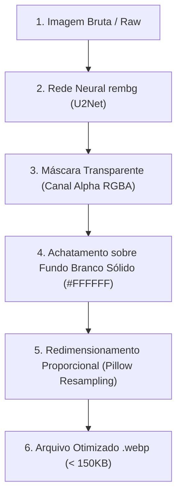
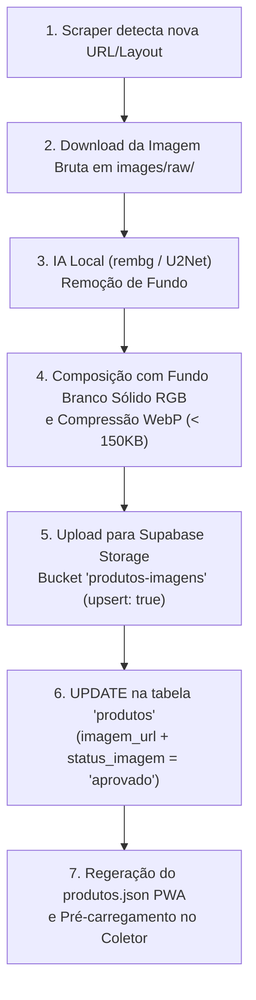

# 🖼️ Pipeline de IA e Processamento de Imagens

O módulo de visão computacional do **PaletScan ETL** ([`images/ai_pipeline/process_image.py`](file:///root/paletscan-etl/images/ai_pipeline/process_image.py)) é responsável pela remoção de fundo por inteligência artificial, padronização em fundo branco sólido, detecção de atualizações de layout de embalagens e otimização para o formato WebP ultra-leve.

---

## 🤖 1. Pipeline de Inteligência Artificial Local (`process_image.py`)

Em vez de depender de APIs de terceiros pagas, o PaletScan utiliza um pipeline de IA **100% local e privado** construído em Python com `rembg` (baseado em modelos de redes neurais U2Net/ONNX) e `Pillow`.



---

## ⚙️ 2. Etapas do Processamento Visual

### A. Remoção de Fundo via IA (`rembg`)
A imagem bruta baixada pelo scraper em `images/raw/` é submetida ao modelo neural da biblioteca `rembg`. O modelo isola a peça de carne ou embalagem comercial do cenário original (estantes, sombras de estúdio ou marcas d'água), gerando uma imagem intermediária com transparência no canal Alpha (`RGBA`).

### B. Achatamento sobre Fundo Branco Sólido (`#FFFFFF`)
Para garantir padrão visual homogêneo e legibilidade máxima no aplicativo PWA (especialmente em telas de coletores de dados e smartphones sob pouca iluminação em câmaras frias), o script cria uma imagem base sólida em RGB na cor branca pura (`255, 255, 255`) e sobrepõe a imagem tratada utilizando a máscara de transparência do canal Alpha:

```python
# Trecho simplificado da lógica implementada em process_image.py
background = Image.new("RGB", img_rgba.size, (255, 255, 255))
background.paste(img_rgba, mask=img_rgba.split()[3])  # Aplica o Alpha channel
```

### C. Redimensionamento e Otimização WebP
- **Dimensão Máxima (`--max-dim 1000`)**: Mantém a proporção original da foto limitando a maior dimensão a 1000 pixels, o que garante excelente definição de rótulos e selos sem desperdício de resolução.
- **Conversão Otimizada para `.webp`**: Salva a imagem final no formato WebP de alta eficiência, reduzindo o peso médio dos arquivos de 2MB-5MB (brutos) para **menos de 100-150KB**.

---

## 📁 3. Ciclo de Vida das Imagens nos Diretórios

O gerenciamento de arquivos de mídia segue um fluxo limpo e rastreável dentro de `images/`:

```text
images/
├── raw/         # Recebe as fotos brutas baixadas pelos scrapers
├── processed/   # Armazena as imagens tratadas prontas para upload
├── archived/    # Imagens que já foram enviadas com sucesso para o Supabase Storage
└── ai_pipeline/ # Código-fonte Python (process_image.py)
```

---

## 🔄 4. Detecção de Novos Layouts de Embalagem e Ciclo de Atualização

Quando um fornecedor atualiza o visual da embalagem ou lança um novo layout no mercado, o PaletScan detecta a alteração e executa o reprocessamento automático:



### A. Como o ETL Identifica Alterações de Layout:
1. **Detecção de URL e Token de Versão na Origem B2B**:
   - Os scrapers de extração (`scrapers/friboi`, `seara`, `brf`, `lar`) inspecionam as URLs de mídias das APIs dos fabricantes. Quando a indústria altera o layout de uma embalagem, a URL de origem da foto muda na CDN do fabricante (ex: alteração de token de versão `/v8734254.../products/393432_01.JPG` ou novo sufixo de arquivo).
   - O algoritmo de acurácia `extractBestProductImage` compara a nova URL com o registro de staging pré-existente.
2. **Comparação de Hash MD5 da Imagem Bruta**:
   - Quando o arquivo é baixado para `images/raw/`, o sistema calcula e compara o hash MD5 da imagem. Caso divirja da versão em cache, a imagem é sinalizada para reprocessamento por Inteligência Artificial.

### B. Etapas de Processamento e Propagação para o PWA:
1. **Tratamento Neural de IA (`process_image.py`)**: A nova imagem da embalagem passa pelo modelo neural `rembg` (U2Net), recebe o fundo branco sólido RGB e é exportada em `.webp` otimizado para `images/processed/`.
2. **Upload Resiliente na CDN (`db_sync/sync_images.ts`)**: A nova foto `.webp` é enviada para o bucket `produtos-imagens` no Supabase Storage utilizando `upsert: true`, sobrescrevendo o ativo antigo na CDN.
3. **Atualização Relacional PostgreSQL**: O script atualiza a coluna `imagem_url` na tabela `produtos` do Supabase e registra o carimbo de data `updated_at`.
4. **Propagação para o Aplicativo PWA**: O script `generate_pwa_produtos_json.ts` regera o catálogo `produtos.json`. No PWA do operador, ao acionar **"Limpar Banco Local e Sincronizar"** (ou via sync automático em segundo plano), o módulo `imageOfflineCache.ts` realiza o *prefetch* do novo WebP e substitui a foto no cache local do dispositivo.

---

## 🖥️ 5. Como Executar o Script

O script pode ser executado manualmente via linha de comando ou ser invocado pelo pipeline TypeScript:

```bash
# Execução básica apontando para o diretório de imagens brutas
python3 images/ai_pipeline/process_image.py --input images/raw --output images/processed

# Execução com parâmetros de dimensão máxima e qualidade WebP
python3 images/ai_pipeline/process_image.py \
  --input images/raw \
  --output images/processed \
  --max-dim 1000 \
  --quality 85
```
