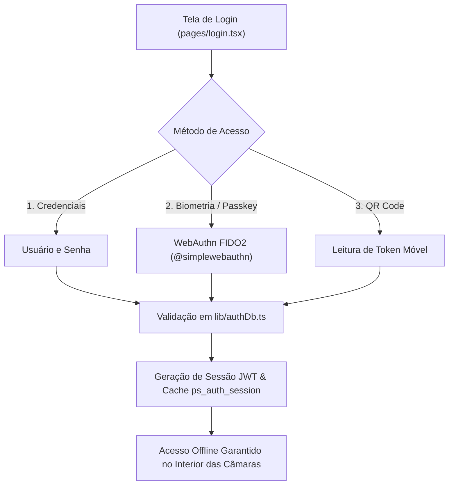

# 🔒 Autenticação, Passkeys & Permissões

O **PaletScan PWA** dispõe de um sistema de segurança multicamadas que combina autenticação tradicional, biometria via Passkeys e controle de acesso baseado em papéis (RBAC), projetado para manter a operação segura mesmo durante blackouts offline.

---

## 🔐 1. Autenticação Multi-Fator Híbrida

* **Passkeys / Biometria (WebAuthn)**: Permite login por impressão digital ou reconhecimento facial sem necessidade de digitar senhas com luvas térmicas no frio.
* **Cache de Sessão Offline (`ps_auth_session`)**: Mantém a sessão do operador ativa e segura mesmo ao fechar e reabrir o PWA offline no fundo da câmara fria.

---

## 🛡️ 2. Matriz de Controle de Acesso (RBAC)

| Permissão | Flag | Administrador (`operador`) | Visitante (`visitante`) |
| :--- | :--- | :---: | :---: |
| **Painel Administrativo** | `isAdmin` | ✅ | ❌ |
| **Bipar e Consultar** | N/A | ✅ | ✅ (Leitura) |
| **Cadastrar Paletes** | `podeCadastrarPalete` | ✅ | ❌ |
| **Cadastrar SKUs Master** | `podeCadastrarProduto` | ✅ | ❌ |
| **Vincular DUN-14** | `podeVincularDun` | ✅ | ❌ |
| **Editar Vaga de Palete** | `podeEditarVaga` | ✅ | ❌ |
| **Exportar Relatórios** | `podeExportarRelatorio` | ✅ | ❌ |
| **Gerenciar Watchlist** | `podeAdicionarRadar` | ✅ | ❌ |
