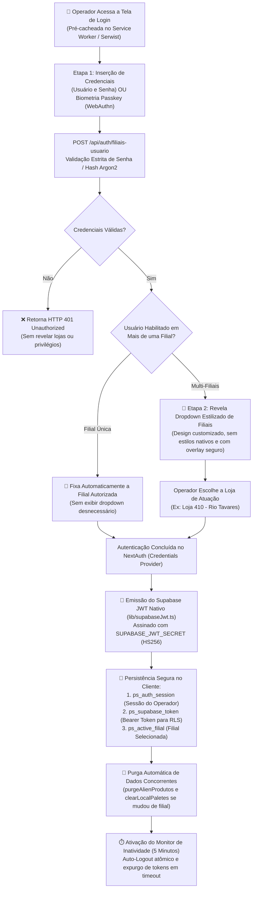
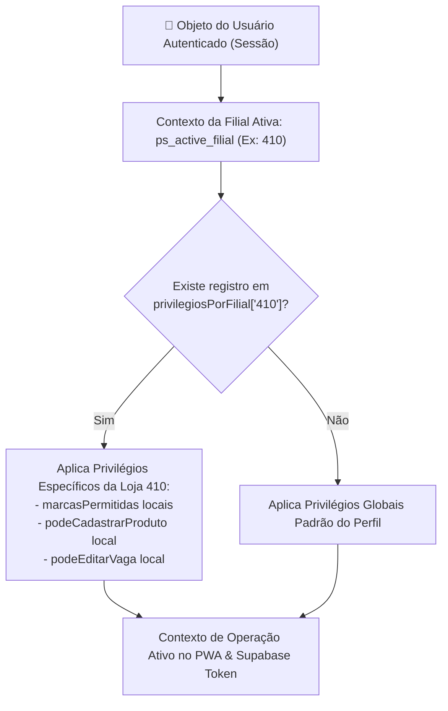
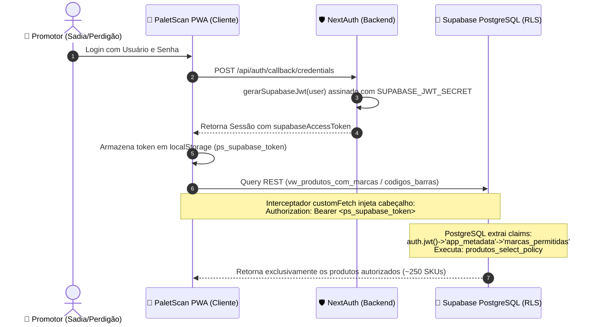

# 🔒 Autenticação, Passkeys, Permissões Granulares & Supabase RLS

O **PaletScan PWA** dispõe de uma arquitetura de segurança multicamadas de nível corporativo que combina autenticação tradicional, biometria via Passkeys (WebAuthn FIDO2), fluxo de seleção de filiais em etapas com credenciais protegidas, controle de acesso baseado em papéis (RBAC) com suporte a matriz de privilégios independentes por filial (`privilegiosPorFilial`), restrição total de acesso a marcas e governança nativa no PostgreSQL do Supabase via **Row Level Security (RLS)** alimentado por tokens JWT customizados.

---

## 🔐 1. Fluxo de Autenticação em Etapas, Passkeys & Resiliência Offline

O acesso à aplicação adota um padrão de segurança em etapas (*Step-Up Authentication*), projetado para proteger a topologia de lojas da rede contra vazamento de metadados e oferecer alta ergonomia operacional para conferentes usando luvas térmicas no frio.



### Componentes de Segurança e Sessão:
* **Dropdown de Filiais Revelado sob Demanda**: O seletor de lojas **nunca** é exibido para visitantes anônimos. Apenas após a confirmação criptográfica da senha ou biometria o sistema consulta `/api/auth/filiais-usuario` e renderiza as lojas autorizadas para aquele operador específico.
* **Passkeys / Biometria (WebAuthn FIDO2)**: Permite login por impressão digital ou reconhecimento facial sem necessidade de digitar senhas alfanuméricas com luvas térmicas no frio.
* **Auto-Logout por Inatividade (5 Minutos)**: Temporizador reativo que encerra a sessão ativa caso o dispositivo fique sem interação física no chão de fábrica, evitando registros inadvertidos em coletores compartilhados. No logout, `ps_auth_session`, `ps_supabase_token` e `ps_active_filial` são limpos atômica e simultaneamente.
* **Isenção de Expiração para Operadores Fixos**: Credenciais operacionais de administração (como `JeanBfreitas_`) contam com política de não-expiração forçada de senha (`senhaNuncaExpira: true`), prevenindo travamento do turno de trabalho.

---

## 🛡️ 2. Matriz de Controle de Acesso (RBAC) Granular por Filial

O modelo de segurança do PaletScan PWA evoluiu de privilégios estáticos globais para uma **matriz dinâmica de privilégios e marcas independentes por filial** (`privilegiosPorFilial`). O mesmo usuário pode ser um operador pleno na Filial 410 e atuar como promotor restrito na Filial 411:



### Matriz Comparativa de Papéis Operacionais:

| Permissão / Atributo | Flag de Perfil / Filial | Administrador (`operador`) | Promotor Dedicado (Ex: Seara) | Conferente de Loja | Visitante (`visitante`) |
| :--- | :--- | :---: | :---: | :---: | :---: |
| **Painel Administrativo** | `isAdmin` | ✅ Total | ❌ | ❌ | ❌ |
| **Bipar e Consultar no Scanner** | N/A | ✅ Todos os SKUs | 🔒 **Apenas marcas autorizadas** | ✅ Todos os SKUs | ✅ Todos (Leitura) |
| **Pesquisa e Consulta de Produtos** | N/A | ✅ Todo o Catálogo | 🔒 **Apenas marcas autorizadas** | ✅ Todo o Catálogo | ✅ Catálogo |
| **Visualizar Detalhes do Produto** | N/A | ✅ Liberado | 🔒 **Apenas marcas autorizadas** | ✅ Liberado | ✅ Liberado |
| **Cadastrar Novos Paletes** | `podeCadastrarPalete` | ✅ | 🔒 Se autorizado (sua marca) | ✅ | ❌ |
| **Cadastrar SKUs no Catálogo** | `podeCadastrarProduto` | ✅ | ❌ (Geralmente falso) | ❌ (Central) | ❌ |
| **Vincular DUN-14 / Pesar** | `podeVincularDun` | ✅ | 🔒 Se autorizado (sua marca) | ✅ | ❌ |
| **Editar Vaga de Palete** | `podeEditarVaga` | ✅ | ❌ | ✅ | ❌ |
| **Editar Atributos de Produtos** | `podeEditarDescricaoProduto` | ✅ | 🔒 Se autorizado (sua marca) | ❌ | ❌ |
| **Exportar Relatórios** | `podeExportarRelatorio` | ✅ | 🔒 Se atribuído | ✅ | ❌ |
| **Gerenciar Watchlist / Radar** | `podeAdicionarRadar` | ✅ | 🔒 Apenas sua marca | ✅ | ❌ |
| **Acesso a Marcas** | `acessoTodasMarcas` | `true` (Universal) | `false` (`marcasPermitidas: [...]`) | `true` (Loja) | `true` (Consulta) |

---

## 🏬 3. Restrição Total de Acesso a Marcas (Brand Guardrail Absoluto)

Em redes varejistas e atacarejos, promotores de vendas terceirizados (ex: **BRF - Sadia/Perdigão** ou **JBS - Seara**) utilizam coletores para auditar validades. Para garantir o sigilo concorrencial e a governança de estoque:

> ⚠️ **Princípio da Restrição Total:** Promotores e operadores restritos **não possuem acesso a dados de concorrentes nem mesmo para mera consulta**. O bloqueio é absoluto em toda a esteira do sistema.

```mermaid
flowchart TD
    SCAN["📷 Operador Bipa ou Consulta um Código de Barras\n(EAN-13, DUN-14 ou Código de Balança)"]
    
    SCAN --> RESOLVE["Resolução do SKU no Banco Local (WatermelonDB)\nou no Backend Next.js (/api/validar e /api/produtos/buscar)"]
    
    RESOLVE --> AUTH_CHECK{"Usuário possui\nacessoTodasMarcas == true?"}
    
    AUTH_CHECK -->|Sim (Admin / Geral)| ALLOW["✅ Acesso Total Concedido\nExibe Detalhes, Permite Cadastro e Bipagem"]
    
    AUTH_CHECK -->|Não| BRAND_CHECK{"Marca do Produto está em\nmarcasPermitidas do Operador?"}
    
    BRAND_CHECK -->|Sim (Marca Autorizada)| ALLOW
    
    BRAND_CHECK -->|Não (Marca Concorrente)| BLOCK["🚫 BLOQUEIO IMEDIATO & IRREVERSÍVEL\nStatus: unauthorized_brand"]
    
    BLOCK --> UI_ALERT["📱 Interface PWA:\nAlerta Vermelho: 'Produto de marca não autorizada.\nSeu acesso nesta filial está restrito a: [Marcas]'"]
    
    BLOCK --> PREVENT_FORM["Trava de Scanner: Não abre formulário de palete\nTrava de Busca: Oculta item dos resultados\nTrava de Modal: Rejeita abertura do DetalheProdutoModal"]
```

### Pontos de Aplicação da Restrição Total:
1. **Scanner Óptico ([`Scanner.tsx`](file:///root/repo_pwa/components/Scanner.tsx))**:
   - Ao decodificar o código de barras, cruza imediatamente com `marcasPermitidas`. Caso o item pertença a uma marca concorrente, emite o status `unauthorized_brand`, toca aviso sonoro/háptico de rejeição e bloqueia a abertura do formulário de palete.
2. **Mecanismo de Pesquisa ([`PesquisaProduto.tsx`](file:///root/repo_pwa/components/PesquisaProduto.tsx))**:
   - As consultas textuais e de código de barras filtram previamente o conjunto de busca, impedindo que itens alienígenas sejam exibidos no dropdown de resultados ou no catálogo pesquisável.
3. **Modal de Detalhes ([`DetalheProdutoModal.tsx`](file:///root/repo_pwa/components/DetalheProdutoModal.tsx))**:
   - Se um operador tentar abrir diretamente os detalhes de um produto de outra marca, o modal é imediatamente abortado.
4. **Edição Rápida de Atributos de Catálogo**:
   - Todas as rotas de backend (`/api/atualizar-descricao`, `/api/atualizar-classe`, `/api/atualizar-conservacao`, `/api/atualizar-marca` e `/api/atualizar-pesar-cod`) recuperam o registro atual da base e validam `verificarAutorizacaoMarca` antes de executar qualquer `UPDATE`. Se o operador não tiver direito sobre a marca do produto, a API retorna `HTTP 403 Forbidden`.

---

## 🔒 4. Supabase PostgreSQL Row Level Security (RLS) Nativo

Para atingir a arquitetura **Zero-Trust** (na qual nem mesmo ataques forjados via console de navegador ou ferramentas como `curl` consigam contornar a segurança), a restrição de marcas opera de forma nativa diretamente no motor relacional do PostgreSQL através de **Row Level Security (RLS)**.



### Estrutura do JWT Supabase Customizado ([`lib/supabaseJwt.ts`](file:///root/repo_pwa/lib/supabaseJwt.ts)):
O token é assinado no algoritmo `HS256` utilizando a chave secreta oficial do projeto (`SUPABASE_JWT_SECRET`) e transporta as credenciais necessárias para as políticas de banco:

```json
{
  "aud": "authenticated",
  "role": "authenticated",
  "sub": "b2c1d4e5-9a8f-4a3b-b2c1-d4e59a8f4a3b",
  "email": "promotor.seara",
  "app_metadata": {
    "provider": "paletscan_nextauth",
    "is_admin": false,
    "acesso_todas_marcas": false,
    "marcas_permitidas": ["seara", "rezende"],
    "pode_cadastrar_produto": false,
    "filial_id": "410",
    "empresa_id": "09.477.652/0178-38"
  },
  "user_metadata": {
    "name": "Promotor Seara",
    "username": "promotor_seara"
  }
}
```

### Políticas RLS Aplicadas no PostgreSQL ([`scripts/aplicar_rls_marcas_supabase.sql`](file:///root/repo_pwa/scripts/aplicar_rls_marcas_supabase.sql)):

```sql
-- 1. Extração determinística de marcas autorizadas do JWT
CREATE OR REPLACE FUNCTION auth.get_user_marcas()
RETURNS text[] LANGUAGE plpgsql STABLE SECURITY DEFINER AS $$
BEGIN
  RETURN COALESCE(
    ARRAY(SELECT lower(jsonb_array_elements_text(auth.jwt()->'app_metadata'->'marcas_permitidas'))),
    ARRAY[]::text[]
  );
END;
$$;

-- 2. Política de Leitura Estrita de Produtos
CREATE POLICY "produtos_select_policy" ON public.produtos
FOR SELECT TO authenticated
USING (
  auth.has_full_brand_access()
  OR marca_id IN (
    SELECT id FROM public.marcas 
    WHERE lower(nome) = ANY(auth.get_user_marcas())
  )
);

-- 3. Política de Leitura Estrita de Códigos de Barras vinculados
CREATE POLICY "codigos_barras_select_policy" ON public.codigos_barras
FOR SELECT TO authenticated
USING (
  auth.has_full_brand_access()
  OR produto_id IN (
    SELECT p.id FROM public.produtos p
    JOIN public.marcas m ON m.id = p.marca_id
    WHERE lower(m.nome) = ANY(auth.get_user_marcas())
  )
);
```

---

## 🛡️ 5. Blindagem de Sessão em Alta Concorrência (`lib/serverAuth.ts`)

Durante a alternância dinâmica de filial entre Produção (`410`) e Homologação (`999`), requisições de API (`switch-filial`, `filiais`, `usuarios`, `logs`, `pendencias`) utilizam o helper centralizado [`lib/serverAuth.ts`](file:///root/repo_pwa/lib/serverAuth.ts):

```mermaid
flowchart TD
    REQ["📥 Requisição para API de Administração\n(Ex: /api/admin/switch-filial)"]
    
    REQ --> ATTEMPT1["Tentativa 1: getServerSession(req, res, authOptions)"]
    
    ATTEMPT1 --> SESS_OK{"Sessão SSR Válida e Hidratada?"}
    
    SESS_OK -->|Sim| AUTH_USER["Valida se o usuário tem privilégio isAdmin == true"]
    
    SESS_OK -->|Não (Latência SSR)| ATTEMPT2["Tentativa 2: Extrai cookie/token bruto da requisição"]
    
    ATTEMPT2 --> DB_LOOKUP["Consulta Direta no Repositório de Credenciais (lib/authDb.ts)"]
    
    DB_LOOKUP --> DB_OK{"Usuário Encontrado e isAdmin?"}
    
    DB_OK -->|Sim| AUTH_USER
    DB_OK -->|Não| REJECT["❌ HTTP 403 Forbidden: Acesso exclusivo para administradores"]
    
    AUTH_USER --> EXEC["✅ Executa a Operação com Auditoria em logs_sessao"]
```

* **Eliminação de Condições de Corrida**: Previne o falso bloqueio de permissão ("você não tem permissão para trocar de filial") ao alternar de ambiente em dispositivos móveis sob latência de rede.
* **Auditoria Contínua**: Cada alternância de filial grava um evento rastreável em `logs_sessao` no Supabase com data, identificador do operador e ambientes de origem e destino.
