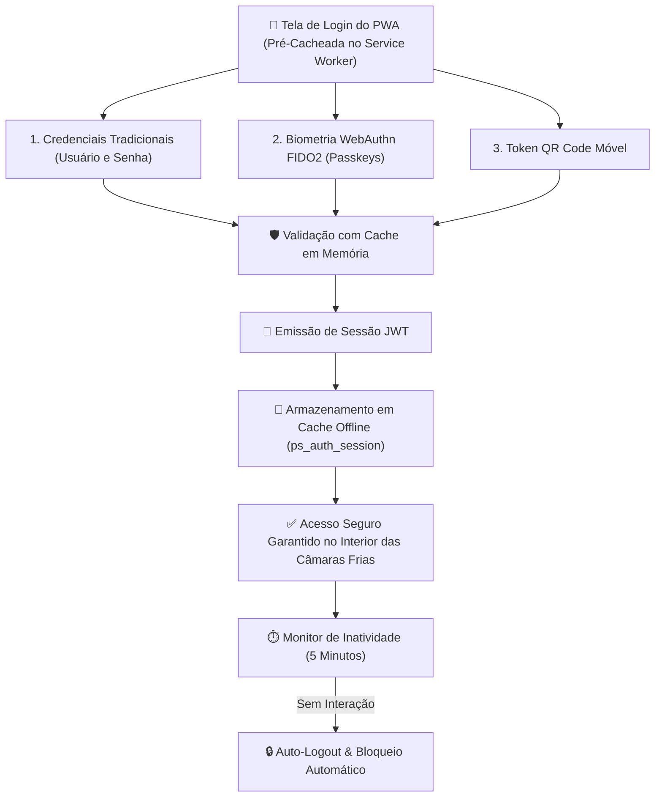
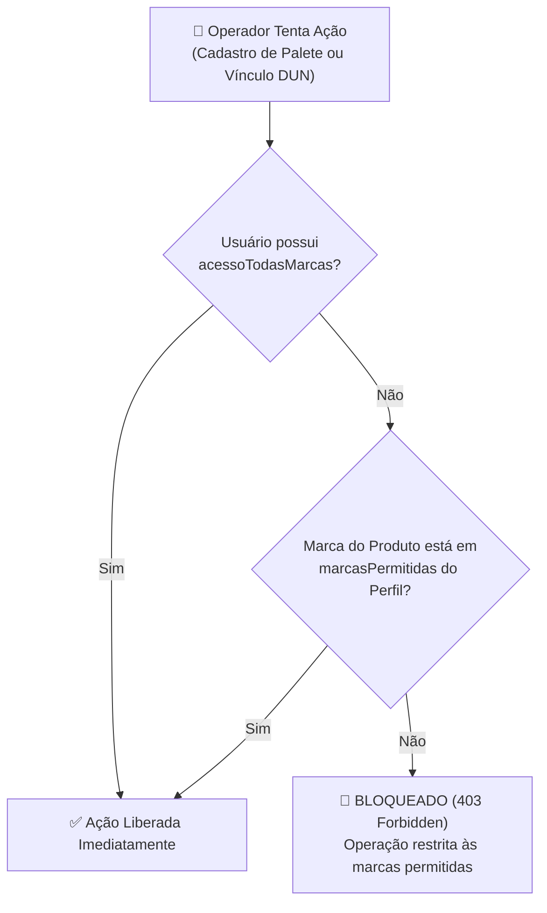

# 🔒 Autenticação, Passkeys & Permissões

O **PaletScan PWA** dispõe de um sistema de segurança multicamadas que combina autenticação tradicional, biometria via Passkeys, auto-logout por inatividade e controle de acesso baseado em papéis (RBAC), projetado para manter a operação segura e ágil mesmo durante blackouts offline.

---

## 🔐 1. Autenticação Multi-Fator Híbrida & Resiliência Offline

O fluxo de autenticação suporta múltiplos métodos de entrada com garantia de sessão offline:

### Componentes de Segurança e Sessão:
* **Passkeys / Biometria (WebAuthn)**: Permite login por impressão digital ou reconhecimento facial sem necessidade de digitar senhas com luvas térmicas no frio.
* **Pré-Cache da Tela de Login**: A página de autenticação é precacheada pelo Service Worker, garantindo abertura instantânea mesmo sem sinal de rede.
* **Auto-Logout por Inatividade (5 Minutos)**: Temporizador reativo que encerra a sessão ativa caso o dispositivo fique sem interação no chão de fábrica, evitando registros inadvertidos em coletores compartilhados.
* **Cache em Memória e Resiliência de Variáveis**: O motor de autenticação unifica o suporte a `REDIS_URL` e `VISITOR_PASSWORD`, eliminando latências de autenticação via cache em memória com timeout estrito.
* **Isenção de Expiração para Operadores Fixos**: As credenciais operacionais de administração (como `JeanBfreitas_`) possuem política de não-expiração forçada de senha, prevenindo travamento do turno de trabalho.

---

## 🛡️ 2. Matriz de Controle de Acesso (RBAC) & Multi-Tenant

| Permissão / Atributo | Flag no Perfil | Administrador (`operador`) | Operador Setorial | Visitante (`visitante`) |
| :--- | :--- | :---: | :---: | :---: |
| **Painel Administrativo** | `isAdmin` | ✅ | ❌ | ❌ |
| **Bipar e Consultar** | N/A | ✅ | ✅ | ✅ (Leitura) |
| **Cadastrar Paletes** | `podeCadastrarPalete` | ✅ | ✅ (Se atribuído) | ❌ |
| **Cadastrar SKUs Master** | `podeCadastrarProduto` | ✅ | ❌ (Restrito Central) | ❌ |
| **Vincular DUN-14** | `podeVincularDun` | ✅ | ✅ (Com validação GS1) | ❌ |
| **Editar Vaga de Palete** | `podeEditarVaga` | ✅ | ✅ | ❌ |
| **Exportar Relatórios** | `podeExportarRelatorio` | ✅ | ✅ (Se atribuído) | ❌ |
| **Gerenciar Watchlist** | `podeAdicionarRadar` | ✅ | ✅ | ❌ |
| **Filial de Atuação** | `filialId` / `filialNome` | 410 (Matriz) | Filial da Loja | 410 |
| **Escopo de Marcas** | `marcasPermitidas` | Todas (`acessoTodasMarcas: true`) | Restrito à Marca | Apenas Leitura |

---

## 🏬 3. Barreira de Segurança de Marcas (Brand Guardrail)

Para assegurar que promotores de vendas ou operadores de chão de fábrica vinculados a uma determinada marca não modifiquem dados de outras marcas concorrentes:

* **Validação em Dupla Camada (Client + Server)**: A verificação ocorre tanto nos formulários e modais do PWA quanto nas rotas de API do backend (`/api/produtos/gerenciar-codigos`, `/api/cadastrar-produto` e `/api/cadastrar`) via [`lib/gs1Validator.ts`](file:///root/repo_pwa/lib/gs1Validator.ts).
* **Mensagens Transparentes e Amigáveis**: Quando o operador é barrado, o PWA apresenta toast claro indicando quais marcas seu usuário tem permissão para manipular.
* **Imutabilidade e Segurança**: Apenas administradores com a flag `isAdmin: true` podem alterar o escopo de filiais e marcas dos operadores através do painel `/admin`.
* **Login Móvel via QR Code Multi-Sessão**: Operadores podem autenticar terminais e coletores escaneando um QR Code gerado por uma sessão autenticada, sem necessidade de digitação repetitiva de senhas em teclados virtuais.

