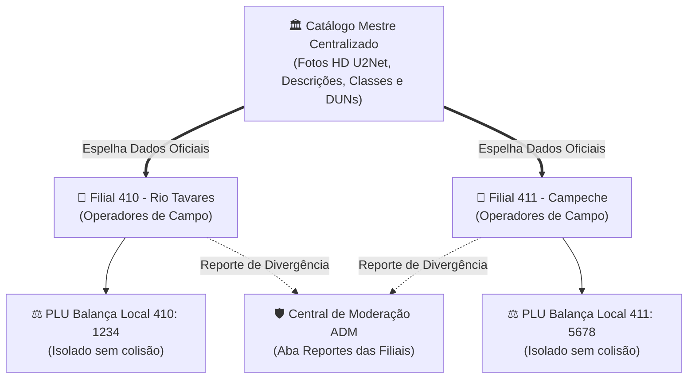

# 🏬 Multi-Filiais, Governança de Catálogo & GS1 Módulo 10

Com a expansão da operação do **PaletScan PWA** para redes de atacarejo e distribuição alimentícia (como a rede Fort Atacadista), o ecossistema implementa uma arquitetura robusta de **Multi-Filiais (Multi-Tenant)**, combinando governança estrita do **Catálogo Mestre**, autonomia operacional local para balanças de pesagem, validações matemáticas oficiais GS1 e canal colaborativo (crowdsourcing) de reportes.

---

## 🏛️ 1. Arquitetura Multi-Filial & Governança de Catálogo

No modelo de atacarejo, produtos industriais compartilham as mesmas características de catálogo em todo o país (fotos, descrições, conservação térmica e códigos EAN/DUN), mas cada filial possui sua própria realidade física de recebimento, equipes de operadores e balanças de pesagem locais.

### Princípios Fundamentais de Governança:
1. **Catálogo Mestre Centralizado**:
   - Fotos oficiais tratadas por IA (U2-Net / WebP 1000px), descrições padronizadas, conservação e classes fiscais são restritas à central administrativa.
   - Operadores de lojas locais não podem corromper as fotos ou alterar descrições globais de outros estabelecimentos.
2. **Autonomia Local de Pesagem (PLU)**:
   - Códigos de balança para pesagem fracionada/açougue variam de filial para filial. O sistema isola o código de pesagem por loja, impedindo que a Loja 410 altere a configuração da Loja 411.
3. **Crowdsourcing Inteligente via Modal de Detalhes**:
   - Qualquer operador de chão de fábrica pode reportar de forma simples divergências observadas (ex: nova embalagem na indústria, divergência de peso), alimentando o painel de pendências da central.

---

## 🏬 2. Módulo de Gestão de Filiais (`/admin`)

O painel administrativo dispõe do módulo completo de **Gestão de Filiais**:

* **Cadastro e Edição de Lojas**: Permite registrar o código da filial (ex: `410`), nome fantasia (ex: `Fort Atacadista - Loja 410 (Rio Tavares)`), cidade e estado federativo.
* **Ativação e Desativação de Lojas**: Filiais inativas têm o acesso de seus operadores restrito temporariamente.
* **Proteção de Integridade da Matriz**: A filial matriz (`410`) possui trava de proteção contra exclusão inadvertida no banco relacional.
* **Vínculo Dinâmico de Usuários**: No formulário de cadastro de operadores, a seleção de filial é realizada via `<select>` dinâmico populado a partir das lojas ativas.

---

## ⚖️ 3. Autonomia do Código de Balança (PLU) por Filial

No setor de carnes, aves e congelados, balanças como Toledo Prix ou Filizola exigem códigos PLU específicos de cada filial.

* **Armazenamento Híbrido**: Persistência isolada na entidade `pesar_cod_filial` indexada pela chave tripla `(empresa_id, filial_id, ean)`.
* **Resiliência Offline**: Espelhamento local em cache JSON (`lib/pesar_cod_filial_db.json`) sincronizado em segundo plano com o Supabase quando há sinal de rede.
* **Interface Clara com Badge da Loja**: No modal [`GerenciarCodigosModal.tsx`](file:///root/repo_pwa/components/GerenciarCodigosModal.tsx), o campo de código de pesar apresenta o badge da loja do operador (`Loja 410`) e a mensagem de apoio:
  > *"Código PLU local exclusivo desta filial. Não afeta as outras lojas."*

---

## 📐 4. Validação Matemática GS1 (Módulo 10) & Correlação

Para eliminar erros de digitação de operadores em ambiente industrial, o PWA integra o motor matemático oficial GS1 ([`lib/gs1Validator.ts`](file:///root/repo_pwa/lib/gs1Validator.ts)).

### A. Algoritmo de Dígito Verificador GS1 Módulo 10

Para um código de barras de $N$ dígitos (onde o último dígito $D_N$ é o Dígito Verificador):
1. Percorre-se os dígitos da direita para a esquerda (excluindo o dígito verificador), multiplicando alternadamente pelos pesos **3** e **1**.
2. Soma-se todos os produtos ponderados:
   $$\text{Soma} = \sum_{i=1}^{N-1} (d_i \times p_i)$$
3. O dígito verificador calculado é a diferença para a próxima dezena:
   $$DV = (10 - (\text{Soma} \pmod{10})) \pmod{10}$$

### B. Correlação Matemática EAN-13 x DUN-14
O validador correlaciona a raiz do GTIN-13 com o DUN-14:
* **Variante Direta**: O DUN-14 possui a mesma raiz de 12 dígitos do EAN-13, precedido pelo indicador logístico `1..8`.
* **Caixa de Distribuição Agrupada**: O prefixo GS1 da empresa coincide, identificando fardos e caixas industriais da mesma linha de produto.

### C. Barreira de Segurança de Marcas Permitidas
Quando um operador tem permissão de acesso restrita (ex: usuário alocado exclusivamente para a marca `Sadia`):
* Qualquer tentativa de cadastrar novos itens ou vincular códigos da marca `Perdigão` ou outras marcas é sumariamente **bloqueada** no cliente e no servidor.
* A API responde com status `403 Forbidden`:
  > *"Operação bloqueada: Seu usuário tem acesso restrito às marcas [Sadia] e não tem autorização para manipular produtos da marca 'Perdigão'."*

---

## 💬 5. Canal de Crowdsourcing & Moderação de Reportes

Para garantir que o catálogo mestre permaneça atualizado sem abrir brechas de integridade, foi implementado o canal de reporte colaborativo:

### Fluxo Operacional:
1. **Ponto de Contato Sutil no Modal de Produto**:
   - Dentro do modal [`DetalheProdutoModal.tsx`](file:///root/repo_pwa/components/DetalheProdutoModal.tsx), há o botão estilizado:
     > **💬 Sugerir correção ou informar à Central**
2. **Modal de Apontamento ([`ReportarDivergenciaModal.tsx`](file:///root/repo_pwa/components/ReportarDivergenciaModal.tsx))**:
   - O operador seleciona o tipo de divergência:
     - 📷 **Foto Incorreta / Embalagem Antiga**
     - 🏷️ **Descrição / Nome**
     - ❄️ **Conservação Térmica**
     - ⚖️ **Peso / Balança**
     - 💬 **Outro Assunto**
   - Redige a observação e envia à central.
3. **Painel de Moderação no `/admin`**:
   - Na aba **Reportes das Filiais** do componente [`ValidacaoPendenciasAdmin.tsx`](file:///root/repo_pwa/components/ValidacaoPendenciasAdmin.tsx), o administrador visualiza:
     - Badge da Loja remetente (ex: `Loja 410`, `Loja 411`);
     - Nome e login do operador;
     - SKU em foco (EAN e descrição);
     - Data e hora do envio;
     - Observação textual completa;
     - Botões rápidos: `[✓ Marcar Resolvido]` e `[✕ Descartar]`.
