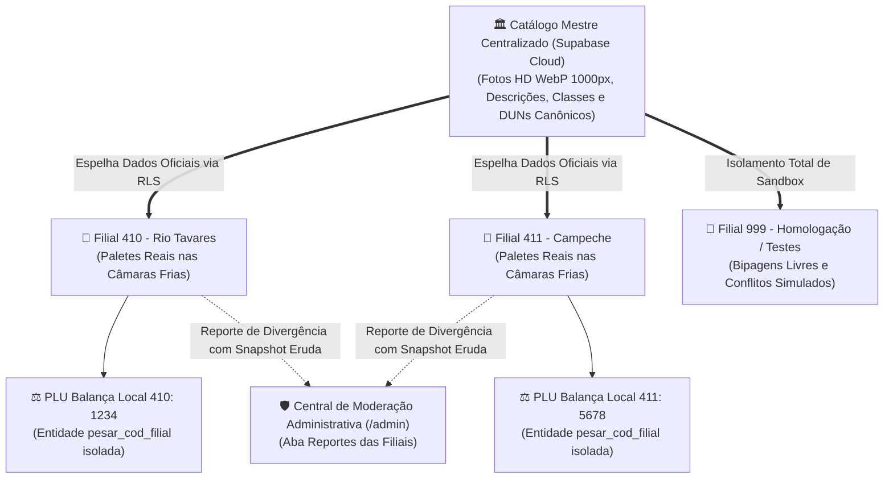
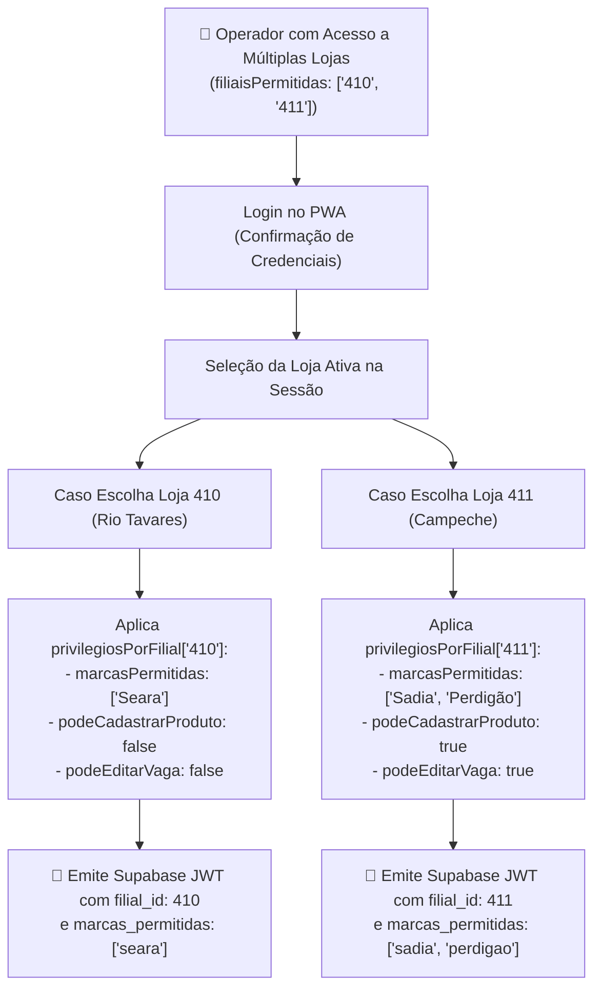
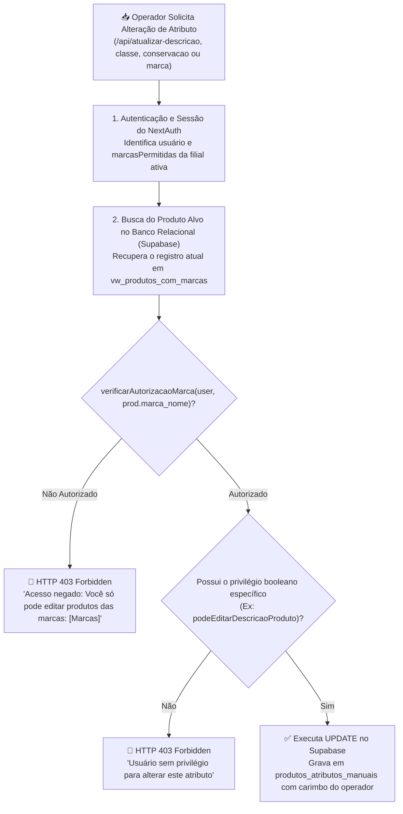
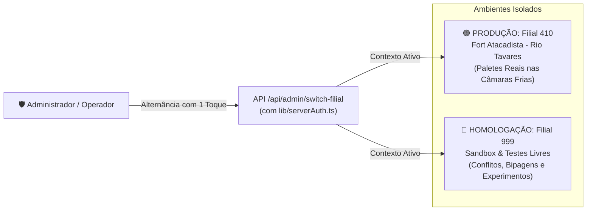
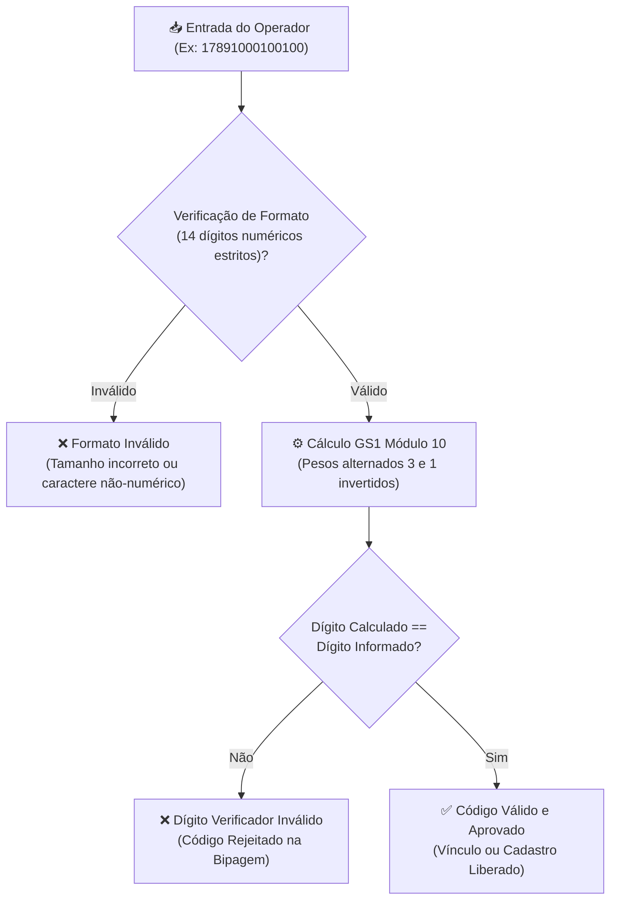

# 🏬 Multi-Filiais, Privilégios Granulares, Governança de Catálogo & GS1 Módulo 10

Com a expansão da operação do **PaletScan PWA** para redes de atacarejo e distribuição alimentícia (como a rede Fort Atacadista), o ecossistema implementa uma arquitetura robusta de **Multi-Filiais (Multi-Tenant)**, combinando governança estrita do **Catálogo Mestre**, matriz de privilégios independentes por loja (`privilegiosPorFilial`), autonomia operacional local para balanças de pesagem (PLU), barreiras de edição cruzada de marcas e canal colaborativo (crowdsourcing) de reportes.

---

## 🏛️ 1. Arquitetura Multi-Filial & Governança de Catálogo

No modelo de atacarejo, produtos industriais compartilham as mesmas características de catálogo em todo o país (fotos tratadas por IA, descrições padronizadas, conservação térmica e códigos EAN/DUN), mas cada filial possui sua própria realidade física de recebimento, equipes de operadores, marcas negociadas e balanças de pesagem locais.



### Princípios Fundamentais de Governança:
1. **Catálogo Mestre Centralizado**:
   - Fotos oficiais tratadas por IA (U2-Net / WebP 1000px), descrições padronizadas, conservação e classes fiscais são restritas à central administrativa.
   - Operadores de lojas locais não podem corromper fotos globais ou alterar descrições de produtos de outras marcas.
2. **Autonomia Local de Pesagem (PLU)**:
   - Códigos de balança para pesagem fracionada/açougue variam de filial para filial. O sistema isola o código de pesagem por loja, impedindo que a Loja 410 altere a configuração da Loja 411.
3. **Crowdsourcing Inteligente via Modal de Detalhes**:
   - Qualquer operador de chão de fábrica pode reportar divergências observadas (ex: nova embalagem na indústria, divergência de peso), alimentando o painel de pendências da central junto com o snapshot de logs do cliente.

---

## 🏢 2. Matriz Dinâmica de Privilégios por Filial (`privilegiosPorFilial`)

O PaletScan PWA implementa a capacidade de configurar **permissões e marcas distintas para o mesmo operador em cada loja onde ele atua**. 



### Estrutura do Perfil no Banco de Credenciais ([`lib/authDb.ts`](file:///root/repo_pwa/lib/authDb.ts)):
```json
{
  "username": "promotor.multimarcas",
  "filialPadrao": "410",
  "filiaisPermitidas": ["410", "411"],
  "privilegiosPorFilial": {
    "410": {
      "acessoTodasMarcas": false,
      "marcasPermitidas": ["Seara", "Rezende"],
      "podeCadastrarProduto": false,
      "podeCadastrarPalete": true
    },
    "411": {
      "acessoTodasMarcas": false,
      "marcasPermitidas": ["Sadia", "Perdigão"],
      "podeCadastrarProduto": true,
      "podeCadastrarPalete": true
    }
  }
}
```

* **Eliminação de Delay na Definição de Permissões**: No painel `/admin`, ao marcar/desmarcar a opção de multi-filiais, o formulário ajusta instantaneamente os privilégios da loja selecionada, mantendo as demais com privilégios desmarcados por padrão sem travamento de estado.
* **Prevenção de Falso 403 em Requisições Administrativas**: Endpoints como `/api/admin/usuarios` utilizam a função `verifyAdminSession`, que autentica a sessão do administrador sem conflitar com o identificador do usuário que está sendo editado.

---

## 🛡️ 3. Barreira de Edição Cruzada de Atributos de Produtos

No PaletScan, mesmo que um usuário possua permissões booleanas ativas (como `podeEditarDescricaoProduto`, `podeEditarClasse` ou `podeEditarConservacao`), **ele não pode editar produtos de marcas concorrentes**:



### Endpoints Protegidos por Barreira de Marca:
* [`/api/atualizar-descricao`](file:///root/repo_pwa/pages/api/atualizar-descricao.ts): Atualiza nome comercial e título padronizado.
* [`/api/atualizar-classe`](file:///root/repo_pwa/pages/api/atualizar-classe.ts): Atualiza classificação tributária e fiscal.
* [`/api/atualizar-conservacao`](file:///root/repo_pwa/pages/api/atualizar-conservacao.ts): Ajusta regime térmico (Congelado vs Resfriado).
* [`/api/atualizar-marca`](file:///root/repo_pwa/pages/api/atualizar-marca.ts): Valida autorização tanto para a marca antiga quanto para a nova marca atribuída.
* [`/api/atualizar-pesar-cod`](file:///root/repo_pwa/pages/api/atualizar-pesar-cod.ts): Regula vínculos de códigos de balança local.

---

## 🧪 4. Filial 999 - Sandbox (Ambiente de Homologação & Testes)

Para permitir que operadores e desenvolvedores validem novas funcionalidades, bipagens, cadastros de produtos e simulação de conflitos de vaga diretamente em coletores ou celulares sem tocar na base real da **Loja 410 (Produção)**, foi projetada a **Filial 999 - Sandbox**:



* **Segregação Estrita de Dados**: Consultas, relatórios, ocupação de vagas e exclusões são filtrados pela coluna `empresa_id` / `filial_id`. Uma exclusão em massa ou conflito gerado na filial 999 **nunca** afeta o inventário da filial 410.
* **Blindagem de Sessão Concorrente (`lib/serverAuth.ts`)**: Elimina condições de corrida na hidratação de sessão do NextAuth, permitindo alternância instantânea entre Produção e Homologação sem bloqueios de permissão indevidos.
* **Pílula de Status Reativa no Header**: Quando em homologação, o topo da aplicação exibe o badge de advertência `[🧪 HOMOLOGAÇÃO / SANDBOX]`, garantindo que o usuário tenha clareza total do ambiente em que está operando.

---

## ⚖️ 5. Autonomia do Código de Balança (PLU) por Filial

No setor de carnes, aves e congelados, balanças como Toledo Prix ou Filizola exigem códigos PLU específicos de cada filial.

* **Armazenamento Híbrido**: Persistência isolada na entidade `pesar_cod_filial` indexada pela chave tripla `(empresa_id, filial_id, ean)`.
* **Resiliência Offline**: Espelhamento local em cache JSON (`lib/pesar_cod_filial_db.json`) sincronizado em segundo plano com o Supabase quando há sinal de rede.
* **Interface Clara com Badge da Loja**: No modal [`GerenciarCodigosModal.tsx`](file:///root/repo_pwa/components/GerenciarCodigosModal.tsx), o campo de código de pesar apresenta o badge da loja do operador (`Loja 410`) e a mensagem de apoio:
  > *"Código PLU local exclusivo desta filial. Não afeta as outras lojas."*

---

## 📐 6. Validação Matemática GS1 (Módulo 10) & Correlação

Para eliminar erros de digitação de operadores em ambiente industrial, o PWA integra o motor matemático oficial GS1 ([`lib/gs1Validator.ts`](file:///root/repo_pwa/lib/gs1Validator.ts)).

### A. Algoritmo de Dígito Verificador GS1 Módulo 10
Para um código de barras de $N$ dígitos (onde o último dígito $D_N$ é o Dígito Verificador):
1. Percorre-se os dígitos da direita para a esquerda (excluindo o dígito verificador), multiplicando alternadamente pelos pesos **3** e **1**.
2. Soma-se todos os produtos ponderados:
   $$\text{Soma} = \sum_{i=1}^{N-1} (d_i \times p_i)$$
3. O dígito verificador calculado é a diferença para a próxima dezena:
   $$DV = (10 - (\text{Soma} \pmod{10})) \pmod{10}$$



### B. Correlação Matemática EAN-13 x DUN-14
O validador correlaciona a raiz do GTIN-13 com o DUN-14:
* **Variante Direta**: O DUN-14 possui a mesma raiz de 12 dígitos do EAN-13, precedido pelo indicador logístico `1..8`.
* **Caixa de Distribuição Agrupada**: O prefixo GS1 da empresa coincide, identificando fardos e caixas industriais da mesma linha de produto.

---

## 💬 7. Canal de Crowdsourcing & Moderação de Reportes

Para garantir que o catálogo mestre permaneça atualizado sem abrir brechas de integridade, o PWA disponibiliza o canal de reporte colaborativo:

1. **Ponto de Contato Sutil no Modal de Produto**:
   - Dentro de [`DetalheProdutoModal.tsx`](file:///root/repo_pwa/components/DetalheProdutoModal.tsx), botão estilizado:
     > **💬 Sugerir correção ou informar à Central**
2. **Modal de Apontamento ([`ReportarDivergenciaModal.tsx`](file:///root/repo_pwa/components/ReportarDivergenciaModal.tsx))**:
   - Categorias: 📷 Foto Incorreta, 🏷️ Descrição / Nome, ❄️ Conservação Térmica, ⚖️ Peso / Balança, 💬 Outro Assunto.
   - Embarca automaticamente o snapshot dos últimos logs do console do cliente (Eruda) para acelerar diagnósticos da equipe técnica.
3. **Painel de Moderação no `/admin`**:
   - Na aba **Reportes das Filiais** do componente [`ValidacaoPendenciasAdmin.tsx`](file:///root/repo_pwa/components/ValidacaoPendenciasAdmin.tsx), o administrador analisa o SKU, filial remetente, observação e logs de cliente antes de marcar como resolvido ou descartar.
