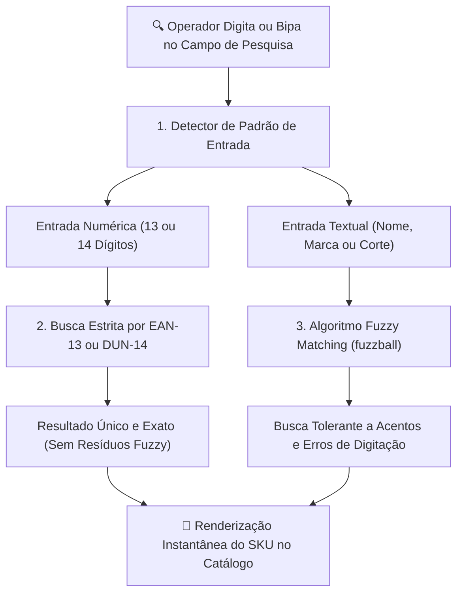
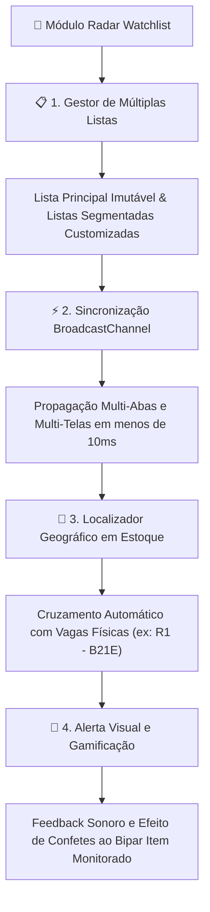

# 🔎 Pesquisa, Consulta & Radar Watchlist

O módulo de **Pesquisa e Consulta** ([`PesquisaProduto.tsx`](file:///root/repo_pwa/components/PesquisaProduto.tsx)) é a central de consulta técnica de SKUs, busca inteligente por aproximação textual, consulta estrita por código de barras e monitoramento prioritário de validades (Watchlist) no **PaletScan PWA**.

---

## 🔍 1. Mecanismo de Busca Híbrido (Exato vs Fuzzy)

O motor de pesquisa adota uma abordagem de dois ramos baseada na natureza da entrada do operador:

* **Busca Estrita por Código Numérico**: Ao bipar ou digitar um código de 13 ou 14 dígitos, o sistema executa correspondência exata sobre as colunas de códigos de barras, eliminando falsos positivos e ruídos residuais de outros produtos com números similares.
* **Busca Fuzzy Textual (`fuzzball`)**: Utiliza o algoritmo `token_set_ratio` com pontuação ponderada, permitindo encontrar produtos mesmo com inversão de palavras, variações de corte ou falta de acentuação no teclado do smartphone.
* **Consulta Local Imediata**: Execução local-first direta sobre a base sincronizada no WatermelonDB / IndexedDB sem dependência de internet.

---

## 🎯 2. Radar de Produtos Procurados (Multi-Watchlists & Sincronização)

O módulo de radar gerencia listas prioritárias e cruza os dados com o estoque físico em tempo real:

### Principais Recursos da Watchlist:
* **Lista Principal Imutável**: A lista padrão é protegida no sistema contra renomeação e exclusão acidental, servindo como destino fixo das consultas prioritárias.
* **Mesclagem e Fusão de Listas**: O operador pode criar listas temporárias (ex: "Carga Noturna", "Validades Críticas") e mesclá-las à lista principal com um clique.
* **Sincronização em Tempo Real (`BroadcastChannel`)**: Atualizações em qualquer lista são propagadas instantaneamente (<10ms) para todas as instâncias abertas no dispositivo, sem necessidade de recarregar a página.
* **Menu Flutuante via React Portal**: Ações de itens e listas são renderizadas em portal isolado no DOM com detecção dinâmica de bordas (*viewport boundary collision*), impedindo que menus sejam cortados em telas estreitas de smartphones.
* **Barra de Progresso e Filtros de Status**: Acompanhamento visual da taxa de localização de itens (Localizados vs Pendentes) nas câmaras frias.

---

## 🏷️ 3. Gerenciamento e Vínculo de Códigos (`GerenciarCodigosModal.tsx`)

* **Isolamento Estrito de Códigos**:
  - **EAN-13**: Código consumidor exclusivo de 13 dígitos numéricos.
  - **DUN-14**: Código logístico de caixa máster de 14 dígitos com recálculo de dígito verificador Modulus 10.
  - **Código de Pesar / Balança**: Identificador de balança de corte variável, restrito estritamente a produtos fracionados.
* **Desduplicação no IndexedDB**: Rotina que consolida registros com múltiplos DUNs e garante a persistência do vínculo ativo sem duplicação visual de cards.
* **Persistência Segura**: Vínculos manuais realizados pelo operador são enviados com prioridade para a tabela `produtos_atributos_manuais`, ficando 100% imunes a rotinas automáticas de scrapers e sincronizações de ETL.
