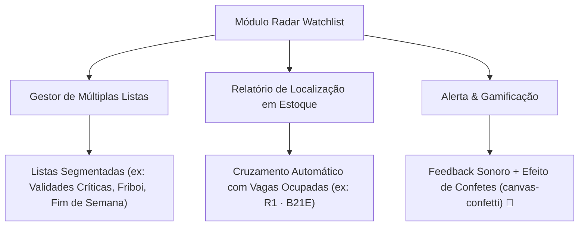

# 🔎 Pesquisa, Consulta & Radar Watchlist

O módulo de **Pesquisa e Consulta** ([`PesquisaProduto.tsx`](file:///root/repo_pwa/components/PesquisaProduto.tsx)) é a central de consulta técnica de SKUs, busca inteligente por aproximação textual e monitoramento prioritário de validades (Watchlist) no **PaletScan PWA**.

---

## 🔍 1. Busca Avançada por Aproximação (Fuzzy Matching)

* **Biblioteca `fuzzball`**: Algoritmo `token_set_ratio` que tolera erros de digitação e acentuação cometidos no teclado do smartphone.
* **Consulta Local Imediata**: Busca reativa sobre o catálogo mestre sincronizado no WatermelonDB, sem depender de conexão de rede.

---

## 🎯 2. Radar de Produtos Procurados (Multi-Watchlists)

---

## 🏷️ 3. Gerenciamento e Vínculo de Códigos (`GerenciarCodigosModal.tsx`)

* **Vínculo de Caixas (DUN-14)**: Permite associar códigos de caixa máster de 14 dígitos a produtos EAN consumidores.
* **Código de Pesagem / Balança**: Restrito estritamente a produtos fracionados de peso variável.
* **Gravação Segura**: Persistido com prioridade na tabela `produtos_atributos_manuais`, garantindo imunidade contra rotinas automáticas de ETL.
