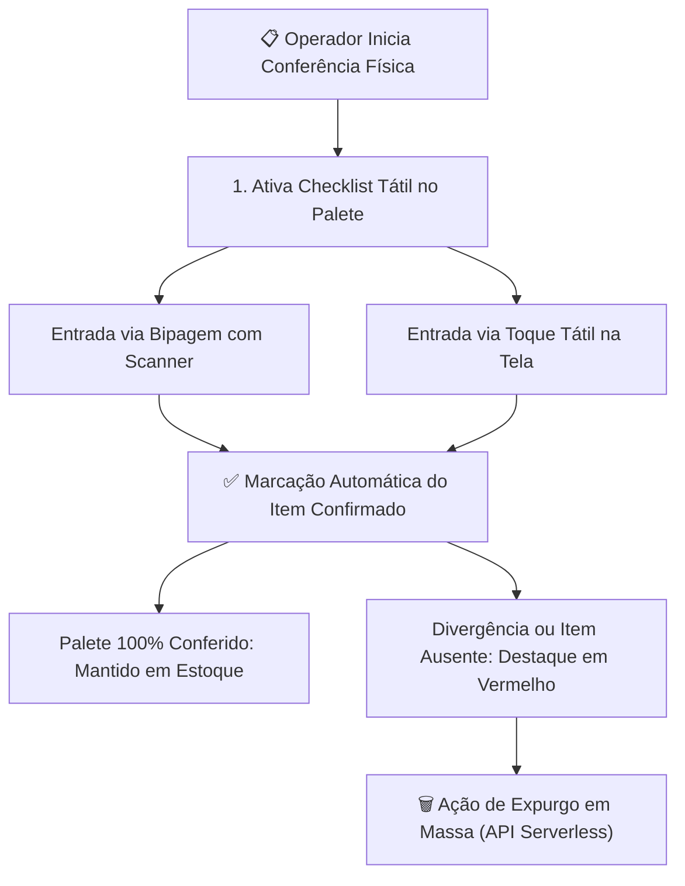
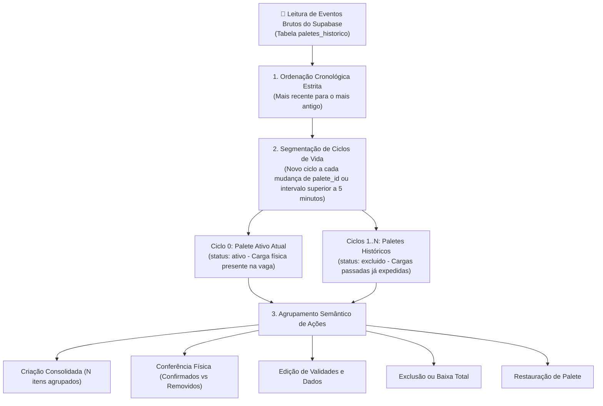
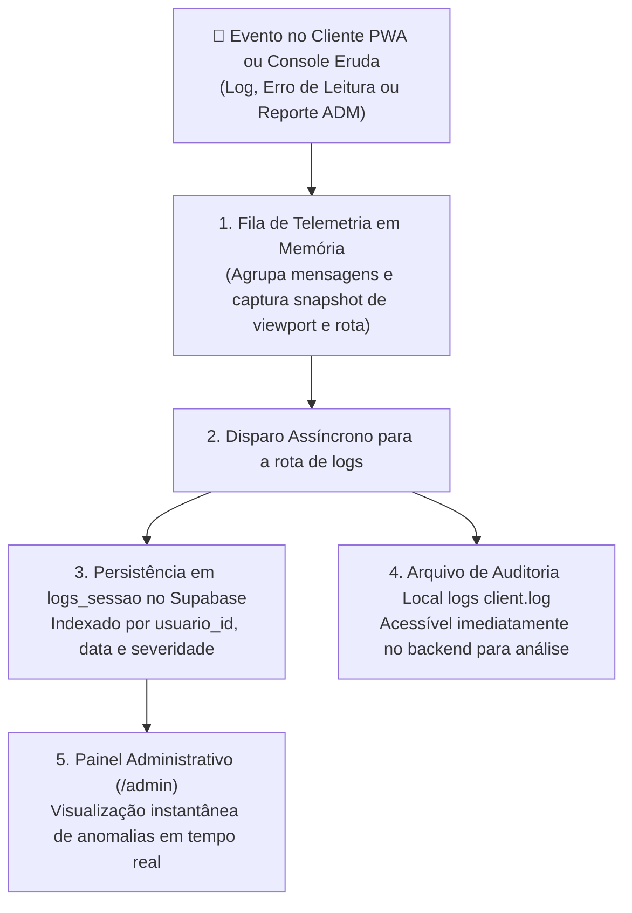

# 📊 Relatórios, Conferência & Auditoria

Os módulos de relatórios e auditoria do **PaletScan PWA** centralizam o controle de estoque, acompanhamento de validades, conferência física de paletes e auditoria de inventário.

---

## 📈 1. Relatório Geral de Paletes ([`Relatorio.tsx`](file:///root/repo_pwa/components/Relatorio.tsx))

* **Cards de Métricas Operacionais**: Total de paletes, SKUs únicos, câmaras em uso e divisão Congelados/Resfriados.
* **Filtro Multi-Seleção de Marcas em Estoque Físico**: O seletor de marcas calcula dinamicamente as opções disponíveis a partir dos paletes reais armazenados nas câmaras frias, permitindo seleção múltipla sem poluir a lista com marcas sem estoque.
* **Cabeçalho Adaptativo e Responsivo**:
  - **Desktop / Tablet**: Exibição completa de colunas (Recebimento, Código, Descrição, Marca, Vaga, Validade e Dias Restantes).
  - **Smartphone**: Layout compacto e verticalizado, otimizando o espaço da tela para visualização rápida da posição física da carga.
* **Padronização de Contêiner**: Largura simétrica fixa (`min-w-[92px] sm:min-w-[100px]`) para exibição consistente de contadores de itens em smartphones.

---

## 📋 2. Modo de Conferência Física de Paletes & Checklist

O fluxo de auditoria física de estoque opera com checklist reativo e ações em massa:

---

## 🧬 3. Motor de Histórico & Ciclos de Vida (`paleteHistoricoEngine.ts`)

Para garantir rastreabilidade total sem poluir a interface do usuário com dezenas de linhas individuais para o mesmo palete, o componente de histórico processa os eventos brutos em **Grupos Semânticos e Ciclos de Vida**:

### Tipos Canônicos de Eventos de Ciclo de Vida:
* `CRIACAO_PALETE` / `CRIACAO`: Criação de um novo palete físico na vaga. Eventos ocorridos na mesma janela temporal são agrupados sob um único card visual (*"Criação do Palete: X itens"*).
* `ADICAO_PRODUTO`: Adição de novo SKU a um palete já existente na câmara fria.
* `CONFERENCIA_ITEM_CONFIRMADO`: Validação física de que a caixa/fardo está presente na câmara.
* `CONFERENCIA_AUSENTE_REMOVIDO`: Baixa de produto ausente durante o checklist.
* `EDICAO_VALIDADE`: Ajuste manual na data de validade de um produto já alocado.
* `EXCLUSAO_TOTAL_PALETE`: Baixa completa do palete da vaga, selando o ciclo de vida.
* `RESTAURACAO_PALETE`: Recuperação de palete ou produto excluído acidentalmente.

---

## 📡 4. Telemetria de Sessão e DevTools Remoto (Eruda & `logs_sessao`)

O chão de fábrica apresenta variáveis incontroláveis de rede e hardware (temperaturas extremas, lentes de câmera embaçadas por condensação térmica e dispositivos de diferentes marcas). 

Para permitir diagnósticos em tempo real sem necessidade de conectar cabos USB no interior das câmaras:

### Recursos de Telemetria Operacional:
* **Snapshot de Ambiente do Dispositivo**: Resolução de tela (ex: `1600x765` para Desktop vs `390x844` para mobile), User-Agent, rota ativa e tempo de resposta da rede.
* **Eruda DevTools Móvel**: Console flutuante integrado acionável em campo por administradores para ver logs locais do browser no celular.
* **Histórico de Auditoria**: Qualquer alteração em paletes, exclusões em massa ou bloqueios de marcas é auditada com o login do operador.

---

## 📄 5. Exportação de Relatórios (CSV CP1252 & PDF Executivo)

* **CSV Otimizado para Android (`CP1252`)**: Codificação Windows-1252 com delimitador ponto e vírgula (`;`), abrindo diretamente no Excel/Google Sheets do celular sem problemas de acentuação.
* **PDF Executivo (`jspdf` + `jspdf-autotable`)**: Relatório formatado com cabeçalho corporativo, divisão por câmara/vaga e badges de validade.
* **Android MediaScan**: Indexação imediata dos arquivos na biblioteca do dispositivo via `termux-media-scan`.

