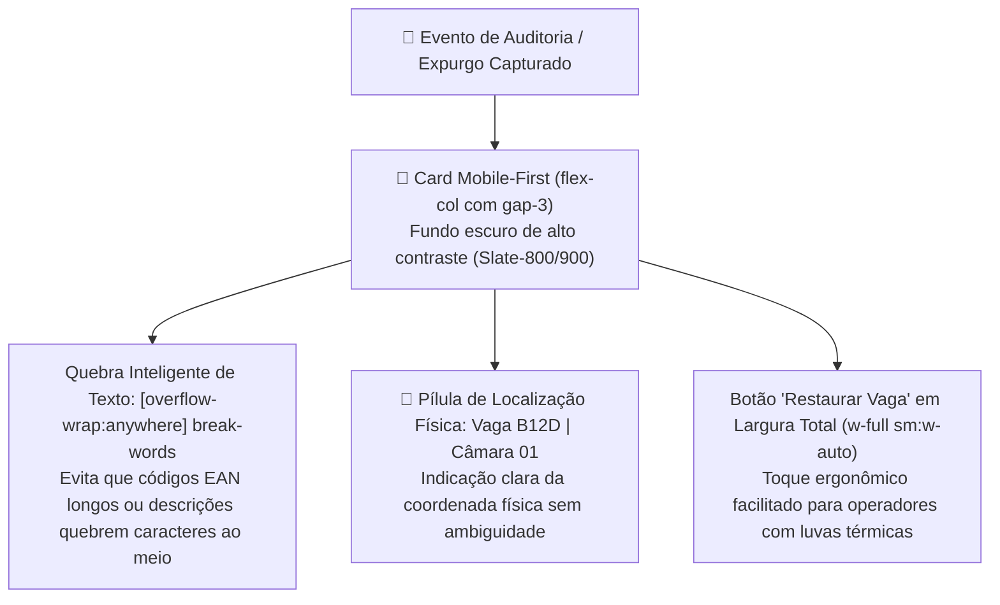
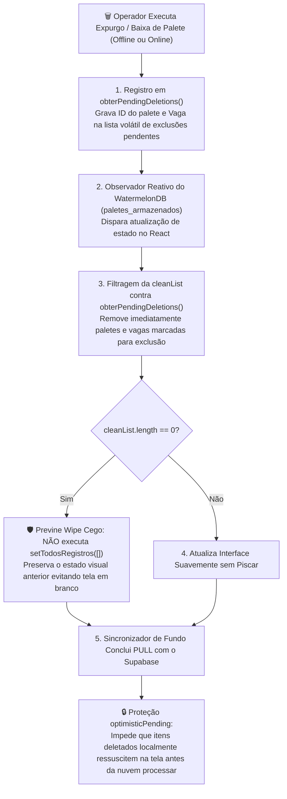
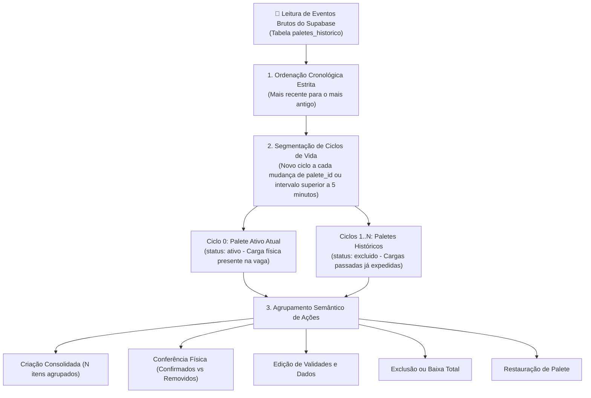
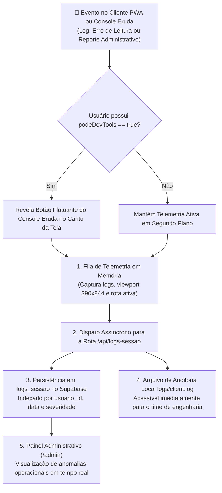

# 📊 Relatórios, Auditoria Mobile-First, Ciclos de Vida & Telemetria

Os módulos de relatórios e auditoria do **PaletScan PWA** centralizam o controle de estoque em câmaras frigoríficas, acompanhamento de validades, conferência física de paletes, layout mobile-first para auditoria administrativa, motor semântico de ciclos de vida e telemetria remota de erros via Eruda DevTools.

---

## 📈 1. Relatório Geral de Paletes ([`Relatorio.tsx`](file:///root/repo_pwa/components/Relatorio.tsx))

* **Cards de Métricas Operacionais**: Total de paletes, SKUs únicos, câmaras em uso e divisão Congelados/Resfriados.
* **Filtro Multi-Seleção de Marcas em Estoque Físico**: O seletor de marcas calcula dinamicamente as opções disponíveis a partir dos paletes reais armazenados nas câmaras frias, permitindo seleção múltipla sem poluir a lista com marcas sem estoque.
* **Cabeçalho Adaptativo e Responsivo**:
  - **Desktop / Tablet**: Exibição tabular completa (Recebimento, Código, Descrição, Marca, Vaga, Validade e Dias Restantes).
  - **Smartphone**: Layout compacto e verticalizado, otimizando o espaço da tela para visualização rápida da posição física da carga.
* **Padronização de Contêiner**: Largura simétrica fixa (`min-w-[92px] sm:min-w-[100px]`) para exibição consistente de contadores de itens em smartphones.

---

## 📱 2. Painel de Auditoria Mobile-First ([`pages/admin.tsx`](file:///root/repo_pwa/pages/admin.tsx))

Para conferentes e auditores que utilizam smartphones ou coletores Android estreitos (ex: largura de 360px a 390px), o painel de auditoria foi totalmente refatorado com ergonomia móvel:

### Características de Usabilidade:
* **Prevenção de Truncamento de Palavras**: Uso da classe `[overflow-wrap:anywhere] break-words`, permitindo leitura limpa de termos técnicos e códigos sem extrapolar a largura do visor.
* **Ação Rápida de Restauração**: O botão *"Restaurar Vaga"* ocupa a largura total da tela no smartphone (`w-full`), oferecendo área de toque confortável.
* **Fallback Seguro de Câmara**: Caso o log histórico não traga a câmara explicitada, o sistema aplica fallback seguro para `CAMARA 01`.

---

## 🛡️ 3. Blindagem de Expurgo Offline & Prevenção de Flash de Tela Vazia

Um problema comum em aplicações reativas é o **efeito de "ressurreição" visual ou flash de tela vazia** durante transições assíncronas entre o banco local e a nuvem. O PaletScan implementa uma blindagem de três camadas:

---

## 🧬 4. Motor de Histórico & Ciclos de Vida (`paleteHistoricoEngine.ts`)

Para garantir rastreabilidade total sem poluir a interface do usuário com dezenas de linhas individuais para o mesmo palete, o componente de histórico processa os eventos brutos em **Grupos Semânticos e Ciclos de Vida**:

### Tipos Canônicos de Eventos de Ciclo de Vida:
* `CRIACAO_PALETE` / `CRIACAO`: Criação de novo palete na vaga. Eventos na mesma janela temporal são agrupados (*"Criação do Palete: X itens"*).
* `ADICAO_PRODUTO`: Adição de novo SKU a um palete já existente na câmara fria.
* `CONFERENCIA_ITEM_CONFIRMADO`: Validação física de que a caixa/fardo está presente na câmara.
* `CONFERENCIA_AUSENTE_REMOVIDO`: Baixa de produto ausente durante o checklist.
* `EDICAO_VALIDADE`: Ajuste manual na data de validade de um produto alocado.
* `EXCLUSAO_TOTAL_PALETE`: Baixa completa do palete da vaga, selando o ciclo de vida.
* `RESTAURACAO_PALETE`: Recuperação de palete ou produto excluído acidentalmente.

---

## 📡 5. Telemetria de Sessão e DevTools Remoto (Eruda & `logs_sessao`)

O chão de fábrica apresenta variáveis incontroláveis de hardware e rede (temperaturas extremas, lentes de câmera embaçadas por condensação térmica e dispositivos de diferentes marcas). 

Para permitir diagnósticos em tempo real sem necessidade de conectar cabos USB no interior das câmaras frias:

### Recursos de Telemetria Operacional:
* **Snapshot de Ambiente do Dispositivo**: Resolução de tela (ex: `390x844` para iPhone / Android vs `1600x765` para desktop), User-Agent, status online/offline e rota ativa.
* **Integração com Reportes de Divergência**: Quando o operador reporta uma embalagem divergente em [`ReportarDivergenciaModal.tsx`](file:///root/repo_pwa/components/ReportarDivergenciaModal.tsx), o snapshot dos últimos logs do console do Eruda é anexado automaticamente para análise remota.
