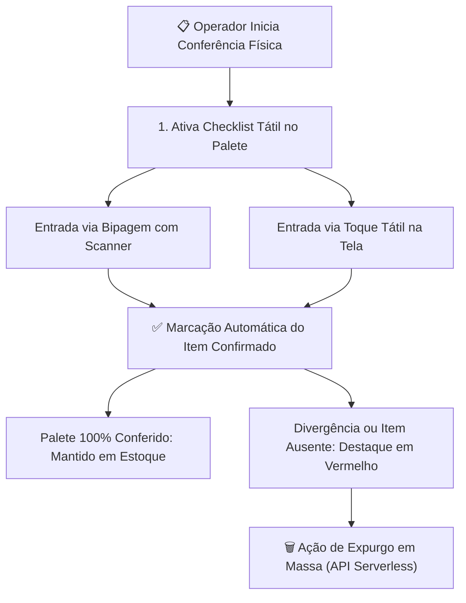

# 📊 Relatórios, Conferência & Auditoria

Os módulos de relatórios e auditoria do **PaletScan PWA** centralizam o controle de estoque, acompanhamento de validades, conferência física de paletes e auditoria de inventário.

---

## 📈 1. Relatório Geral de Paletes ([`Relatorio.tsx`](file:///root/repo_pwa/components/Relatorio.tsx))

* **Cards de Métricas Operacionais**: Total de paletes, SKUs únicos, câmaras em uso e divisão Congelados/Resfriados.
* **Filtro Multi-Seleção de Marcas em Estoque Físico**: O seletor de marcas calcula dinamicamente as opções disponíveis a partir dos paletes reais armazenados nas câmaras frias, permitindo seleção múltipla sem poluir a lista com marcas sem estoque.
* **Cabeçalho Adaptativo e Responsivo**:
  - **Desktop / Tablet**: Exibição completa de colunas (Recebimento, Código, Descrição, Marca, Vaga, Validade e Dias Restantes).
  - **Smartphone**: Layout compacto e verticalizado, otimizando o espaço da tela para visualização rápida da posição física da carga.
* **Padronização de Contêiner**: Largura simétrica fixa (`min-w-[92px] sm:min-w-[100px]`) para exibição consistente de contadores de itens em smartphones.

---

## 📋 2. Modo de Conferência Física de Paletes & Checklist

O fluxo de auditoria física de estoque opera com checklist reativo e ações em massa:

---

## 📄 3. Exportação de Relatórios (CSV CP1252 & PDF Executivo)

* **CSV Otimizado para Android (`CP1252`)**: Codificação Windows-1252 com delimitador ponto e vírgula (`;`), abrindo diretamente no Excel/Google Sheets do celular sem problemas de acentuação.
* **PDF Executivo (`jspdf` + `jspdf-autotable`)**: Relatório formatado com cabeçalho corporativo, divisão por câmara/vaga e badges de validade.
* **Android MediaScan**: Indexação imediata dos arquivos na biblioteca do dispositivo via `termux-media-scan`.
