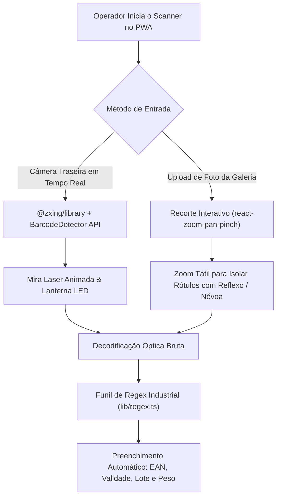

# 🔍 Leitor Óptico & Funil de Regex Industrial

O módulo de leitura visual e decodificação do **PaletScan PWA** combina o leitor de câmera com um funil de expressões regulares industriais especializado nas normas internacionais GS1 e particularidades de fornecedores alimentícios.

---

## 📷 1. Componente Leitor Óptico (`Scanner.tsx`)

---

## 🧩 2. Motor de Regex Industrial (`lib/regex.ts`)

### A. Tabela de Identificadores GS1 e Regras Especiais

| Identificador (AI) | Significado | Exemplo de Leitura | Ação Executada pelo Sistema |
| :--- | :--- | :--- | :--- |
| `(01)` ou `01` | GTIN-14 / DUN-14 | `0107891000123456` | Identifica a caixa máster ou produto de 14 dígitos. |
| `(17)` ou `17` | Data de Vencimento | `17260830` | Converte `260830` em validade formatada `30/08/2026`. |
| `(10)` ou `10` | Lote de Fabricação | `10L2026A` | Associa a string ao campo de lote do palete. |
| `(11)` ou `11` | Data de Fabricação (Marca Lar) | `11250830` | Quando o AI 17 está ausente, o sistema calcula automaticamente a validade sugerida de **+365 dias**. |
| `(310X)` / `(pesar)` | Pesagem Variável | `3102001550` | Detecta peso em balança e abre o campo de quilos no formulário. |

### B. Normalização de Zeros à Esquerda
O motor padroniza variações de formatação de códigos EAN/DUN de indústrias como **Friboi / JBS**, permitindo a correspondência perfeita com o catálogo master gerado pelo pipeline ETL.
