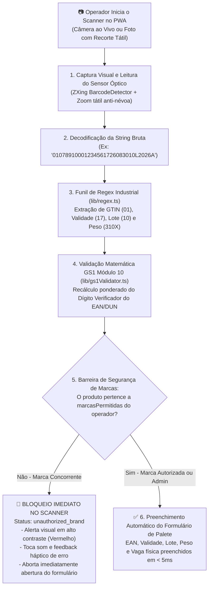
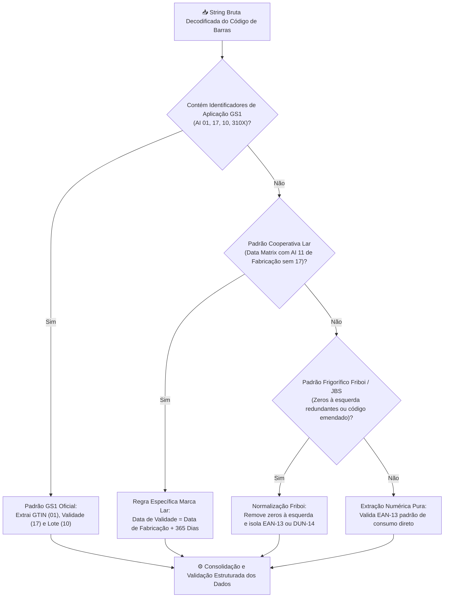

# 🔍 Leitor Óptico, Funil de Regex Industrial & Barreira de Marcas

O módulo de leitura visual e decodificação do **PaletScan PWA** ([`Scanner.tsx`](file:///root/repo_pwa/components/Scanner.tsx)) combina o motor de leitura óptica da câmera com um funil especializado de expressões regulares industriais (normas GS1-128 e Data Matrix), validação matemática GS1 Módulo 10 e barreira imediata de marcas permitidas para promotores restritos.

---

## 📷 1. Componente Leitor Óptico & Fluxo Operacional

---

## 🧩 2. Motor de Regex Industrial (`lib/regex.ts`)

O motor de expressões regulares atua em pipeline sequencial vertical, tratando diferentes padrões de indústrias alimentícias sem gerar falsos positivos:

### Tabela de Identificadores GS1 e Regras Especiais:

| Identificador (AI) | Significado | Exemplo de Leitura | Ação Executada pelo Sistema |
| :--- | :--- | :--- | :--- |
| `(01)` ou `01` | GTIN-14 / DUN-14 | `0107891000123456` | Identifica a caixa máster ou fardo de distribuição de 14 dígitos. |
| `(17)` ou `17` | Data de Vencimento | `17260830` | Converte `260830` em validade formatada `30/08/2026`. |
| `(10)` ou `10` | Lote de Fabricação | `10L2026A` | Associa a cadeia alfanumérica ao campo de lote do palete. |
| `(11)` ou `11` | Data de Fabricação (Marca Lar) | `11250830` | Na ausência do AI 17, projeta automaticamente **+365 dias** de validade. |
| `(310X)` / `(pesar)` | Pesagem Variável | `3102001550` | Identifica peso em balança e abre o campo de quilos no formulário. |

---

## 📐 3. Validação Matemática GS1 Módulo 10 (`lib/gs1Validator.ts`)

Além de extrair códigos por padrões regex, o sistema executa a validação matemática estrita da norma **GS1 Módulo 10** em tempo real:

* **Validação de DUN-14**: Exige 14 dígitos numéricos estritos e calcula o dígito verificador ponderado. Códigos digitados incorretamente recebem alerta visual imediato prevenindo gravações incorretas.
* **Validação de EAN-13**: Garante que o dígito de controle do produto comercial seja matematicamente válido antes de permitir a associação de novos SKUs.
* **Detecção de Correlação EAN x DUN**: Avalia matematicamente se um código DUN-14 é uma variante direta (`variante_direta`) ou agrupamento logístico (`caixa_distribuicao`) do EAN base, evitando associações de produtos diferentes.

---

## 🚫 4. Bloqueio no Scanner para Marcas Concorrentes

Quando um promotor (ex: **Sadia**) bipa um produto concorrente (ex: **Seara**):
1. O scanner decodifica o código com sucesso.
2. Consulta o catálogo local pré-sincronizado ou a API de validação.
3. Ao identificar a marca divergente, aciona o status `unauthorized_brand`.
4. Exibe o alerta vermelho na tela:
   > *"Produto de marca não autorizada. Seu acesso nesta filial está restrito a: [Marcas Permitidas]."*
5. A câmera permanece ativa para a leitura do próximo item sem travar a interface e sem expor informações de estoque ou validade do produto concorrente.
