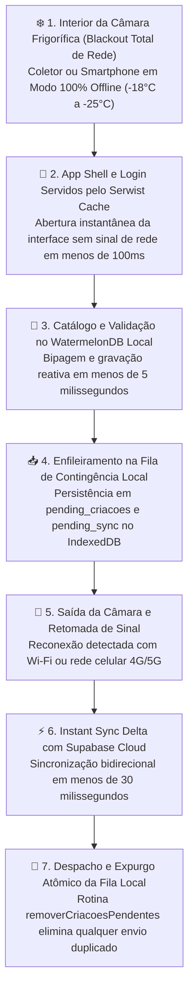
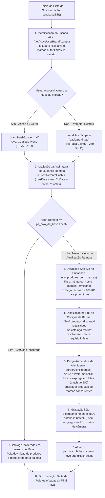
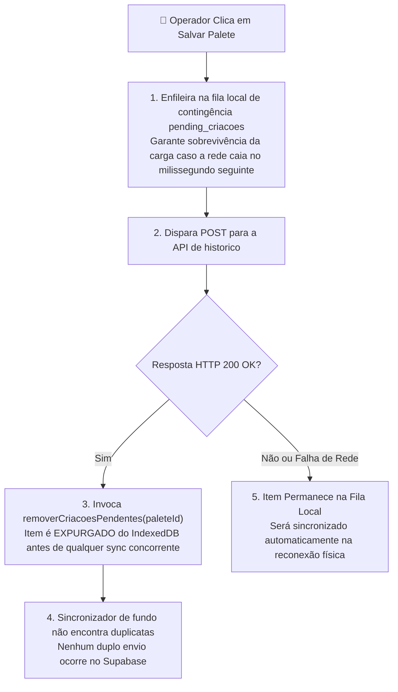
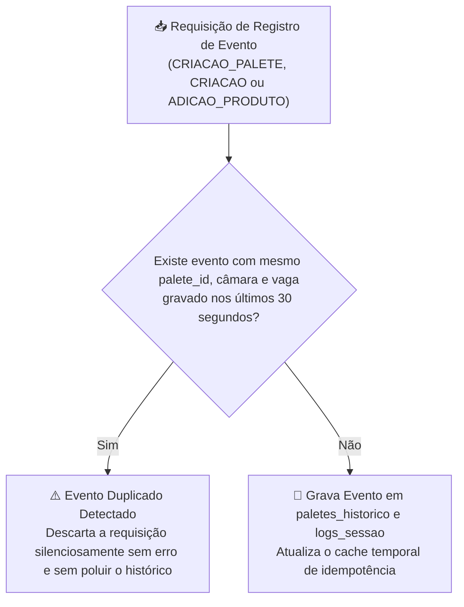

# ⚡ Service Worker, Resiliência Offline & Motor Local-First (WatermelonDB)

O **PaletScan PWA** foi concebido para resolver o problema clássico de conectividade em depósitos industriais: **o isolamento térmico das câmaras frigoríficas atua fisicamente como uma Gaiola de Faraday**, bloqueando sinais Wi-Fi e redes móveis (4G/5G).

Para operar sem interrupções nesse ambiente hostil, o sistema emprega uma arquitetura **Local-First** com Service Worker inteligente ([Serwist](https://github.com/serwist/serwist)), banco de dados reativo de alta performance (**WatermelonDB / IndexedDB**), sincronização delta seletiva por escopo de marcas e purga automática de dados alienígenas.


## ❄️ 1. O Desafio da Câmara Frigorífica



## 🛠️ 2. Motor de Service Worker (`sw.ts` / `@serwist/next`)

O gerenciamento de cache é orquestrado pelo **Serwist**, compilado em tempo de build:

```typescript
/// <reference lib="webworker" />
import { defaultCache } from '@serwist/next/worker';
import { Serwist, NetworkFirst, NetworkOnly, CacheFirst } from 'serwist';

declare const self: ServiceWorkerGlobalScope & {
  __SW_MANIFEST: (string | { url: string; revision: string | null })[];
};

const serwist = new Serwist({
  precacheEntries: self.__SW_MANIFEST,
  skipWaiting: true,
  clientsClaim: true,
  navigationPreload: false,
  fallbacks: {
    entries: [
      {
        url: '/',
        matcher({ request }) {
          return request.mode === 'navigate';
        },
      },
    ],
  },
  runtimeCaching: [
    {
      // 1. Não cacheia rotas de mutação de API
      matcher: ({ url }) => url.pathname.startsWith('/api/'),
      handler: new NetworkOnly(),
    },
    {
      // 2. Navegação suave do App Shell e Login com fallback offline
      matcher: ({ request, url }) => request.mode === 'navigate' || url.pathname === '/' || url.pathname === '/login',
      handler: new NetworkFirst({
        cacheName: 'offline-pages',
        networkTimeoutSeconds: 3,
      }),
    },
    {
      // 3. CacheFirst para imagens: economia extrema de tráfego de rede móvel
      matcher: ({ request, url }) =>
        request.destination === 'image' ||
        url.pathname.startsWith('/imagens_produtos/') ||
        url.hostname.includes('supabase.co') ||
        /\.(?:png|jpg|jpeg|svg|webp|gif|bmp|ico)/i.test(url.pathname),
      handler: new CacheFirst({
        cacheName: 'product-images-cache-v2',
      }),
    },
    ...defaultCache,
  ],
});

serwist.addEventListeners();
```

## 🗄️ 3. Sincronização Seletiva, Invalidação de Hash & Purga de Alienígenas (`lib/database/sync.ts`)

Diferente de abordagens tradicionais que baixam o catálogo completo de 3.776 produtos para todos os celulares (gerando lentidão e vazamento de dados de concorrentes), o motor de sincronização do PaletScan adota uma arquitetura **Seletiva, Segmentada e Econômica**:



### Principais Pilares da Sincronização Local-First:
1. **Cache Inteligente por Hash de Escopo (`brandHashScope`)**:
   - A fórmula da chave de hash incorpora as marcas outorgadas ao operador e a última mutação de códigos de barras (`maxCbDate`):
     ```typescript
     const brandHashScope = brandAccess.acessoTodasMarcas
       ? 'all'
       : brandAccess.marcasPermitidas.slice().sort().map(m => m.toLowerCase().trim()).join('|');
     currentRemoteHash = `${maxProdDate}_${maxCbDate}_${remoteProdCount}_${remoteCbCount}_v54_catalog_update_${brandHashScope}`;
     ```
   - Ao reabrir o PWA, a checagem leva **menos de 10ms**. Caso o catálogo do promotor não tenha sofrido alterações na indústria, o app **não consome dados de rede nem recarrega tabelas**.
   - Se o promotor fizer logout e entrar um promotor de marca concorrente, o `brandHashScope` se altera instantaneamente, forçando a invalidação imediata e o download apenas da nova fatia.
2. **Purga Atômica de Produtos Alienígenas ([`purgeAlienProdutos`](file:///root/repo_pwa/lib/database/sync.ts#L494))**:
   - Em smartphones ou coletores compartilhados entre turnos, se um promotor anterior deixou produtos de marcas concorrentes no IndexedDB, a rotina de purga é acionada no login e expurga em lotes atômicos de 500 registros (`database.batch`) todos os produtos estranhos à credencial ativa.
3. **Otimização Extrema de Códigos de Barras ([`sync.ts`](file:///root/repo_pwa/lib/database/sync.ts#L891))**:
   - Caso nenhum produto seja puxado para o operador, **zero** requisições são disparadas para a tabela `codigos_barras`.
   - Para catálogos restritos de promotores (~250 itens), a busca de EANs, DUNs e pesagens é resolvida em uma **única página HTTP**, gerando uma economia superior a **85% de banda e tempo de processamento**.
4. **Telemetria de Sincronização Fidedigna ([`StatusSincronizacao.tsx`](file:///root/repo_pwa/components/StatusSincronizacao.tsx))**:
   - A pílula de sincronização na barra de navegação calcula o status com base no escopo autorizado:
     - Promotor BRF (248 produtos autorizados): exibe `Sincronizado (248)` com badge verde;
     - Administrador Geral (3.776 produtos): exibe `Sincronizado (3776)`.

## 🛡️ 4. Fila Offline `pending_criacoes` & Expurgo Imediato Anti-Duplicação

Um dos desafios mais sutis em aplicações móveis industriais é a **duplicação de registros por sincronização concorrente**.

### O Cenário de Corrida (Race Condition):
1. O operador bipa e salva um palete com a rede online.
2. Como salvaguarda contra quedas imprevistas de Wi-Fi, o aplicativo imediatamente coloca o palete na fila IndexedDB `pending_criacoes` via [`lib/paleteOfflineHistorico.ts`](file:///root/repo_pwa/lib/paleteOfflineHistorico.ts).
3. A requisição HTTP para a API `/api/paletes-historico` completa com sucesso em ~200ms.
4. Ao receber o retorno positivo, o fluxo chamava a sincronização de pendências em segundo plano.
5. Se o item ainda residisse na fila local, o sincronizador o enviava uma segunda vez ao Supabase com diferença de poucas centenas de milissegundos!

### A Solução: Expurgo Atômico Imediato (`removerCriacoesPendentes`):
Para eliminar essa brecha, foi implementada a rotina de expurgo imediato:



## ⏱️ 5. Barreira de Idempotência Temporal no Backend (`paleteLifecycle.ts`)

Como rede industrial em galpões de alvenaria e câmaras frigoríficas pode reenviar pacotes TCP ou o operador pode dar duplo clique rápido no botão tátil do smartphone, o backend implementa uma **Barreira de Idempotência Temporal de 30 Segundos**:



- **Escopo da Proteção**: Eventos de criação inicial e adições de produtos ficam blindados contra reenvios acidentais.
- **Janela Temporal Calibrada**: O período de 30 segundos cobre confortavelmente oscilações de conexão e retentativas automáticas de Service Workers e navegadores.

## 📐 6. Invariantes Estritos de Schema do WatermelonDB

Para evitar travamentos silenciosos no motor de banco local no smartphone:
- Colunas de carimbo de tempo gerenciadas pelo motor (como `updated_at` e `created_at`) devem ser estritamente do tipo `number` e **não opcionais** (`isOptional: false`).
- Qualquer migração ou schema que marque `updated_at` como opcional dispara erro de invariante no WatermelonDB (`Diagnostic error: updated_at must be of type number and not optional`).
- A arquitetura garante que todos os schemas e migrações sigam rigorosamente a tipagem numérica invariante.

## 📡 7. Circuit Breaker Tri-State de Conectividade (`networkHealth.ts`)

Para proteger o operador contra congelamento da interface durante oscilações de sinal:
- **Estados Tri-State da Rede**: O sistema avalia dinamicamente os estados `ONLINE` (latência estável < 1.500ms), `OSCILANDO` (perda parcial de pacotes ou latência elevada) e `OFFLINE` (blackout total de sinal na câmara).
- **Pílula de Conectividade na Base da Tela ([`NetworkStatusPill.tsx`](file:///root/repo_pwa/components/NetworkStatusPill.tsx))**: Exibe o status da conexão em formato flutuante e ergonômico, com opção de descarte rápido pelo operador para desobstruir a área de trabalho.
- **Modo Preventivo Offline**: Quando a rede começa a oscilar, o circuito desarma requisições longas de rede e comuta automaticamente para gravação imediata no IndexedDB local, evitando engasgos ou telas pretas.
- **Daemon de Monitoramento Bash ([`network_sentinel.sh`](file:///root/repo_pwa/scripts/network_sentinel.sh))**: Script sentinela em segundo plano que valida conectividade contínua em ambientes Termux através de comandos integrados `npm run sentinel:status`.

## 🔄 8. Auto-Update Proativo, Heartbeat de 30s & Prevenção de Duplo Reload

Para garantir que correções críticas de software cheguem aos smartphones sem exigir intervenção manual do operador:
- **Heartbeat de Verificação (30 Segundos)**: Ciclo em segundo plano no `pages/_app.tsx` que consulta a existência de novos Service Workers registrados.
- **Prevenção de Recarregamento Duplo**: Utiliza a chave `ps_manual_reload_ts` em `sessionStorage` para impedir que reloads automáticos colidam com recarregamentos manuais acionados pelo usuário.
- **Purga Ativa de Caches Obsoletos**: Ao detectar uma nova versão, o Service Worker expurga caches legados de páginas e bundles Javascript antes de aplicar o `window.location.reload()`, assegurando inicialização limpa.

## 📦 9. Filas de Contingência Offline para Reportes e Telemetria

- **Fila Offline de Divergências ([`lib/reportesOffline.ts`](file:///root/repo_pwa/lib/reportesOffline.ts))**: Divergências de cadastro apontadas na câmara fria são enfileiradas no IndexedDB e despachadas para o Supabase assim que a conexão se restabelece.
- **Fila de Logs e Telemetria DevTools ([`lib/clientLogBridge.ts`](file:///root/repo_pwa/lib/clientLogBridge.ts))**: Eventos do console Eruda e erros operacionais ocorridos sem sinal são armazenados localmente e sincronizados em lote com a tabela `logs_sessao`.
