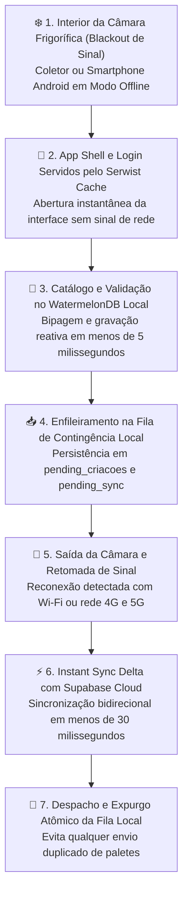
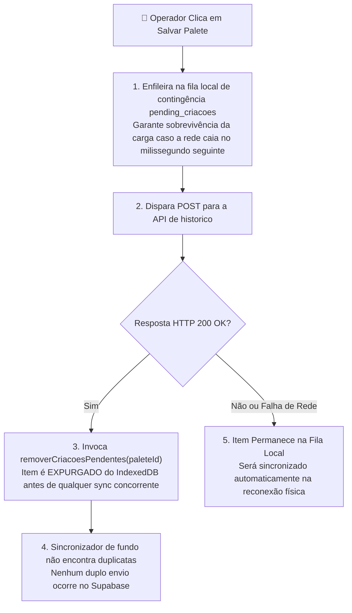
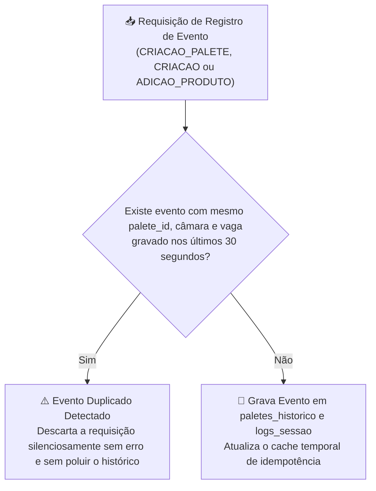

# ⚡ Service Worker & Resiliência Offline

O **PaletScan PWA** foi concebido para resolver o problema clássico de conectividade em depósitos industriais: **o isolamento térmico das câmaras frigoríficas atua fisicamente como uma Gaiola de Faraday**, bloqueando sinais Wi-Fi e redes móveis (4G/5G).

---

## ❄️ 1. O Desafio da Câmara Frigorífica



---

## 🛠️ 2. Motor de Service Worker (`sw.ts` / `@serwist/next`)

O gerenciamento de cache é orquestrado pelo **Serwist**, compilado em tempo de build:

```typescript
/// <reference lib="webworker" />
import { defaultCache } from '@serwist/next/worker';
import { Serwist, NetworkFirst, NetworkOnly, CacheFirst } from 'serwist';

declare const self: ServiceWorkerGlobalScope & {
  __SW_MANIFEST: (string | { url: string; revision: string | null })[];
};

const serwist = new Serwist({
  precacheEntries: self.__SW_MANIFEST,
  skipWaiting: true,
  clientsClaim: true,
  navigationPreload: true,
  fallbacks: {
    entries: [
      {
        url: '/',
        matcher({ request }) {
          return request.mode === 'navigate';
        },
      },
    ],
  },
  runtimeCaching: [
    {
      // 1. Não cacheia rotas de mutação de API
      matcher: ({ url }) => url.pathname.startsWith('/api/'),
      handler: new NetworkOnly(),
    },
    {
      // 2. Navegação suave do App Shell e Login com fallback offline
      matcher: ({ request, url }) => request.mode === 'navigate' || url.pathname === '/' || url.pathname === '/login',
      handler: new NetworkFirst({
        cacheName: 'offline-pages',
        networkTimeoutSeconds: 3,
      }),
    },
    {
      // 3. CacheFirst para imagens: economia extrema de tráfego de rede móvel
      matcher: ({ request, url }) =>
        request.destination === 'image' ||
        url.pathname.startsWith('/imagens_produtos/') ||
        url.hostname.includes('supabase.co') ||
        /\.(?:png|jpg|jpeg|svg|webp|gif|bmp|ico)/i.test(url.pathname),
      handler: new CacheFirst({
        cacheName: 'product-images-cache-v2',
      }),
    },
    ...defaultCache,
  ],
});

serwist.addEventListeners();
```

---

## 🗄️ 3. Banco de Dados Local-First (WatermelonDB & IndexedDB)

Diferente de soluções convencionais que utilizam apenas o `localStorage` (limitado a 5MB e síncrono), o PaletScan utiliza o **WatermelonDB** construído sobre adaptadores **IndexedDB / LokiJS**:

* **Zero Latência**: Leitura e escrita completas em menos de 5 milissegundos.
* **Invalidação de Hash e Propagação de DUNs**: O sincronizador compara a assinatura de hash do catálogo remoto e invalida o cache local somente quando há mutações reais, forçando a propagação imediata de vínculos de DUN-14 para o IndexedDB móvel.
* **Fila de Contingência `pending_sync`**: Caso ocorra instabilidade de rede no envio para o Supabase, as mutações são preservadas localmente e despachadas automaticamente ao restabelecer o sinal.

---

## 🛡️ 4. Fila Offline `pending_criacoes` & Expurgo Imediato Anti-Duplicação

Um dos desafios mais sutis em aplicações móveis industriais é a **duplicação de registros por sincronização concorrente**.

### O Cenário de Corrida (Race Condition):
1. O operador bipa e salva um palete com a rede online.
2. Como salvaguarda contra quedas imprevistas de Wi-Fi, o aplicativo imediatamente coloca o palete na fila IndexedDB `pending_criacoes` via [`lib/paleteOfflineHistorico.ts`](file:///root/repo_pwa/lib/paleteOfflineHistorico.ts).
3. A requisição HTTP para a API `/api/paletes-historico` completa com sucesso em ~200ms.
4. Ao receber o retorno positivo, o fluxo chamava a sincronização de pendências em segundo plano.
5. Se o item ainda residisse na fila local, o sincronizador o enviava uma segunda vez ao Supabase com diferença de poucas centenas de milissegundos!

### A Solução: Expurgo Atômico Imediato (`removerCriacoesPendentes`):
Para eliminar essa brecha, foi implementada a rotina de expurgo imediato:



---

## ⏱️ 5. Barreira de Idempotência no Backend (`paleteLifecycle.ts`)

Como rede industrial em galpões de alvenaria e câmaras frigoríficas pode reenviar pacotes TCP ou o operador pode dar duplo clique rápido no botão tátil do smartphone, o backend implementa uma **Barreira de Idempotência Temporal de 30 Segundos**:



* **Escopo da Proteção**: Eventos de criação inicial e adições de produtos ficam blindados contra reenvios acidentais.
* **Janela Temporal Calibrada**: O período de 30 segundos cobre confortavelmente oscilações de conexão e retentativas automáticas de Service Workers e navegadores.

---

## 📐 6. Invariantes Estritos de Schema do WatermelonDB

Para evitar travamentos silenciosos no motor de banco local no smartphone:
* Colunas de carimbo de tempo gerenciadas pelo motor (como `updated_at` e `created_at`) devem ser estritamente do tipo `number` e **não opcionais** (`isOptional: false`).
* Qualquer migração ou schema que marque `updated_at` como opcional dispara erro de invariante no WatermelonDB (`Diagnostic error: updated_at must be of type number and not optional`).
* A arquitetura garante que todos os schemas e migrações sigam rigorosamente a tipagem numérica invariante.

