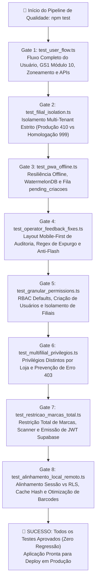

# 🧪 Suíte de Testes Automatizados, Garantias & Qualidade Contínua

O ecossistema **PaletScan PWA** opera em um dos cenários mais exigentes da indústria logística: câmaras frigoríficas industriais (-18°C a -25°C), ausência total de sinal de rede (Gaiola de Faraday), dispositivos móveis de diversas marcas operados por conferentes com luvas térmicas e controle rigoroso de validade de mercadorias perecíveis de alto valor agregado.

Para assegurar que qualquer alteração de código, refatoração de backend ou ajuste de interface preserve a estabilidade absoluta da operação, o projeto adota uma **filosofia de Zero Regressão**, amparada por uma suíte robusta de testes ponta a ponta, testes de integração local-first, validações criptográficas e barreiras de segurança multitenant.

---

## 🏛️ 1. Arquitetura do Pipeline de Testes e Portas de Qualidade (Quality Gates)

Todos os testes são orquestrados no pipeline contínuo através do comando central `npm test`, executando uma esteira sequencial de verificação rigorosa antes de qualquer deploy ou liberação para os operadores de campo:



---

## 📊 2. Matriz Geral das Suítes de Testes

| Comando | Arquivo de Teste | Camada Validada | Foco dos Casos de Teste |
| :--- | :--- | :--- | :--- |
| `npm test` | [`scripts/test_user_flow.ts`](file:///root/repo_pwa/scripts/test_user_flow.ts) | E2E / Negócio / Regras GS1 | Fluxo ponta a ponta do conferente: cadastro de usuário, hash de senha Argon2, zoneamento de vagas (4 caracteres), validação matemática GS1 Módulo 10, correlação EAN x DUN, PLU de balança e reportes de divergência. |
| `npm test` | [`scripts/test_filial_isolation.ts`](file:///root/repo_pwa/scripts/test_filial_isolation.ts) | Banco Relacional / Multi-Tenant | Segregação estrita entre Loja 410 (Produção) e Loja 999 (Homologação). Garante que conflitos e exclusões em massa em homologação não afetem o estoque real. |
| `npm run test:offline` | [`scripts/test_pwa_offline.ts`](file:///root/repo_pwa/scripts/test_pwa_offline.ts) | Local-First / Service Worker | Bipagem e armazenamento em modo offline dentro da câmara, integridade do IndexedDB, enfileiramento em `pending_criacoes` e despacho limpo ao restabelecer o sinal. |
| `npm test` | [`scripts/test_operator_feedback_fixes.ts`](file:///root/repo_pwa/scripts/test_operator_feedback_fixes.ts) | UX Mobile / Expurgo / Reatividade | Layout responsivo dos cards de auditoria móvel, prevenção de quebra de palavras, regex de expurgo em lote, botão "Restaurar Vaga" e eliminação do flash de tela vazia. |
| `npm run test:permissions` | [`scripts/test_granular_permissions.ts`](file:///root/repo_pwa/scripts/test_granular_permissions.ts) | Segurança / RBAC | Defaults de operador e visitante, persistência de permissões granulares parciais e configuração de filiais autorizadas. |
| `npm run test:multifilial` | [`scripts/test_multifilial_privilegios.ts`](file:///root/repo_pwa/scripts/test_multifilial_privilegios.ts) | Segurança / Multi-Filiais | Matriz dinâmica `privilegiosPorFilial`, permitindo que o mesmo usuário tenha privilégios e marcas diferentes em lojas distintas; proteção do endpoint `/api/auth/filiais-usuario`. |
| `npm run test:marcas` | [`scripts/test_restricao_marcas_total.ts`](file:///root/repo_pwa/scripts/test_restricao_marcas_total.ts) | Segurança / Promotores / RLS | Restrição total de marcas em scanner, busca e catálogo; emissão de JWT compatível com Supabase e validação criptográfica da assinatura HMAC-SHA256. |
| `npm run test:alinhamento` | [`scripts/test_alinhamento_local_remoto.ts`](file:///root/repo_pwa/scripts/test_alinhamento_local_remoto.ts) | Sincronização / Performance / RLS | Alinhamento da sessão local com o RLS remoto do Supabase, PULL seletivo de catálogo, purga automática de alienígenas (`purgeAlienProdutos`), cache por hash (`brandHashScope`) e telemetria da pílula. |
| `npm run test:mobile` | [`scripts/test_mobile_resilience.ts`](file:///root/repo_pwa/scripts/test_mobile_resilience.ts) | Interface / Hardware Móvel | Resiliência da viewport móvel, gestos de pinça e zoom anti-névoa na câmera, consumo de memória e ciclo de vida do Eruda DevTools. |

---

## 🔍 3. Detalhamento Aprofundado: Benefícios & Garantias de Cada Teste

### 1. `test_user_flow.ts` (Fluxo Operacional Ponta a Ponta)
* **O que valida**:
  - Cadastro, autenticação e validação de credenciais no repositório seguro (`authDb`);
  - Algoritmo matemático oficial **GS1 Módulo 10** com cálculo ponderado de pesos 3 e 1 para EAN-13 e DUN-14;
  - Regras de correlação entre EAN do produto e DUN da caixa máster;
  - Decomposição de coordenadas de endereçamento rígido em 4 caracteres (Rua, Prédio, Nível e Lado);
  - Persistência isolada de códigos de balança local (`pesarCodDb`) e moderação de reportes colaborativos (`reportesDb`).
* **Benefícios para o Desenvolvimento**:
  - Garante que mudanças no motor de validação ou banco de dados local não quebrem o fluxo diário que os operadores utilizam para receber cargas.
* **Garantias para o Negócio & Chão de Fábrica**:
  - **Zero Erros de Digitação:** Um operador com luvas não consegue salvar acidentalmente um código de barras com dígito verificador adulterado, eliminando falhas graves no inventário contábil.
  - **Zero Colisão de Endereçamento:** Garante que o padrão rígido de vagas da câmara seja cumprido à risca.

---

### 2. `test_filial_isolation.ts` (Blindagem Multi-Tenant: 410 vs 999)
* **O que valida**:
  - Inserção concorrente de paletes de Produção (`empresa_local` / Loja 410) e Homologação (`filial_999`) na mesma câmara e coordenada física;
  - Execução de expurgo, baixas e consultas filtradas por `empresa_id` / `filial_id`.
* **Benefícios para o Desenvolvimento**:
  - Permite que novos testes e validações de homologação sejam executados livremente em celulares de conferentes sem risco de contaminar o ambiente produtivo.
* **Garantias para o Negócio & Chão de Fábrica**:
  - **Imunidade Absoluta da Matriz:** Uma operação de "limpeza de banco" ou simulação de conflito na loja 999 **jamais** apaga ou movimenta paletes físicos da loja real 410.

---

### 3. `test_pwa_offline.ts` (Resiliência Local-First & Gaiola de Faraday)
* **O que valida**:
  - Sobrevivência de dados no IndexedDB / WatermelonDB quando a conexão cai no milissegundo seguinte à leitura;
  - Enfileiramento na fila `pending_criacoes` e rotina de expurgo imediato `removerCriacoesPendentes` para evitar duplicatas ao reconectar;
  - Retomada de sincronização delta em segundo plano.
* **Benefícios para o Desenvolvimento**:
  - Valida o comportamento assíncrono do Service Worker sob quedas súbitas de WebSocket e HTTP.
* **Garantias para o Negócio & Chão de Fábrica**:
  - **Zero Perda de Bipagem no Frio Extremo:** O operador pode registrar 50 paletes no fundo da câmara escura sem sinal; ao cruzar a porta do depósito e retomar o 4G/Wi-Fi, todos os dados sobem de forma atômica e sem duplicações.

---

### 4. `test_operator_feedback_fixes.ts` (Ergonomia Móvel & Estabilidade Visual)
* **O que valida**:
  - Expressões regulares de identificação de expurgo em massa nos logs de auditoria (com e sem aspas, variações de câmaras);
  - Classes de layout móvel dos cards de auditoria (`flex-col`, quebra de texto `[overflow-wrap:anywhere] break-words`);
  - Blindagem anti-flash de tela vazia: integração de `obterPendingDeletions()` com os observadores reativos de paletes em `pages/index.tsx` e `components/Relatorio.tsx`.
* **Benefícios para o Desenvolvimento**:
  - Impede regressões visuais em telas de smartphones de 360px a 390px e protege a reatividade do React contra renderizações vazias.
* **Garantias para o Negócio & Chão de Fábrica**:
  - **Fim do Piscar de Tela:** A interface não tem surtos visuais de "sumiço de paletes" durante sincronizações em segundo plano, evitando pânico no conferente.
  - **Operação Desimpedida com Luvas:** Botões de restauração em largura total (`w-full`) facilitam o clique rápido no coletor.

---

### 5. `test_granular_permissions.ts` (RBAC & Integridade de Perfis)
* **O que valida**:
  - Integridade das estruturas de usuário padrão (`DEFAULT_OPERADOR` e `DEFAULT_VISITANTE`);
  - Criação e persistência de operadores com permissões granulares parciais (ex: pode cadastrar palete mas não pode editar vaga);
  - Isolamento de filiais no armazenamento `auth_db.json`.
* **Benefícios para o Desenvolvimento**:
  - Valida tipagens TypeScript e defaults de modelo, impedindo que novas flags de permissão nasçam com valores indefinidos (*undefined*).
* **Garantias para o Negócio & Chão de Fábrica**:
  - **Princípio do Menor Privilégio:** Visitantes e operadores temporários não recebem privilégios indevidos por falha de inicialização de perfil.

---

### 6. `test_multifilial_privilegios.ts` (Permissões Customizadas por Loja)
* **O que valida**:
  - Resolução dinâmica da chave `privilegiosPorFilial` no NextAuth `authorize`;
  - Simulação de login do mesmo usuário na Loja 410 (onde tem privilégios restritos) e na Loja 999 (onde tem privilégios expandidos);
  - Prevenção de falso erro 403 em rotas administrativas através do helper `verifyAdminSession`;
  - Validação estrita de senha no endpoint `/api/auth/filiais-usuario`.
* **Benefícios para o Desenvolvimento**:
  - Desacopla o perfil do usuário de uma filial estática, viabilizando redes com dezenas de filiais ativas.
* **Garantias para o Negócio & Chão de Fábrica**:
  - **Flexibilidade com Segurança:** Promotores que cobrem múltiplas lojas têm seus privilégios rigorosamente ajustados de acordo com os acordos comerciais de cada praça.

---

### 7. `test_restricao_marcas_total.ts` (Segurança Total de Marcas & Supabase JWT)
* **O que valida**:
  - Bloqueio imediato no scanner (`unauthorized_brand`) para marcas fora do escopo do operador;
  - Filtragem do catálogo em `/api/validar` e `/api/produtos/buscar`;
  - Geração de token JWT Supabase assinado no padrão `HS256` utilizando `SUPABASE_JWT_SECRET`;
  - Validação criptográfica da assinatura HMAC-SHA256 e conformidade dos claims `role: 'authenticated'` e `app_metadata.marcas_permitidas`;
  - Fallback gracioso caso a chave de segredo não esteja configurada.
* **Benefícios para o Desenvolvimento**:
  - Garante a integridade criptográfica da ponte entre a autenticação NextAuth e as regras PostgreSQL do Supabase.
* **Garantias para o Negócio & Chão de Fábrica**:
  - **Sigilo Concorrencial Inviolável:** Um promotor da Sadia não consegue visualizar preços, validades, lotes ou histórico de produtos da Seara ou de qualquer outro concorrente, nem mesmo inspecionando o tráfego HTTP.

---

### 8. `test_alinhamento_local_remoto.ts` (Alinhamento Local-Remoto & Performance)
* **O que valida**:
  - Alinhamento em tempo real entre a sessão local (`ps_auth_session`), a filial ativa (`ps_active_filial`) e os claims do JWT Supabase;
  - Sincronização seletiva com filtro remoto `in('marca_nome', ...)`;
  - Rotina de purga em lotes atômicos (`purgeAlienProdutos`) para eliminação de resíduos em celulares compartilhados;
  - Otimização do hash de catálogo (`brandHashScope`), evitando downloads desnecessários (< 10ms);
  - Condensação de requisições de códigos de barras (zero chamadas se não houver produtos; página única para promotores);
  - Fidedignidade do contador da pílula de sincronização (`StatusSincronizacao`).
* **Benefícios para o Desenvolvimento**:
  - Mede e garante a economia extrema de recursos de rede e CPU no smartphone.
* **Garantias para o Negócio & Chão de Fábrica**:
  - **Agilidade e Baixo Consumo de Bateria:** O coletor não esquenta, não trava por falta de memória RAM e não consome a franquia do plano de dados móveis do depósito.
  - **Telemetria Confiável:** A pílula exibe com exatidão a fatia do operador, eliminando dúvidas se a carga está realmente atualizada.

---

## 🚀 4. Como Executar os Testes

```bash
# Executar a bateria completa de testes automatizados (Quality Gate)
npm test

# Executar suítes específicas individualmente:
npm run test:alinhamento    # Alinhamento local-remoto, RLS e performance
npm run test:marcas         # Restrição total de marcas e JWT Supabase
npm run test:multifilial    # Privilégios distintos por filial
npm run test:permissions    # Matriz RBAC granular
npm run test:offline        # Resiliência offline e filas de contingência
npm run test:mobile         # Ergonomia e resiliência de viewport móvel
```
