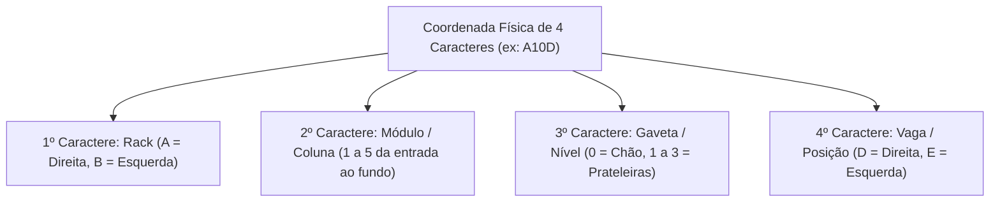
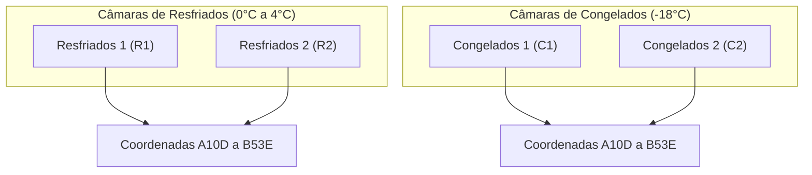

# 🏢 Endereçamento Rígido & Zoneamento de Vagas

O sistema de endereçamento do **PaletScan PWA** organiza espacialmente as câmaras frias através de coordenadas de 4 caracteres, prevenindo perdas de tempo na localização de lotes por operadores de empilhadeira.

---

## 📌 1. Composição da Coordenada de Vaga (4 Caracteres)

| Elemento | Significado | Valores | Descrição Operacional |
| :--- | :--- | :--- | :--- |
| **Rack** | Corredor | `A` (Direita) \| `B` (Esquerda) | Lado da estrutura em relação ao corredor de entrada central. |
| **Módulo** | Coluna | `1` a `5` | Posição horizontal da entrada da câmara (1) até o fundo (5). |
| **Gaveta** | Nível/Altura | `0` (Chão) \| `1` \| `2` \| `3` | Nível vertical (`0` = Solo, `1`/`2`/`3` = Prateleiras suspensas). |
| **Vaga** | Posição Lateral | `D` (Direita) \| `E` (Esquerda) | Posição exata do palete dentro do plano da gaveta. |

---

## ❄️ 2. Zoneamento das Câmaras Frigoríficas

* **Resfriados (`R1` / `R2`)**: Produtos lácteos, embutidos, margarinas e carnes resfriadas (0°C a 4°C).
* **Congelados (`C1` / `C2`)**: Vegetais, pratos prontos, polpas e aves/cortes congelados (-18°C).

---

## 🛑 3. Bloqueio Ativo de Vaga Duplicada

Durante a seleção de vaga no componente `VagaSelector.tsx`, o sistema consulta em milissegundos o banco local WatermelonDB:
- 🟢 **Vaga Livre**: Permite o salvamento imediato.
- 🔴 **Vaga Ocupada**: Trava o botão de confirmação e exibe os dados da carga já alocada, impedindo sobreposição e divergência de inventário.

---

## 🏷️ 4. Protocolo de Sinalização Física
1. **Etiquetas Adesivas**: Duas etiquetas impressas na balança e coladas no primeiro lastro de caixas.
2. **Marcador Vermelho**: Escrita manual da identificação (ex: `R1-A32E` ou `C2-B20D`).
3. **Frente e Verso**: Visibilidade garantida para o operador de empilhadeira em qualquer sentido de circulação.
