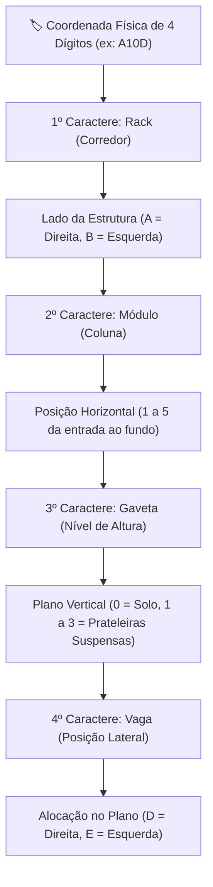
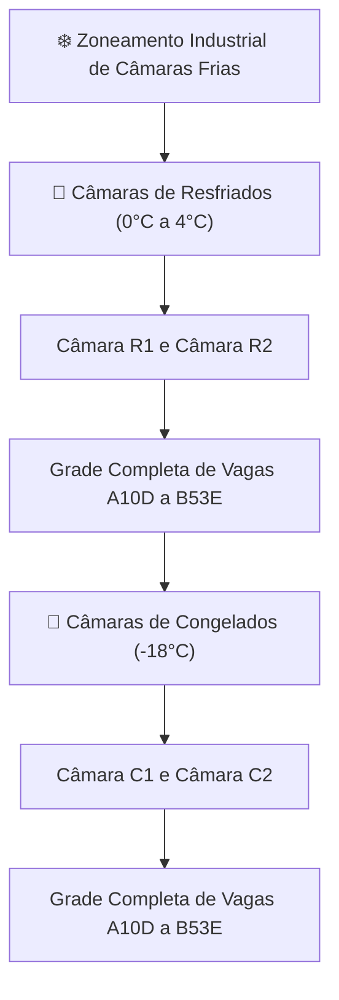
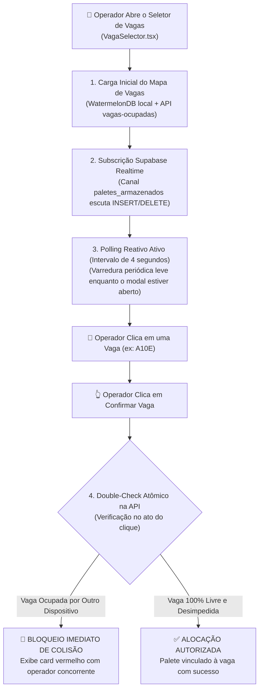
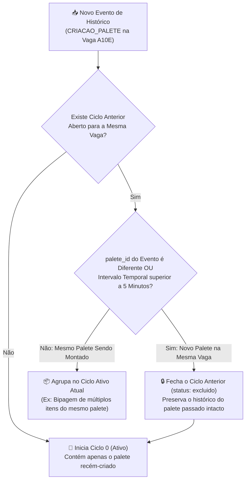
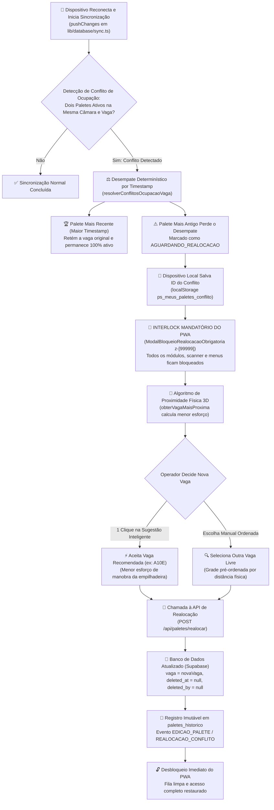

# 🏢 Endereçamento Rígido & Zoneamento de Vagas

O sistema de endereçamento do **PaletScan PWA** organiza espacialmente as câmaras frias através de coordenadas de 4 caracteres, prevenindo perdas de tempo na localização de lotes por operadores de empilhadeira.

---

## 📌 1. Composição da Coordenada de Vaga (4 Caracteres)

A coordenada física é decomposta em 4 níveis sequenciais estritamente verticais:



| Elemento | Significado | Valores | Descrição Operacional |
| :--- | :--- | :--- | :--- |
| **Rack** | Corredor | `A` (Direita) \| `B` (Esquerda) | Lado da estrutura em relação ao corredor de entrada central. |
| **Módulo** | Coluna | `1` a `5` | Posição horizontal da entrada da câmara (1) até o fundo (5). |
| **Gaveta** | Nível/Altura | `0` (Chão) \| `1` \| `2` \| `3` | Nível vertical (`0` = Solo, `1`/`2`/`3` = Prateleiras suspensas). |
| **Vaga** | Posição Lateral | `D` (Direita) \| `E` (Esquerda) | Posição exata do palete dentro do plano da gaveta. |

---

## ❄️ 2. Zoneamento das Câmaras Frigoríficas



* **Resfriados (`R1` / `R2`)**: Produtos lácteos, embutidos, margarinas e carnes resfriadas (0°C a 4°C).
* **Congelados (`C1` / `C2`)**: Vegetais, pratos prontos, polpas e aves/cortes congelados (-18°C).

---

## 🛑 3. Prevenção Ativa de Colisão de Vagas & Detecção de Concorrência

Em operações com múltiplos operadores trabalhando simultaneamente — como conferentes com smartphones/coletores no interior das câmaras frias e supervisores de expedição operando terminais Desktop —, o risco de **dupla alocação concorrente** em uma mesma vaga física é crítico.

Para eliminar colisões e inconsistências de inventário, o **PaletScan PWA** emprega uma arquitetura de prevenção em 4 camadas concorrentes:



### Mecanismos de Proteção Concorrente:
1. **Supabase Realtime Channel (`paletes_armazenados`)**:
   - Assim que o modal [`VagaSelector.tsx`](file:///root/repo_pwa/components/VagaSelector.tsx) é aberto, ele estabelece uma subscrição WebSocket no canal `paletes_armazenados` do Supabase.
   - Qualquer palete salvo ou desalocado em outro terminal dispara um evento broadcast que atualiza instantaneamente a matriz de vagas visíveis.
2. **Polling de Resguardo (4 Segundos)**:
   - Em caso de oscilação momentânea do canal WebSocket (comum em redes Wi-Fi industriais), um temporizador de 4 segundos consulta a rota `/api/vagas-ocupadas` em segundo plano para garantir consistência visual contínua.
3. **Double-Check Atômico na Confirmação (`handleConfirmar`)**:
   - No momento exato em que o operador pressiona o botão de confirmação, o componente efetua uma requisição direta ao endpoint de validação. Se outro operador confirmou a mesma coordenada nos últimos segundos, a transação local é abortada e uma notificação de colisão é exibida.
4. **Deduplicação Estrita no Servidor (`pages/api/vagas-ocupadas.ts`)**:
   - O backend deduplica estritamente as posições ocupadas através da chave canônica normalizada `${camara}|||${vaga}`, prevenindo que múltiplos registros de produtos em uma mesma vaga física sejam retornados como posições duplicadas.

---

## 🔄 4. Motor de Isolamento de Ciclos de Vida (`paleteHistoricoEngine.ts`)

Uma mesma vaga física (ex: `A10E` na câmara *Congelados 2*) é um recurso estático reutilizável: hoje ela pode abrigar uma carga de *Sobrecoxa Sadia*, amanhã ser esvaziada e, no dia seguinte, receber um lote de *Peito de Frango Lar*.

No motor de histórico do PaletScan, os eventos físicos de uma vaga são agrupados em **Ciclos de Vida Independentes**:



### Diretrizes do Motor de Ciclos:
* **Fim da Fusão Indevida de Paletes**: Impede que a criação de um palete hoje seja fundida no grupo de criação de um palete antigo de ontem que já foi expedido.
* **Sintetização de `EXCLUSAO_TOTAL_PALETE`**: Quando uma vaga é esvaziada sem emissão de evento explícito pelo coletor (ex: limpeza direta no banco), o endpoint `/api/paletes-historico` sintetiza o evento de exclusão total, demarcando de forma definitiva a fronteira do ciclo.
* **Status do Ciclo**:
  - `ativo`: Representa a carga física presente na câmara neste instante.
  - `excluido`: Representa cargas passadas já baixadas do estoque, acessíveis exclusivamente para conferência de auditoria e rastreabilidade.

---

## 🏷️ 5. Protocolo de Sinalização Física
1. **Etiquetas Adesivas**: Duas etiquetas impressas na balança e coladas no primeiro lastro de caixas.
2. **Marcador Vermelho**: Escrita manual da identificação (ex: `R1-A32E` ou `C2-B20D`).
3. **Frente e Verso**: Visibilidade garantida para o operador de empilhadeira em qualquer sentido de circulação.

---

## 🧮 6. Resolução Inteligente de Conflitos Offline & Bloqueio Mandatório (Interlock)

Em operações de câmara frigorífica com conectividade intermitente, pode ocorrer um **conflito offline de ocupação**: dois operadores em dispositivos distintos (ou um operador e um terminal desktop) cadastram paletes diferentes atribuindo a mesmíssima coordenada de vaga (ex: `A10D` na câmara *Congelados 2*) enquanto um dos dispositivos estava fora de rede.

Ao restabelecer a conectividade e acionar a sincronização em lote (`pushChanges` / `syncLocalDB`), o sistema não descarta nenhuma carga e não transfere a sobrecarga decisória para a gerência. Em vez disso, executa uma **resolução determinística automatizada com interlock mandatório no cliente**:



### A. Regra de Desempate Estrita por Timestamp
Quando a rotina [`resolverConflitosOcupacaoVaga`](file:///root/repo_pwa/lib/conflitosPaletes.ts) identifica múltiplos paletes ativos na mesma câmara e vaga:
1. **O Palete com Maior Timestamp Vence**: Aquele registrado mais recentemente pelo operador (ou sincronizado por último com timestamp de bipagem superior) é mantido ativo e em posse da vaga disputada.
2. **O Palete Perdedor é Desalocado**: O registro mais antigo recebe exclusão lógica no Supabase (`deleted_at = NOW()`) com motivo padronizado:
   ```text
   AGUARDANDO_REALOCACAO:vaga_original=A10D:vencedor=1788646072439-0-456
   ```
3. **Registro Local no Dispositivo**: O cliente que originou o palete desalocado armazena o ID no `localStorage` sob a chave `ps_meus_paletes_conflito`, garantindo o bloqueio da tela mesmo antes da próxima sincronização remota.

### B. Algoritmo de Decomposição 3D & Distância Física Ponderada
Para evitar que o operador de empilhadeira tenha que percorrer a câmara inteira procurando uma vaga livre aleatória, o módulo calcula a distância física métrica entre a vaga original e todas as vagas livres da câmara:

```typescript
export interface CoordenadasVaga {
  rua: string;    // "A" (Direita) ou "B" (Esquerda)
  nivel: number;  // 1 a 5 (Altura vertical)
  coluna: number; // 0 a 3 (Profundidade longitudinal)
  lado: string;   // "D" (Direita) ou "E" (Esquerda do módulo)
}
```

A distância física ponderada leva em consideração o **custo operacional real de manobra e elevação de carga** da empilhadeira industrial:

$$\text{Distância} = (\Delta\text{Rua} \times 100) + (\Delta\text{Nível} \times 15) + (\Delta\text{Coluna} \times 10) + (\Delta\text{Lado} \times 2)$$

| Variável | Delta ($\Delta$) | Peso | Racional Operacional no Chão de Fábrica |
| :--- | :---: | :---: | :--- |
| **Rua** | $\vert \text{Rua}_1 - \text{Rua}_2 \vert$ | **100** | Trocar de corredor exige manobra completa de giro de 180° e deslocamento com carga pesada. Maior custo de tempo e risco. |
| **Nível** | $\vert \text{Nível}_1 - \text{Nível}_2 \vert$ | **15** | Subir ou descer a torre da empilhadeira exige parada total e operação hidráulica vertical lenta. |
| **Coluna** | $\vert \text{Coluna}_1 - \text{Coluna}_2 \vert$ | **10** | Andar pelo mesmo corredor exige apenas deslocamento linear em linha reta na mesma rua. |
| **Lado** | $\text{Lado}_1 \neq \text{Lado}_2$ | **2** | No mesmo vão estrutural, mudar do lado `D` para o lado `E` exige apenas giro milimétrico dos garfos. É a melhor vaga substituta possível. |

### C. Motor de Sugestão Inteligente (`obterVagaMaisProxima`)
O algoritmo avalia as vagas livres e seleciona atomicamente a melhor coordenada disponível, gerando a justificativa técnica contextual:
* **Distância = 2**: *"Mesmo vão, lado oposto"* (ex: de `A10D` para `A10E`).
* **Distância = 10**: *"Mesmo nível, coluna ao lado"* (ex: de `A10D` para `A11D`).
* **Distância = 15**: *"Mesma rua, nível adjacente"* (ex: de `A10D` para `A20D`).

### D. Bloqueio Mandatório de Tela (Interlock Mobile)
O componente [`ModalBloqueioRealocacaoObrigatoria.tsx`](file:///root/repo_pwa/components/ModalBloqueioRealocacaoObrigatoria.tsx) impõe uma barreira física e visual inegociável:
* **Overlay com `z-[99999]`**: Cobre totalmente a viewport móvel, sem botão de fechar (X), sem fechamento por clique fora e sem cancelamento por tecla `Escape`.
* **Amarração ao Usuário Criador**: O bloqueio é ativado se o usuário logado for o criador do palete (`created_by === currentUserName`), se o ID do palete estiver no `localStorage` do dispositivo ou se for um operador comum com pendências na câmara.
* **Bloqueio Total de Módulos**: O leitor de código de barras (câmera), consulta de estoque, relatórios e menus permanecem inoperantes até a definição da vaga.
* **Resolução em 1 Clique**: Um card destacado exibe a vaga sugerida com botão de toque largo: `[ ✓ Confirmar e Alocar na Vaga {vagaSugerida} → ]`.
* **Opção de Escolha Manual Ordenada**: Permite ao operador alternar para uma grade de botões com todas as outras vagas livres da câmara, automaticamente pré-ordenadas da mais próxima para a mais distante.

### E. Transação de Realocação e Desbloqueio (`/api/paletes/realocar`)
Ao pressionar o botão de confirmação:
1. **Validação de Destino**: O backend verifica atomicamente se a nova vaga não foi ocupada nesse intervalo.
2. **Reativação do Palete**: Remove `deleted_at` e `motivo_exclusao`, atualiza `vaga` para a nova coordenada e registra o operador em `updated_by`.
3. **Auditoria Imutável**: Grava na tabela `paletes_historico` o evento `EDICAO_PALETE` com detalhes `tipo: 'REALOCACAO_CONFLITO'`, salvando a vaga anterior e a nova vaga para rastreabilidade de inventário.
4. **Purga de Cache & Liberação**: O `localStorage.ps_meus_paletes_conflito` é expurgado no cliente, o cache das câmaras no servidor é limpo e a aplicação é desbloqueada instantaneamente.


