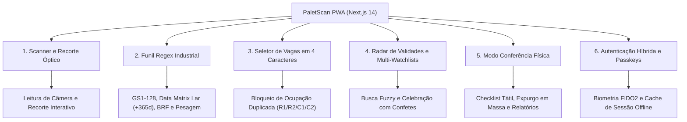

# 📱 Visão Geral da Aplicação PWA Local-First

O **PaletScan PWA** é a interface operacional de chão de fábrica do ecossistema, projetada para operadores de empilhadeira, conferentes e auditores de estoque atuando no setor de perecíveis (câmaras de congelados e resfriados).

---

## 🎯 1. Principais Funcionalidades da Aplicação

---

## ⚡ 2. Diferenciais do PWA no Ambiente Frigorífico

1. **Instalável e Sem Distrações (*Standalone Mode*)**:
   - Funciona como um app nativo no Android, ocultando barras de endereço do navegador para maximizar o espaço útil da tela e evitar toques acidentais.
2. **Design Ergonômico de Alta Densidade (*Touch-First*)**:
   - Botões ampliados e layout em contraste elevado (paletas *Slate/Dark*) adequados para operação com luvas térmicas em ambientes escuros.
3. **Leitura Resiliente a Condensação e Reflexos**:
   - Ferramenta integrada de recorte manual (`react-zoom-pan-pinch`) para leitura de códigos em paletes com filme stretch embaçado ou amassado.
4. **Alocação Rígida sem Duplicidades**:
   - Bloqueio ativo de confirmação caso o operador tente alocar um novo palete em uma coordenada física já ocupada por outra carga.
