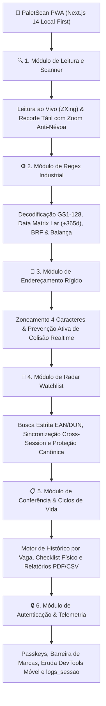

# 📱 Visão Geral da Aplicação PWA Local-First

O **PaletScan PWA** é a interface operacional de chão de fábrica do ecossistema, projetada para operadores de empilhadeira, conferentes e auditores de estoque atuando no setor de perecíveis (câmaras de congelados e resfriados).

## 🎯 1. Principais Funcionalidades da Aplicação

A esteira de módulos operacionais do aplicativo está estruturada em fluxo sequencial vertical:

## ⚡ 2. Diferenciais do PWA no Ambiente Frigorífico

1. **Fullscreen Edge-to-Edge & Safe Area Insets**:
   - Funciona em tela cheia com respeito às variáveis de ambiente CSS `env(safe-area-inset-top)` e `env(safe-area-inset-bottom)`, garantindo visualização desimpedida em celulares com entalhes (*notch*), ilhas dinâmicas ou botões virtuais de navegação.
2. **Cápsula Minimalista de Status no Header**:
   - Cabeçalho limpo com identificação visual do app, versão, badge da filial ativa (ex: Loja 410 vs Homologação 999), pílula reativa de sincronização com contagem exata e menu contextual de configurações.
3. **Resiliência de Rede com Circuit Breaker Tri-State**:
   - Monitoramento dinâmico de conectividade que detecta estados *Online*, *Offline* e *Degradado/Oscilante*, evitando sobrecarga da CPU do smartphone durante micro-quedas de sinal no tráfego entre câmaras.
4. **Alerta Flutuante de Modo Offline em Alto Contraste**:
   - Indicador de status de rede calibrado com paleta luminosa para câmaras escuras, posicionado estrategicamente para não cobrir botões de ação e leitura.
5. **Design Ergonômico de Alta Densidade (*Touch-First*)**:
   - Botões ampliados e layout em contraste elevado (paletas *Slate/Dark*) adequados para operação com luvas térmicas em temperaturas negativas (-18°C a -25°C).
6. **Leitura Resiliente a Condensação e Reflexos**:
   - Ferramenta integrada de recorte manual (`react-zoom-pan-pinch`) para leitura de códigos em paletes com filme stretch embaçado ou amassado, combinada ao leitor acelerado nativo `BarcodeDetector API` e controle de lanterna (Torch).
7. **Alocação Rígida sem Duplicidades & Prevenção de Colisão**:
   - Bloqueio ativo de confirmação via polling e escuta WebSocket no Supabase Realtime, impedindo que múltiplos operadores sobreponham cargas na mesma coordenada física.
8. **Isolamento de Ciclos de Vida por Vaga**:
   - O histórico de paletes antigos que já deixaram a câmara não contamina o palete recém-alocado, eliminando registros duplicados no histórico e no desktop.

