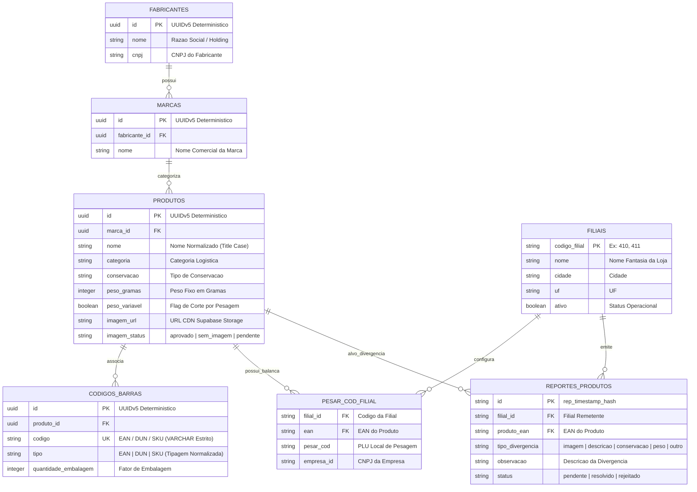

# 📜 Governança de Dados e Manifesto de Schema

O módulo de governança do **PaletScan ETL** assegura que nenhum dado corrompido, órfão ou fora de contrato seja inserido no banco de dados relacional. Ele combina contratos formais em JSON Schema ([`schema_manifest.json`](file:///root/paletscan-etl/core/manifest/schema_manifest.json)) com identificadores determinísticos UUIDv5, sincronização dinâmica de marcas/aliases e funções de sanitização em PL/pgSQL no PostgreSQL / Supabase.

---

## 📊 1. Relação Atual de Métricas e Volumes no Banco de Dados

Após a execução do pipeline de ingestão e sanitização estrita, a base de dados relacional encontra-se auditada e 100% íntegra, apresentando a seguinte relação de volumes:

| Entidade Relacional | Quantidade Auditada | Descrição / Regra de Negócio |
| :--- | :--- | :--- |
| **Fabricantes (Holdings)** | **4** | JBS S.A., Seara Alimentos LTDA, BRF S.A. e Cooperativa Agroindustrial Lar. |
| **Marcas Comerciais** | **143** | Marcas ativas associadas (ex: Friboi, Seara, Sadia, Perdigão, Lar, Maturatta, 1953). |
| **Produtos Validados** | **3.386** | Todos 100% respaldados por EAN numérico único (0 produtos órfãos ou sem EAN). |
| **Códigos de Barras** | **9.310** | Registros catalogados e normalizados nas tipagens estritas `EAN` e `DUN`. |

---

## 🏛️ 2. Modelo Relacional Anti-Redundância

O modelo de dados do PaletScan foi desenhado para eliminar duplicidades e garantir a integridade entre fornecedores, marcas, SKUs e variações logísticas de código de barras:



---

## 📑 3. Manifesto JSON Schema e Compatibilidade Dinâmica (`schema_manifest.json`)

O arquivo [`core/manifest/schema_manifest.json`](file:///root/paletscan-etl/core/manifest/schema_manifest.json) define o contrato formal (JSON Schema Draft-07) e o catálogo mestre do projeto.

### A. Registro Dinâmico de Holdings, Marcas e Aliases CLI:
Para garantir que a inclusão ou remoção de marcas e fornecedores seja refletida automaticamente nos aliases do terminal e na central de ajuda (`paletscan` / `etl-help`), o arquivo de manifesto inclui as seções:

```json
{
  "manifesto_holdings": [
    {
      "id": "fab_friboi_jbs",
      "nome": "JBS S.A.",
      "divisoes": ["Friboi", "Seara Alimentos"],
      "marcas": ["Friboi", "Maturatta", "1953", "Swift", "Seara", "Gourmet", "Incrível!"],
      "scrapers": ["scrapers/friboi/index.ts", "scrapers/seara/index.ts"],
      "aliases_scraper": ["etl-friboi", "etl-seara"]
    }
  ],
  "manifesto_aliases": {
    "etl-run": "Executa o pipeline completo e exibe o relatório de timestamps na CLI.",
    "etl-friboi": "Extrai catálogo B2B Friboi/JBS."
  }
}
```

> 🔄 **Dinamicidade Garantida:** O script `scripts/render_help_from_manifest.ts` lê este manifesto em tempo de execução. Se uma marca entrar ou sair do projeto, a CLI atualiza seu menu mobile sem requerer alteração de código.

---

## 🔑 4. Identificadores Determinísticos via UUIDv5

Para garantir que reexecuções do pipeline ETL não gerem registros duplicados ou IDs aleatórios a cada sincronização, todos os identificadores primários são gerados via **UUIDv5** a partir de um namespace estático:

$$\text{UUID} = \text{UUIDv5}(\text{PALETSCAN\_NAMESPACE}, \text{Chave\_Natural})$$

Exemplo de chaves naturais utilizadas:
- **Fabricante ID**: `UUIDv5(NAMESPACE, "jbs-friboi")`
- **Marca ID**: `UUIDv5(NAMESPACE, "friboi-reserva")`
- **Produto ID**: `UUIDv5(NAMESPACE, "sku-109403")`
- **Código de Barras ID**: `UUIDv5(NAMESPACE, "ean-7891515432101")`

---

## 🛢️ 5. Higienização SQL em Nível de Banco (`validar_e_corrigir_eans.sql`)

Como camada adicional de proteção e governança, o arquivo [`db_sync/validar_e_corrigir_eans.sql`](file:///root/paletscan-etl/db_sync/validar_e_corrigir_eans.sql) instala a função `fn_calculate_mod10_ean13` diretamente no banco Supabase em PL/pgSQL.

---

## 📱 6. Diretrizes Estritas de Exportação ao PWA (Regras de Negócio)

Para preservar a excelência da experiência do usuário e a precisão operacional nos coletores/smartphones:

1. **Requisito Mínimo de EAN-13:** Apenas produtos com código **EAN numérico de 13 dígitos** válido são exportados para os arquivos `produtos.json` e servidos ao PWA.
2. **Eliminação de SKUs na Interface do Usuário:** O PWA não exibe códigos SKU ou referências internas de fabricante. A experiência de usuário restringe-se exclusivamente aos identificadores **EAN (13 dígitos)** e **DUN (14 dígitos)**.
3. **Isolamento Relacional de Produtos sem EAN:** Produtos provenientes de canais B2B que contenham apenas SKU interno ou DUN são preservados no Supabase para auditoria e rastreabilidade, mas são categoricamente descartados da publicação no catálogo do PWA.

