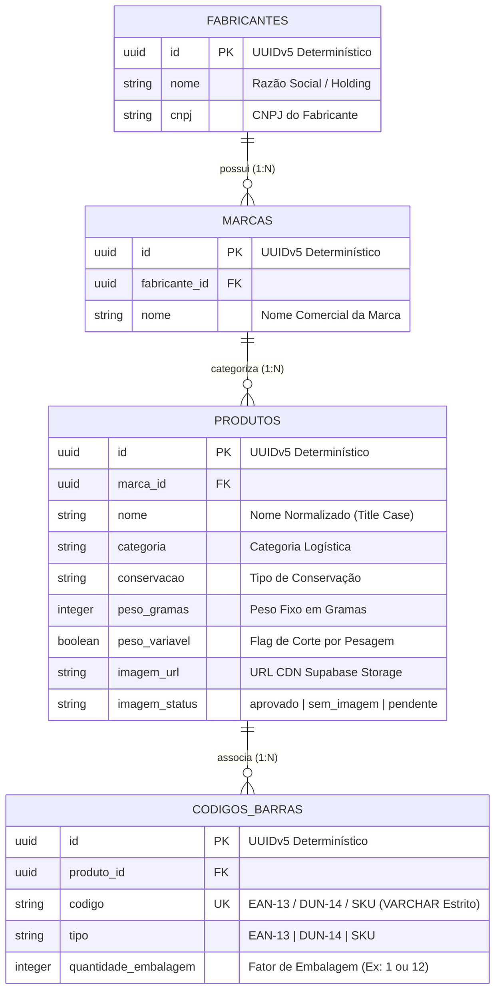

# 📜 Governança de Dados e Manifesto de Schema

O módulo de governança do PaletScan assegura que nenhum dado corrombido ou fora de contrato seja inserido no banco de dados relacional. Ele combina contratos formais em JSON Schema ([`schema_manifest.json`](file:///root/paletscan-etl/core/manifest/schema_manifest.json)) com funções de sanitização em PL/pgSQL no PostgreSQL / Supabase.

---

## 🏛️ 1. Modelo Relacional Anti-Redundância

O modelo de dados do PaletScan foi desenhado para eliminar duplicidades e garantir a integridade entre fornecedores, marcas, SKUs e variações logísticas de código de barras:

---

## 📑 2. Manifesto JSON Schema (`schema_manifest.json`)

O arquivo [`core/manifest/schema_manifest.json`](file:///root/paletscan-etl/core/manifest/schema_manifest.json) define o contrato formal (JSON Schema Draft-07) que todo arquivo de staging deve respeitar rigorosamente antes do processo de carga no banco.

### Principais Regras de Integridade:
- **Tipos de Dados Estritos**: Atributos de identificação e códigos de barras são declarados obrigatoriamente como `string`.
- **Prevenção de Truncamento**: Proíbe a coerção de códigos de barras iniciados em zero para tipos numéricos (`integer`/`number`).
- **Validação de Formato**: Exige a especificação do tipo de código de barras (`EAN-13`, `DUN-14`, `SKU`) e fatores de conversão de embalagem.

---

## 🔑 3. Identificadores Determinísticos via UUIDv5

Para garantir que re-execuções do pipeline ETL não gerem registros duplicados ou IDs aleatórios a cada sincronização, todos os identificadores primários são gerados via **UUIDv5** a partir de um namespace estático:

$$\text{UUID} = \text{UUIDv5}(\text{PALETSCAN\_NAMESPACE}, \text{Chave\_Natural})$$

Exemplo de chaves naturais utilizadas:
- **Fabricante ID**: `UUIDv5(NAMESPACE, "jbs-friboi")`
- **Marca ID**: `UUIDv5(NAMESPACE, "friboi-reserva")`
- **Produto ID**: `UUIDv5(NAMESPACE, "sku-109403")`
- **Código de Barras ID**: `UUIDv5(NAMESPACE, "ean-7891515432101")`

---

## 🛢️ 4. Higienização SQL em Nível de Banco (`validar_e_corrigir_eans.sql`)

Como camada adicional de proteção e governança, o arquivo [`db_sync/validar_e_corrigir_eans.sql`](file:///root/paletscan-etl/db_sync/validar_e_corrigir_eans.sql) instala a função `fn_calculate_mod10_ean13` diretamente no banco Supabase em PL/pgSQL.

### A. Função PL/pgSQL `fn_calculate_mod10_ean13`
Calcula o 13º dígito verificador Modulus 10 diretamente no motor relacional do PostgreSQL, permitindo sanitizar registros legados importados de planilhas de terceiros.

### B. Correção de Registros Incompletos
Remove caracteres não numéricos de colunas de código, reajusta registros truncados com 12 dígitos para EAN-13 válido e atualiza a coluna `codigo` mantendo a restrição de unicidade (`UNIQUE`).
