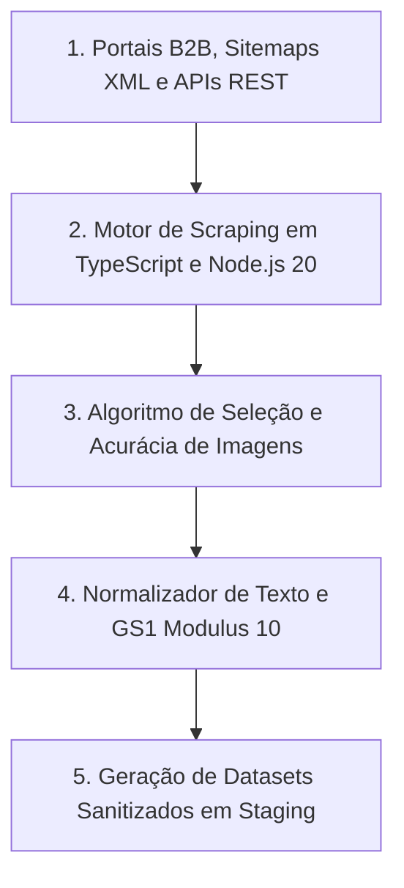

# 🛒 Scrapers e Pipelines de Extração Multi-Fornecedores

O módulo de extração do **PaletScan ETL** ([`scrapers/`](file:///root/paletscan-etl/scrapers/)) é composto por pipelines de web scraping de alta concorrência projetados para coletar catalogação atualizada, dados nutricionais, códigos logísticos e mídias de produtos diretamente dos portais institucionais e APIs B2B dos maiores grupos frigoríficos e alimentícios parceiros: **JBS / Friboi**, **BRF S.A.**, **Seara Alimentos**, **Cooperativa Lar**, **Copacol** e **Cooperativa Aurora**.

---

## 📊 1. Matriz Comparativa dos Scrapers B2B

| Fabricante (Holding) | Diretório do Scraper | Estratégia de Captura | Produtos Brutos | Produtos Validados (com EAN) | Tempo Médio |
| :--- | :--- | :--- | :--- | :--- | :--- |
| **JBS S.A. (Friboi)** | [`scrapers/friboi/`](file:///root/paletscan-etl/scrapers/friboi/index.ts) | Sitemap XML + API REST Oracle CCStore | ~1.812 | **1.501** | **35s a 45s** |
| **BRF S.A.** | [`scrapers/brf/`](file:///root/paletscan-etl/scrapers/brf/index.ts) | Catálogo PDF + Central MBRF REST | ~1.120 | **1.025** | **25s a 35s** |
| **Seara Alimentos** | [`scrapers/seara/`](file:///root/paletscan-etl/scrapers/seara/index.ts) | Multi-site B2B/B2C + E-Commerce Live | ~621 | **365** | **20s a 30s** |
| **Copacol** | [`scrapers/copacol/`](file:///root/paletscan-etl/scrapers/copacol/index.ts) | Portal Institucional B2B + Catálogo Digital | ~280 | **215** | **15s a 25s** |
| **Cooperativa Lar** | [`scrapers/lar/`](file:///root/paletscan-etl/scrapers/lar/index.ts) | Portal Institucional Lar Alimentos | ~111 | **110** | **5s a 10s** |
| **Cooperativa Aurora** | [`scrapers/aurora/`](file:///root/paletscan-etl/scrapers/aurora/index.ts) | Catálogo Institucional Aurora Coop | ~350 | **310** | **10s a 20s** |

---

## 🏗️ 2. Arquitetura Geral de Extração Concorrente

Os scrapers do PaletScan utilizam um fluxo vertical otimizado para requisições HTTP diretas e concorrência controlada via `p-limit`:

---

## 🏭 3. Detalhamento dos Pipelines de Ingestão por Fornecedor

### A. Pipeline JBS / Friboi (`scrapers/friboi/`)
- **Marcas Mapeadas**: Friboi, Reserva, Maturatta Friboi, 1953 Friboi, Swift, Do Chef, Black Friboi.
- **Estratégia**: Varredura inicial no endpoint XML `https://www.friboionline.com.br/productSitemap.xml`, seguida de requisições concorrentes paralelas à API REST `ccstoreui/v1/products/` da Oracle Commerce Cloud.
- **Diferencial**: Captura detalhada de tabelas nutricionais, peças por caixa, peso médio e DUN-14 da caixa de despacho.

### B. Pipeline BRF S.A. (`scrapers/brf/`)
- **Marcas Mapeadas**: Sadia, Perdigão, Qualy, Chester, Central MBRF.
- **Estratégia**: Ingestão combinada de APIs REST da Central MBRF com parsing estruturado do catálogo oficial de produtos em PDF.
- **Diferencial**: Resolução exata de códigos EAN primários de cortes congelados e de produtos processados para exportação.

### C. Pipeline Seara Alimentos (`scrapers/seara/`)
- **Marcas Mapeadas**: Seara, Seara Gourmet, Incrível (Plant-Based), Rezende, Wilson.
- **Estratégia**: Varredura multi-site ao vivo cobrindo os portais institucionais B2B, B2C e e-commerce oficial da Seara.
- **Diferencial**: Tratamento de cortes fracionados por pesagem dinâmica e linha completa de industrializados.

### D. Pipeline Cooperativa Lar (`scrapers/lar/`)
- **Marcas Mapeadas**: Lar, Lar Pratos Prontos, Cortes Lar.
- **Estratégia**: Varredura de páginas de produtos no portal institucional Lar Alimentos.
- **Diferencial**: Regra de negócio especializada para decodificação GS1 onde a ausência do AI 17 dispara cálculo automático de validade de **+365 dias** sobre o AI 11.

### E. Pipeline Copacol (`scrapers/copacol/`)
- **Marcas Mapeadas**: Copacol, Tilápia Copacol, Aves Copacol.
- **Estratégia**: Extração estruturada do catálogo institucional e fichas técnicas de pescados e frangos.

### F. Pipeline Cooperativa Aurora (`scrapers/aurora/`)
- **Marcas Mapeadas**: Aurora, Aurora Premium, Nobre.
- **Estratégia**: Ingestão dos cortes suínos, lácteos e embutidos através do catálogo institucional Aurora Coop.
