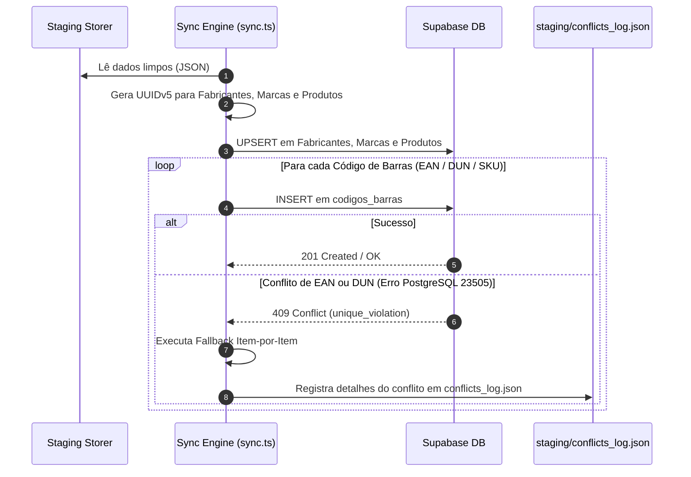

# ⚡ Integração Supabase (Database & Storage)

O módulo de integração ([`db_sync/sync.ts`](file:///root/paletscan-etl/db_sync/sync.ts) e [`db_sync/sync_images.ts`](file:///root/paletscan-etl/db_sync/sync_images.ts)) realiza a carga dos dados sanitizados e mídias tratadas diretamente nas instâncias do Supabase PostgreSQL e Supabase Storage.

---

## 🔄 1. Pipeline de Sincronização Relacional (`db_sync/sync.ts`)

O script `sync.ts` lê o staging sanitizado, gera as chaves determinísticas UUIDv5 e executa as chamadas de gravação relacional no Supabase.



---

## 🛡️ 2. Tratamento Resiliente de Conflitos de EAN (`Erro 23505`)

Como fornecedores diferentes podem comercializar o mesmo produto com o mesmo EAN-13, a tentativa de inserção pode disparar uma exceção de violação de chave única no PostgreSQL (`error code 23505` - `unique_violation`).

### A. Algoritmo de Fallback Item-por-Item
Em vez de abortar o lote inteiro de sincronização, o `sync.ts` captura a exceção de conflito, isola o código de barras conflitante e continua a execução dos demais itens do lote.

### B. Registro de Auditoria (`conflicts_log.json`)
Todas as tentativas de inserção duplicada são registradas no arquivo `staging/conflicts_log.json`, permitindo auditorias posteriores para identificar tentativas de re-cadastramento de EANs por múltiplos scrapers:

```json
[
  {
    "timestamp": "2026-07-28T10:15:30.123Z",
    "codigo": "7891515432101",
    "tipo": "EAN-13",
    "produto_id": "8d3e91b4-5f21-5a9e-b811-123456789abc",
    "mensagem": "Código de barras já existente na base relacional. Inserção duplicada ignorada."
  }
]
```

---

## 🖼️ 3. Sincronização de Mídias e Upload CDN (`db_sync/sync_images.ts`)

O script `sync_images.ts` lida com o envio de ativos visuais otimizados (`.webp`) para o bucket do Supabase Storage:

1. **Varredura em `images/processed/`**: Localiza arquivos `.webp` prontos para publicação.
2. **Upload para o Bucket `produtos-imagens`**: Envia os arquivos via API Supabase Storage com os cabeçalhos de cache apropriados (`cacheControl: '3600'`).
3. **Atualização de Status na Tabela `produtos`**:
   - `imagem_url`: Define a URL pública do CDN Supabase (`https://<project-ref>.supabase.co/storage/v1/object/public/produtos-imagens/<sku>.webp`).
   - `imagem_status`: Atualiza o status para `aprovado`.
4. **Arquivamento Seguro**: Move a imagem tratada de `images/processed/` para `images/archived/`.

---

## 📱 4. Consumo no Frontend PWA

A infraestrutura Supabase comunica-se diretamente com a aplicação PWA em produção:

- **Componente `ProdutoAvatar.tsx`**: Exibe o avatar do produto respeitando o status `imagem_status`. Quando o status é `sem_imagem`, renderiza automaticamente um placeholder limpo em SVG sem dependências residuais de imagens estáticas locais.
- **Redução do TTL de Cache**: O endpoint `/api/validar` opera com TTL de 1 minuto e consulta direta em tempo real ao Supabase, garantindo que novos EANs cadastrados fiquem disponíveis para escaneamento no coletor em poucos segundos.

---

## 🆕 5. Rastreamento e Log de Novos Produtos Incluídos

Durante a execução da carga relacional, o `sync.ts` compara as chaves primárias dos produtos recebidos em staging com as chaves já existentes no Supabase através de consultas paginadas:

1. **Regra de Status de Novo Produto**: Um produto ganha o status de **NOVO** única e exclusivamente na **primeira execução em que é incluído no Supabase**.
2. **Ciclo de Vida Automático**: Na execução subsequente, por já constar na base do Supabase, o produto perde automaticamente o status de novo e passa a constar como produto pré-existente (`0 novos produtos`).
3. **Log de Novos Produtos (`staging/novos_produtos_log.json`)**: Armazena a lista de produtos inseridos na execução mais recente.
4. **Comando CLI (`etl-novos`)**: Permite consultar via terminal Linux a relação detalhada dos produtos incluídos na última carga (`npx tsx scripts/show_new_products.ts`).
5. **Sinalização Exclusiva em Log (ETL)**: A sinalização visual e modais de novos produtos foram removidos da interface PWA, mantendo o rastreamento concentrado nos relatórios operacionais do pipeline ETL.

---

## 📝 6. Rastreamento e Log de Produtos Alterados / Atualizados

Qualquer alteração ou atualização nos atributos de um produto pré-existente no Supabase é detectada automaticamente durante a sincronização relacional:

1. **Diffing em Nível de Campo**: O `sync.ts` compara campo por campo do produto pré-existente com os dados novos do staging:
   - `imagem_url` / `status_imagem`
   - `descricao_padronizada`
   - `classe`
   - `conservacao`
   - `peso_gramas` / `fracionado`
   - `marca_id`
2. **Log de Alterações (`staging/produtos_atualizados_log.json`)**: Quando uma mudança é detectada, o arquivo armazena os valores anteriores (`anterior`) e os valores atualizados (`atualizado`).
3. **Comando CLI (`etl-atualizados`)**: O utilitário `scripts/show_updated_products.ts` permite inspecionar quais produtos sofreram alteração na última execução do pipeline.

---

## 🛡️ 7. Governança de Atributos Manuais Imutáveis (`produtos_atributos_manuais`)

Para garantir que intervenções operacionais de chão de fábrica (como vinculação manual de caixas DUN-14 ou definição de códigos de balança/pesar) nunca sejam sobrescritas pelas execuções automáticas periódicas do pipeline ETL:

1. **Tabela de Overrides Imutáveis**: Criada a tabela `produtos_atributos_manuais` com chave primária `produto_ean`.
2. **Precedência na View e Sincronização**: Tanto a view `vw_produtos_com_marcas` quanto o motor de sincronização do PWA (`lib/database/sync.ts`) e o endpoint `/api/validar` aplicam a regra de precedência:
   $$\text{DUN Exibido} = \text{Override Manual} \succ \text{codigos\_barras (ETL)} \succ \text{Catálogo Base}$$
3. **Imutabilidade contra Cargas B2B**: Mesmo que um scraper colete dados divergentes de embalagem, o vínculo validado pelo operador no PWA permanece preservado.

---

## 🔐 8. Políticas de Segurança e Multi-Tenancy (RLS)

O esquema do banco de dados no Supabase implementa Row Level Security (RLS) para isolamento corporativo de dados:

- **Script de Migração**: [`01_migration_multi_tenant_rls.sql`](file:///root/paletscan-etl/db_sync/01_migration_multi_tenant_rls.sql).
- **Coluna `empresa_id`**: Presente em tabelas operacionais (`paletes_armazenados`, `produtos_atributos_manuais`, `auditorias`).
- **Políticas RLS**: Garantem que operadores e sessões acessem estritamente os paletes e registros vinculados à sua respectiva organização ou filial.

---

## 📦 9. Exportação Estrita para Catálogo PWA (`export_pwa_catalog.ts`)

O pipeline inclui a ferramenta de exportação e auditoria pré-deploy do catálogo mestre para o PWA:

- **EAN Obrigatório de 13 Dígitos**: Filtro estrito que elimina SKUs sem código EAN-13 numérico válido (`/^\d{13}$/`), impedindo a poluição do catálogo mobile com códigos internos ou provisórios.
- **Sanitização de Mídias**: Descarte rigoroso de placeholders, banners e URLs inválidas, garantindo carregamento instantâneo no cliente offline (WatermelonDB).


