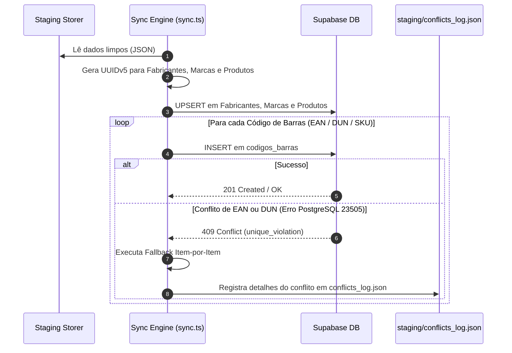

# ⚡ Integração Supabase (Database & Storage)

O módulo de integração ([`db_sync/sync.ts`](file:///root/paletscan-etl/db_sync/sync.ts) e [`db_sync/sync_images.ts`](file:///root/paletscan-etl/db_sync/sync_images.ts)) realiza a carga dos dados sanitizados e mídias tratadas diretamente nas instâncias do Supabase PostgreSQL e Supabase Storage.

---

## 🔄 1. Pipeline de Sincronização Relacional (`db_sync/sync.ts`)

O script `sync.ts` lê o staging sanitizado, gera as chaves determinísticas UUIDv5 e executa as chamadas de gravação relacional no Supabase.



---

## 🛡️ 2. Tratamento Resiliente de Conflitos de EAN (`Erro 23505`)

Como fornecedores diferentes podem comercializar o mesmo produto com o mesmo EAN-13, a tentativa de inserção pode disparar uma exceção de violação de chave única no PostgreSQL (`error code 23505` - `unique_violation`).

### A. Algoritmo de Fallback Item-por-Item
Em vez de abortar o lote inteiro de sincronização, o `sync.ts` captura a exceção de conflito, isola o código de barras conflitante e continua a execução dos demais itens do lote.

### B. Registro de Auditoria (`conflicts_log.json`)
Todas as tentativas de inserção duplicada são registradas no arquivo `staging/conflicts_log.json`, permitindo auditorias posteriores para identificar tentativas de re-cadastramento de EANs por múltiplos scrapers:

```json
[
  {
    "timestamp": "2026-07-28T10:15:30.123Z",
    "codigo": "7891515432101",
    "tipo": "EAN-13",
    "produto_id": "8d3e91b4-5f21-5a9e-b811-123456789abc",
    "mensagem": "Código de barras já existente na base relacional. Inserção duplicada ignorada."
  }
]
```

---

## 🖼️ 3. Sincronização de Mídias e Upload CDN (`db_sync/sync_images.ts`)

O script `sync_images.ts` lida com o envio de ativos visuais otimizados (`.webp`) para o bucket do Supabase Storage:

1. **Varredura em `images/processed/`**: Localiza arquivos `.webp` prontos para publicação.
2. **Upload para o Bucket `produtos-imagens`**: Envia os arquivos via API Supabase Storage com os cabeçalhos de cache apropriados (`cacheControl: '3600'`).
3. **Atualização de Status na Tabela `produtos`**:
   - `imagem_url`: Define a URL pública do CDN Supabase (`https://<project-ref>.supabase.co/storage/v1/object/public/produtos-imagens/<sku>.webp`).
   - `imagem_status`: Atualiza o status para `aprovado`.
4. **Arquivamento Seguro**: Move a imagem tratada de `images/processed/` para `images/archived/`.

---

## 📱 4. Consumo no Frontend PWA

A infraestrutura Supabase comunica-se diretamente com a aplicação PWA em produção:

- **Componente `ProdutoAvatar.tsx`**: Exibe o avatar do produto respeitando o status `imagem_status`. Quando o status é `sem_imagem`, renderiza automaticamente um placeholder limpo em SVG sem dependências residuais de imagens estáticas locais.
- **Redução do TTL de Cache**: O endpoint `/api/validar` opera com TTL de 1 minuto e consulta direta em tempo real ao Supabase, garantindo que novos EANs cadastrados fiquem disponíveis para escaneamento no coletor em poucos segundos.
