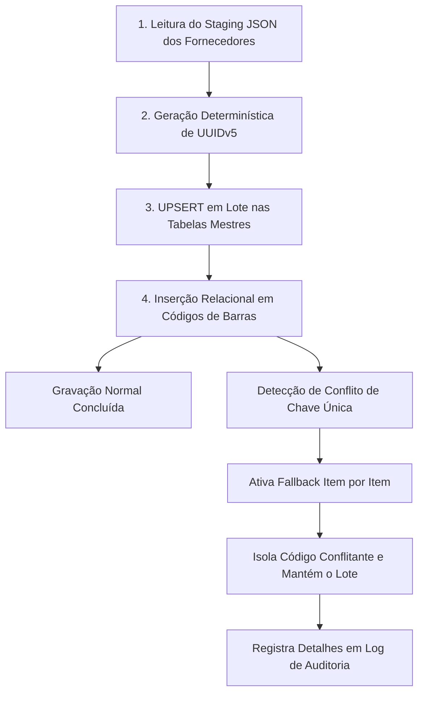

# ⚡ Integração Supabase (Database & Storage)

O módulo de integração ([`db_sync/sync.ts`](file:///root/paletscan-etl/db_sync/sync.ts) e [`db_sync/sync_images.ts`](file:///root/paletscan-etl/db_sync/sync_images.ts)) realiza a carga dos dados sanitizados e mídias tratadas diretamente nas instâncias do Supabase PostgreSQL e Supabase Storage.

---

## 🔄 1. Pipeline de Sincronização Relacional (`db_sync/sync.ts`)

O script `sync.ts` lê o staging sanitizado, gera as chaves determinísticas UUIDv5 e executa as chamadas de gravação relacional no Supabase em um fluxo vertical de alta resiliência:



---

## 🛡️ 2. Tratamento Resiliente de Conflitos de EAN (`Erro 23505`)

Como fornecedores diferentes podem comercializar o mesmo produto com o mesmo EAN-13, a tentativa de inserção pode disparar uma exceção de violação de chave única no PostgreSQL (`error code 23505` - `unique_violation`).

### A. Algoritmo de Fallback Item-por-Item
Em vez de abortar o lote inteiro de sincronização, o `sync.ts` captura a exceção de conflito, isola o código de barras conflitante e continua a execução dos demais itens do lote.

### B. Registro de Auditoria (`conflicts_log.json`)
Todas as tentativas de inserção duplicada são registradas no arquivo `staging/conflicts_log.json`, permitindo auditorias posteriores para identificar tentativas de re-cadastramento de EANs por múltiplos scrapers:

```json
[
  {
    "timestamp": "2026-07-28T10:15:30.123Z",
    "codigo": "7891515432101",
    "tipo": "EAN-13",
    "produto_id": "8d3e91b4-5f21-5a9e-b811-123456789abc",
    "mensagem": "Código de barras já existente na base relacional. Inserção duplicada ignorada."
  }
]
```

---

## 🔒 3. Alinhamento Relacional Estrito & Política Zero Data Loss

Para garantir que nenhuma alteração manual realizada pelo operador no chão de fábrica do PWA seja sobrescrita ou perdida em rotinas automáticas de ETL:

1. **Separação Canônica de Entidades**:
   - `produtos`: ID determinístico UUIDv5, `marca_id`, `descricao_padronizada`, `descricao_original`, `classe`, `conservacao`, `status_imagem`.
   - `codigos_barras`: Associação 1:N com `produto_id` e tipos estritos (`EAN`, `DUN`, `PESAR`).
   - `produtos_atributos_manuais`: Armazena com prioridade absoluta qualquer ajuste manual feito no PWA (edição de nome, conservação, classe ou vínculos de DUN).
   - `vw_produtos_com_marcas`: View relacional consolidada consumida pelo PWA durante a sincronização delta.
2. **Suíte de Testes de Imunidade a Perda de Dados**:
   - O script [`scripts/test_pwa_crud_and_sync_safety.ts`](file:///root/paletscan-etl/scripts/test_pwa_crud_and_sync_safety.ts) valida o ciclo CRUD completo e garante 100% de preservação de dados após operações de wipe ou sincronizações globais.

---

## 🖼️ 4. Sincronização de Mídias e Upload CDN (`db_sync/sync_images.ts`)

O script [`db_sync/sync_images.ts`](file:///root/paletscan-etl/db_sync/sync_images.ts) gerencia o upload das imagens WebP tratadas para o bucket público do Supabase Storage:

1. **Leitura dos Arquivos Processados**: Lê os ativos WebP em `images/processed/`.
2. **Upload para o Storage Bucket**:
   - Bucket: `produtos-imagens`
   - Parâmetro: `upsert: true` (permite atualizar fotos quando a indústria muda o layout da embalagem).
3. **Atualização da Tabela de Produtos**:
   - `imagem_url`: Define a URL pública do CDN Supabase.
   - `status_imagem`: Atualiza para `aprovado`.
   - `updated_at`: Atualiza o timestamp da última mutação para orientar a sincronização delta do PWA.

---

## 💻 5. Comandos de Sincronização & Teste

```bash
# Sincronizar dados relacionais de todas as indústrias para o Supabase
npm run sync:supabase

# Sincronizar apenas imagens tratadas para o Supabase Storage
npm run sync:images

# Validar imunidade a perda de dados e integridade relacional do PWA
npx tsx scripts/test_pwa_crud_and_sync_safety.ts
```
